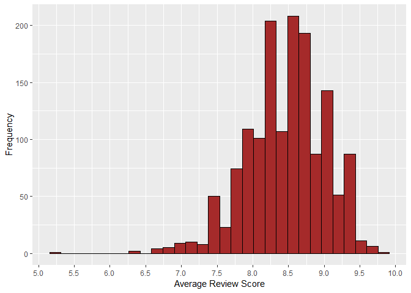
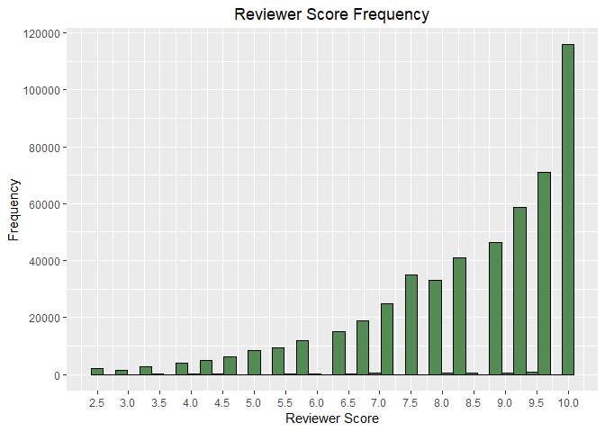
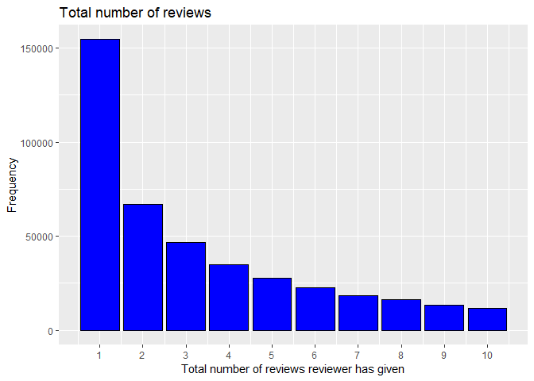
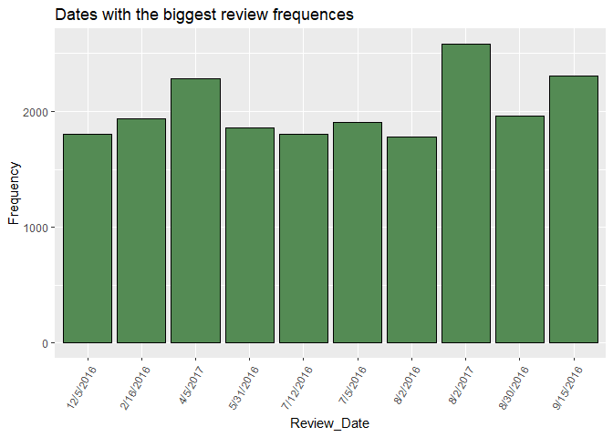
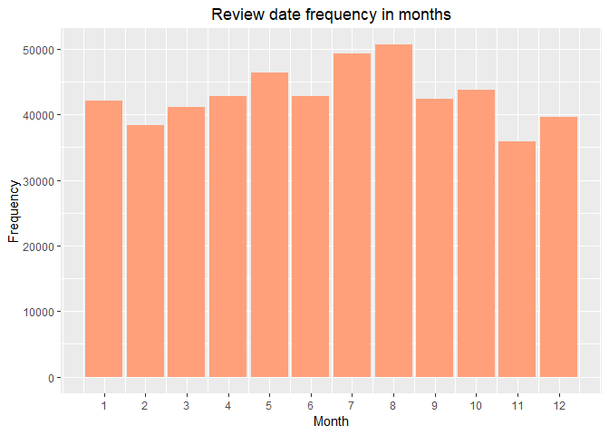
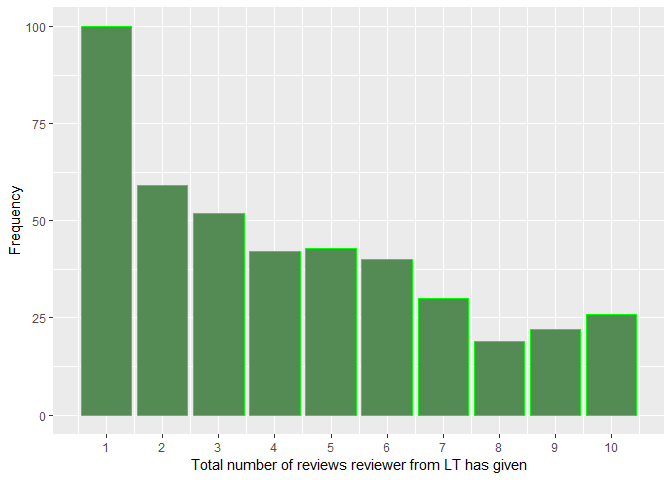
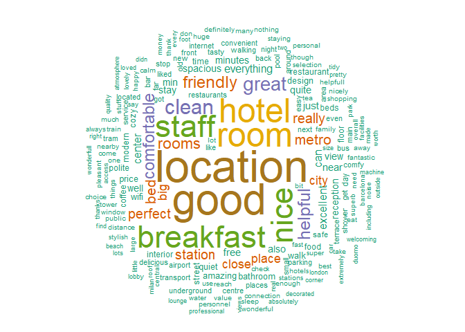
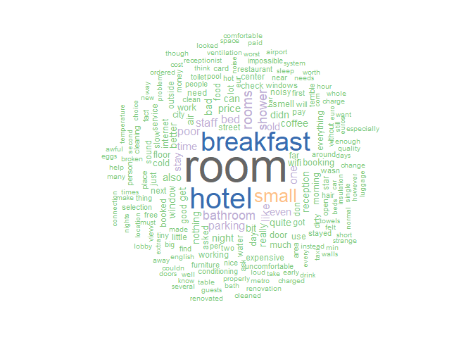

# Introduction
This projects includes data preprocessing and some vizualisations about hotels across Europe. Dataset contains 515,000 customer reviews of 1493 luxury hotels. 

## Preparations 

Libraries that will be used for project:

```r
library(dplyr) 
library(ggplot2)
library(stringr)
library(tm) 
library(wordcloud) 
library(leaflet) 
library(mapview) 
library(data.table)
```

### Reading data

```r
path2 <- "C:/Users/Lukas/Desktop/R2/Hotel Reviews/Input/Hotel_Reviews.csv"
data <- fread(path2, header = TRUE, showProgress = FALSE)
```


### Exploring data

Dimensions

```r
cat("Number of observations in dataset:", dim(data)[1],", number of features:", dim(data)[2])
```

Number of observations in dataset: 515738 , number of features: 17

Structure

```r
str(data)
```

```
## Classes 'data.table' and 'data.frame':	515738 obs. of  17 variables:
##  $ Hotel_Address                             : chr  "s Gravesandestraat 55 Oost 1092 AA Amsterdam Netherlands" "s Gravesandestraat 55 Oost 1092 AA Amsterdam Netherlands" "s Gravesandestraat 55 Oost 1092 AA Amsterdam Netherlands" "s Gravesandestraat 55 Oost 1092 AA Amsterdam Netherlands" ...
##  $ Additional_Number_of_Scoring              : int  194 194 194 194 194 194 194 194 194 194 ...
##  $ Review_Date                               : chr  "8/3/2017" "8/3/2017" "7/31/2017" "7/31/2017" ...
##  $ Average_Score                             : num  7.7 7.7 7.7 7.7 7.7 7.7 7.7 7.7 7.7 7.7 ...
##  $ Hotel_Name                                : chr  "Hotel Arena" "Hotel Arena" "Hotel Arena" "Hotel Arena" ...
##  $ Reviewer_Nationality                      : chr  "Russia" "Ireland" "Australia" "United Kingdom" ...
##  $ Negative_Review                           : chr  "I am so angry that i made this post available via all possible sites i use when planing my trips so no one will"| __truncated__ "No Negative" "Rooms are nice but for elderly a bit difficult as most rooms are two story with narrow steps So ask for single "| __truncated__ "My room was dirty and I was afraid to walk barefoot on the floor which looked as if it was not cleaned in weeks"| __truncated__ ...
##  $ Review_Total_Negative_Word_Counts         : int  397 0 42 210 140 17 33 11 34 15 ...
##  $ Total_Number_of_Reviews                   : int  1403 1403 1403 1403 1403 1403 1403 1403 1403 1403 ...
##  $ Positive_Review                           : chr  "Only the park outside of the hotel was beautiful" "No real complaints the hotel was great great location surroundings rooms amenities and service Two recommendati"| __truncated__ "Location was good and staff were ok It is cute hotel the breakfast range is nice Will go back" "Great location in nice surroundings the bar and restaurant are nice and have a lovely outdoor area The building"| __truncated__ ...
##  $ Review_Total_Positive_Word_Counts         : int  11 105 21 26 8 20 18 19 0 50 ...
##  $ Total_Number_of_Reviews_Reviewer_Has_Given: int  7 7 9 1 3 1 6 1 3 1 ...
##  $ Reviewer_Score                            : num  2.9 7.5 7.1 3.8 6.7 6.7 4.6 10 6.5 7.9 ...
##  $ Tags                                      : chr  "[' Leisure trip ', ' Couple ', ' Duplex Double Room ', ' Stayed 6 nights ']" "[' Leisure trip ', ' Couple ', ' Duplex Double Room ', ' Stayed 4 nights ']" "[' Leisure trip ', ' Family with young children ', ' Duplex Double Room ', ' Stayed 3 nights ', ' Submitted fro"| __truncated__ "[' Leisure trip ', ' Solo traveler ', ' Duplex Double Room ', ' Stayed 3 nights ']" ...
##  $ days_since_review                         : chr  "0 days" "0 days" "3 days" "3 days" ...
##  $ lat                                       : num  52.4 52.4 52.4 52.4 52.4 ...
##  $ lng                                       : num  4.92 4.92 4.92 4.92 4.92 ...
##  - attr(*, ".internal.selfref")=<externalptr>
```

Summary

```r
summary(data)
```

```
##  Hotel_Address      Additional_Number_of_Scoring Review_Date       
##  Length:515738      Min.   :   1.0               Length:515738     
##  Class :character   1st Qu.: 169.0               Class :character  
##  Mode  :character   Median : 341.0               Mode  :character  
##                     Mean   : 498.1                                 
##                     3rd Qu.: 660.0                                 
##                     Max.   :2682.0                                 
##                                                                    
##  Average_Score    Hotel_Name        Reviewer_Nationality
##  Min.   :5.200   Length:515738      Length:515738       
##  1st Qu.:8.100   Class :character   Class :character    
##  Median :8.400   Mode  :character   Mode  :character    
##  Mean   :8.397                                          
##  3rd Qu.:8.800                                          
##  Max.   :9.800                                          
##                                                         
##  Negative_Review    Review_Total_Negative_Word_Counts
##  Length:515738      Min.   :  0.00                   
##  Class :character   1st Qu.:  2.00                   
##  Mode  :character   Median :  9.00                   
##                     Mean   : 18.54                   
##                     3rd Qu.: 23.00                   
##                     Max.   :408.00                   
##                                                      
##  Total_Number_of_Reviews Positive_Review   
##  Min.   :   43           Length:515738     
##  1st Qu.: 1161           Class :character  
##  Median : 2134           Mode  :character  
##  Mean   : 2744                             
##  3rd Qu.: 3613                             
##  Max.   :16670                             
##                                            
##  Review_Total_Positive_Word_Counts
##  Min.   :  0.00                   
##  1st Qu.:  5.00                   
##  Median : 11.00                   
##  Mean   : 17.78                   
##  3rd Qu.: 22.00                   
##  Max.   :395.00                   
##                                   
##  Total_Number_of_Reviews_Reviewer_Has_Given Reviewer_Score  
##  Min.   :  1.000                            Min.   : 2.500  
##  1st Qu.:  1.000                            1st Qu.: 7.500  
##  Median :  3.000                            Median : 8.800  
##  Mean   :  7.166                            Mean   : 8.395  
##  3rd Qu.:  8.000                            3rd Qu.: 9.600  
##  Max.   :355.000                            Max.   :10.000  
##                                                             
##      Tags           days_since_review       lat             lng        
##  Length:515738      Length:515738      Min.   :41.33   Min.   :-0.370  
##  Class :character   Class :character   1st Qu.:48.22   1st Qu.:-0.143  
##  Mode  :character   Mode  :character   Median :51.50   Median : 0.011  
##                                        Mean   :49.44   Mean   : 2.824  
##                                        3rd Qu.:51.52   3rd Qu.: 4.834  
##                                        Max.   :52.40   Max.   :16.429  
##                                        NA's   :3268    NA's   :3268
```

Missing values

```r
cat("Number of missing values in dataset:",  sum(is.na(data)))
```

```
## Number of missing values in dataset: 6700
```

Extracting columns with missing values.
```r
missing_values <- lapply(data,function(x) sum(is.na(x)))
missing_values[missing_values>0]
```

```
## $Negative_Review
## [1] 153
## 
## $Positive_Review
## [1] 11
## 
## $lat
## [1] 3268
## 
## $lng
## [1] 3268
```

Number of hotels with missing values in latitude and longitude:

```r
table_with_missing_values <- data[which(is.na(data$lat == TRUE)), ] 
length(unique(table_with_missing_values$Hotel_Address))
```

```
## [1] 17
```

Hotel names with missing values:

```r
unique(table_with_missing_values$Hotel_Address)
```

```
##  [1] "20 Rue De La Ga t 14th arr 75014 Paris France"              
##  [2] "23 Rue Damr mont 18th arr 75018 Paris France"               
##  [3] "4 rue de la P pini re 8th arr 75008 Paris France"           
##  [4] "Bail n 4 6 Eixample 08010 Barcelona Spain"                  
##  [5] "Gr nentorgasse 30 09 Alsergrund 1090 Vienna Austria"        
##  [6] "Hasenauerstra e 12 19 D bling 1190 Vienna Austria"          
##  [7] "Josefst dter Stra e 10 12 08 Josefstadt 1080 Vienna Austria"
##  [8] "Josefst dter Stra e 22 08 Josefstadt 1080 Vienna Austria"   
##  [9] "Landstra er G rtel 5 03 Landstra e 1030 Vienna Austria"     
## [10] "Paragonstra e 1 11 Simmering 1110 Vienna Austria"           
## [11] "Pau Clar s 122 Eixample 08009 Barcelona Spain"              
## [12] "Savoyenstra e 2 16 Ottakring 1160 Vienna Austria"           
## [13] "Sep lveda 180 Eixample 08011 Barcelona Spain"               
## [14] "Sieveringer Stra e 4 19 D bling 1190 Vienna Austria"        
## [15] "Taborstra e 8 A 02 Leopoldstadt 1020 Vienna Austria"        
## [16] "W hringer Stra e 12 09 Alsergrund 1090 Vienna Austria"      
## [17] "W hringer Stra e 33 35 09 Alsergrund 1090 Vienna Austria"
```

Removing duplicates from data

```r
data <- distinct(data)
```

Filling missing values manually with cordinates from the internet

```r
data[data$Hotel_Address == "20 Rue De La Ga t 14th arr 75014 Paris France", ncol(data)] <- 2.323509
data[data$Hotel_Address == "20 Rue De La Ga t 14th arr 75014 Paris France", ncol(data)-1] <- 48.840747
data[data$Hotel_Address == "4 rue de la P pini re 8th arr 75008 Paris France", ncol(data)] <- 2.322156
data[data$Hotel_Address == "4 rue de la P pini re 8th arr 75008 Paris France", ncol(data)-1] <- 48.875382
data[data$Hotel_Address == "Gr nentorgasse 30 09 Alsergrund 1090 Vienna Austria", ncol(data)] <- 16.356793
data[data$Hotel_Address == "Gr nentorgasse 30 09 Alsergrund 1090 Vienna Austria", ncol(data)-1] <- 48.224874
data[data$Hotel_Address == "Josefst dter Stra e 10 12 08 Josefstadt 1080 Vienna Austria", ncol(data)] <- 16.353097
data[data$Hotel_Address == "Josefst dter Stra e 10 12 08 Josefstadt 1080 Vienna Austria", ncol(data)-1] <- 48.209445
data[data$Hotel_Address == "Landstra er G rtel 5 03 Landstra e 1030 Vienna Austria", ncol(data)] <- 16.393673
data[data$Hotel_Address == "Landstra er G rtel 5 03 Landstra e 1030 Vienna Austria", ncol(data)-1] <- 48.211162
data[data$Hotel_Address == "Pau Clar s 122 Eixample 08009 Barcelona Spain", ncol(data)] <- 2.170299
data[data$Hotel_Address == "Pau Clar s 122 Eixample 08009 Barcelona Spain", ncol(data)-1] <- 41.394611
data[data$Hotel_Address == "Sep lveda 180 Eixample 08011 Barcelona Spain", ncol(data)] <- 2.160687
data[data$Hotel_Address == "Sep lveda 180 Eixample 08011 Barcelona Spain", ncol(data)-1] <- 41.384845
data[data$Hotel_Address == "Taborstra e 8 A 02 Leopoldstadt 1020 Vienna Austria", ncol(data)] <- 16.414759
data[data$Hotel_Address == "Taborstra e 8 A 02 Leopoldstadt 1020 Vienna Austria", ncol(data)-1] <- 48.209254
data[data$Hotel_Address == "W hringer Stra e 33 35 09 Alsergrund 1090 Vienna Austria", ncol(data)] <- 16.356514
data[data$Hotel_Address == "W hringer Stra e 33 35 09 Alsergrund 1090 Vienna Austria", ncol(data)-1] <- 48.224946
data[data$Hotel_Address == "23 Rue Damr mont 18th arr 75018 Paris France", ncol(data)] <- 2.342705
data[data$Hotel_Address == "23 Rue Damr mont 18th arr 75018 Paris France", ncol(data)-1] <- 48.888148
data[data$Hotel_Address == "Bail n 4 6 Eixample 08010 Barcelona Spain", ncol(data)] <- 2.177693
data[data$Hotel_Address == "Bail n 4 6 Eixample 08010 Barcelona Spain", ncol(data)-1] <- 41.391972
data[data$Hotel_Address == "Hasenauerstra e 12 19 D bling 1190 Vienna Austria", ncol(data)] <- 16.345239
data[data$Hotel_Address == "Hasenauerstra e 12 19 D bling 1190 Vienna Austria", ncol(data)-1] <- 48.233705
data[data$Hotel_Address == "Josefst dter Stra e 22 08 Josefstadt 1080 Vienna Austria", ncol(data)] <- 16.351014
data[data$Hotel_Address == "Josefst dter Stra e 22 08 Josefstadt 1080 Vienna Austria", ncol(data)-1] <- 48.209659
data[data$Hotel_Address == "Paragonstra e 1 11 Simmering 1110 Vienna Austria", ncol(data)] <- 16.418367
data[data$Hotel_Address == "Paragonstra e 1 11 Simmering 1110 Vienna Austria", ncol(data)-1] <- 48.171124
data[data$Hotel_Address == "Savoyenstra e 2 16 Ottakring 1160 Vienna Austria", ncol(data)] <- 16.302941
data[data$Hotel_Address == "Savoyenstra e 2 16 Ottakring 1160 Vienna Austria", ncol(data)-1] <- 48.215164
data[data$Hotel_Address == "Sieveringer Stra e 4 19 D bling 1190 Vienna Austria", ncol(data)] <- 16.341607
data[data$Hotel_Address == "Sieveringer Stra e 4 19 D bling 1190 Vienna Austria", ncol(data)-1] <- 48.245945
data[data$Hotel_Address == "W hringer Stra e 12 09 Alsergrund 1090 Vienna Austria", ncol(data)] <- 16.359787
data[data$Hotel_Address == "W hringer Stra e 12 09 Alsergrund 1090 Vienna Austria", ncol(data)-1] <- 48.216853
```

# Data analysis
## Descriptive statistics and visualizations

Average Review Scores:
```r
data%>%select(Average_Score,Hotel_Address)%>%distinct(Average_Score,Hotel_Address)%>%
  ggplot(aes(x=Average_Score))+
  geom_histogram(color='black',fill='brown', bins=30)+xlab("Average Review Score") + ylab("Frequency") +
  scale_x_continuous(breaks = seq(5,10,0.5))
```

<!-- -->

The most frequent scores:

```r
ggplot(data = data, aes(x = data$Reviewer_Score)) +
  geom_histogram(bins = 40, fill = "palegreen4", color='black') +
  scale_x_continuous(breaks = seq(min(data$Reviewer_Score), max(data$Reviewer_Score), 0.5)) + 
  scale_y_continuous(breaks = seq(0,120000,20000)) +
  xlab("Reviewer Score") + ylab("Frequency") +
  ggtitle("Reviewer Score Frequency") +  
  theme(plot.title = element_text(hjust = 0.5))
```

<!-- -->

Nationalities of the people that wrote a review about hotel

```r
data %>% select(Reviewer_Nationality) %>% group_by(Reviewer_Nationality) %>% 
  count() %>% arrange(desc(n)) %>% head(10)
```

```
## # A tibble: 10 x 2
## # Groups:   Reviewer_Nationality [10]
##    Reviewer_Nationality          n
##    <chr>                     <int>
##  1 United Kingdom           245110
##  2 United States of America  35349
##  3 Australia                 21648
##  4 Ireland                   14814
##  5 United Arab Emirates      10229
##  6 Saudi Arabia               8940
##  7 Netherlands                8757
##  8 Switzerland                8669
##  9 Germany                    7929
## 10 Canada                     7883
```

The most reviewed hotels:

```r
data %>% select(Hotel_Name, Total_Number_of_Reviews) %>% 
  arrange(desc(Total_Number_of_Reviews)) %>% distinct() %>%
  head(10) %>% select(Hotel_Name)
```

```
##                                           Hotel_Name
## 1                                     Hotel Da Vinci
## 2               Park Plaza Westminster Bridge London
## 3                             Hotel degli Arcimboldi
## 4                                Strand Palace Hotel
## 5         Britannia International Hotel Canary Wharf
## 6                 Best Western Premier Hotel Couture
## 7                   The Student Hotel Amsterdam City
## 8                        Golden Tulip Amsterdam West
## 9  DoubleTree by Hilton Hotel London Tower of London
## 10                                       Glam Milano
```

Number of total reviews reviewer has given:

```r
data %>% select(Total_Number_of_Reviews_Reviewer_Has_Given, Reviewer_Nationality) %>%
  group_by(Total_Number_of_Reviews_Reviewer_Has_Given) %>%
  count() %>% head(10) %>%
  ggplot(., aes(Total_Number_of_Reviews_Reviewer_Has_Given, n)) +
  geom_bar(stat = "identity", fill = "blue", color='black') + ylab("Frequency") + xlab("Total number of reviews reviewer has given") +
  ggtitle("Total number of reviews") +
  scale_x_continuous(breaks = seq_len(10))
```

<!-- -->

Correlation coeficient between reviewer score and number of negative words in review:

```r
cor(data$Reviewer_Score, data$Review_Total_Negative_Word_Counts)
```

```
## [1] -0.3825523
```

Best rated hotels: (hotels that have more than 10 reviews)

```r
data %>% select(Hotel_Name, Reviewer_Score) %>% group_by(Hotel_Name) %>% 
  mutate(Daznis = n()) %>% filter(Daznis > 10) %>%
  summarize(Vertinimas = mean(Reviewer_Score)) %>%
  arrange(desc(Vertinimas)) %>% head(10)
```

```
## # A tibble: 10 x 2
##    Hotel_Name                          Vertinimas
##    <chr>                                    <dbl>
##  1 Ritz Paris                                9.72
##  2 Hotel Casa Camper                         9.72
##  3 41                                        9.71
##  4 H tel de La Tamise Esprit de France       9.69
##  5 Le Narcisse Blanc Spa                     9.67
##  6 H10 Casa Mimosa 4 Sup                     9.66
##  7 Hotel Eiffel Blomet                       9.65
##  8 Hotel The Serras                          9.62
##  9 45 Park Lane Dorchester Collection        9.60
## 10 The Soho Hotel                            9.60
```

Worst rated hotels: (hotels that have more than 10 reviews)

```r
data %>% select(Hotel_Name, Reviewer_Score) %>% group_by(Hotel_Name) %>% 
  mutate(Daznis = n()) %>% filter(Daznis > 10) %>%
  summarize(Vertinimas = mean(Reviewer_Score)) %>%
  arrange((Vertinimas)) %>% head(10)
```

```
## # A tibble: 10 x 2
##    Hotel_Name                               Vertinimas
##    <chr>                                         <dbl>
##  1 Hotel Liberty                                  5.12
##  2 Kube Hotel Ice Bar                             5.85
##  3 Villa Eugenie                                  5.86
##  4 Savoy Hotel Amsterdam                          6.01
##  5 Holiday Inn Paris Montparnasse Pasteur         6.33
##  6 Best Western Maitrise Hotel Edgware Road       6.38
##  7 Ibis Styles Milano Palmanova                   6.38
##  8 Villa Lut ce Port Royal                        6.39
##  9 Hotel Cavendish                                6.44
## 10 The Tophams Hotel                              6.48
```

Dates with the biggest number of reviews written:

```r
data %>% select(Review_Date) %>% group_by(Review_Date) %>%
  count() %>% arrange(desc(n)) %>% head(10) %>% 
  ggplot(., aes(x = Review_Date, y = n)) +
  geom_bar(stat="identity", fill = "palegreen4", color='black') + ylab("Frequency") + 
  ggtitle("Dates with the biggest review frequences") + 
  theme(axis.text.x = element_text(angle = 60, hjust = 1))
```

<!-- -->

Months with a biggest number of reviews written:

```r
month <- sapply(data$Review_Date, function(x) as.numeric(str_split(as.character(x), "/")[[1]][1]))
month %>% as.data.frame %>% 
  ggplot(., aes(.)) +
  geom_bar(fill = "lightsalmon1") + 
  scale_x_continuous(breaks = seq_len(12)) + 
  xlab("Month") + ylab("Frequency") +
  ggtitle("Review date frequency in months") + 
  theme(plot.title = element_text(hjust = 0.5))
```

<!-- -->

Most popular hotels for lithuanians and mean of of the score that was given:

```r
data %>% select(Reviewer_Nationality, Hotel_Name, Reviewer_Score) %>% 
  filter(trimws(Reviewer_Nationality) == "Lithuania") %>% 
  group_by(Hotel_Name) %>% 
  summarise(Frequency = n(), Mean = mean(Reviewer_Score)) %>%
  arrange(desc(Frequency)) %>%
  head(10)
```

```
## # A tibble: 10 x 3
##    Hotel_Name                                 Frequency  Mean
##    <chr>                                          <int> <dbl>
##  1 Hotel Da Vinci                                    19  8.26
##  2 Hotel degli Arcimboldi                            11  8.03
##  3 Idea Hotel Milano San Siro                         8  7.4 
##  4 Arion Cityhotel Vienna und Appartements            7  8.23
##  5 Starhotels Business Palace                         7  8.7 
##  6 Sunotel Central                                    7  7.21
##  7 Hotel Best Western PLUS Alfa Aeropuerto            6  7.15
##  8 Best Western Hotel St George                       5  8.42
##  9 Britannia International Hotel Canary Wharf         5  7.5 
## 10 Hotel Kavalier                                     5  8.66
```

Number of total reviews reviewer from Lithuania has given:

```r
data %>% filter(trimws(Reviewer_Nationality) == "Lithuania") %>%
  select(Total_Number_of_Reviews_Reviewer_Has_Given) %>%
  group_by(Total_Number_of_Reviews_Reviewer_Has_Given) %>% 
  count() %>% head(10) %>%
  ggplot(., aes(Total_Number_of_Reviews_Reviewer_Has_Given, n)) + 
  geom_bar(stat = "identity", fill = "palegreen4", color='green') + ylab("Frequency") + xlab("Total number of reviews reviewer from LT has given")+
  scale_x_continuous(breaks = seq_len(10))
```

<!-- -->
 
## Wordcloud 

Preparing data for wordcloud:

```r
liet <- data %>% 
  select(Reviewer_Nationality, Positive_Review, Negative_Review) %>%
  filter(trimws(Reviewer_Nationality) == "Lithuania")
liet2 <- liet[liet$Positive_Review != "No Positive" &
                liet$Negative_Review != "No Negative", ]
```

The most frequent postive words that people from LT have written in the review:

```r
pos2 <- Corpus(VectorSource(liet2$Positive_Review))
pos2 <- tm_map(pos2, content_transformer(tolower))
pos2 <- tm_map(pos2, removeNumbers)          
pos2 <- tm_map(pos2, removeWords, stopwords("en"))  
pos2 <- tm_map(pos2, stripWhitespace)
tdm <- TermDocumentMatrix(pos2)
m <- as.matrix(tdm)
v <- sort(rowSums(m), decreasing = TRUE)
d <- data.frame(word = names(v), freq = v)
wordcloud(d$word, d$freq, random.order = FALSE, rot.per = 0.3, max.words = 200, colors = brewer.pal(7, "Dark2"))
```

<!-- -->

The most frequent negative words that people from LT have written in the review:

```r
neg <- Corpus(VectorSource(liet2$Negative_Review))
neg <- tm_map(neg, content_transformer(tolower))
neg <- tm_map(neg, removeNumbers)          
neg <- tm_map(neg, removeWords, stopwords("en"))  
neg <- tm_map(neg, stripWhitespace)
tdm2 <- TermDocumentMatrix(neg)
m2 <- as.matrix(tdm2)
v2 <- sort(rowSums(m2), decreasing = TRUE)
d2 <- data.frame(word = names(v2), freq = v2)
wordcloud(d2$word, d2$freq, random.order = FALSE, rot.per = 0.3, max.words = 200, colors = brewer.pal(8, "Accent"))
```

<!-- -->

## Location of the hotels


```r
zem <- data %>% select(Hotel_Name, lat, lng, Average_Score) %>% distinct()
koor <- cbind(zem$lng, zem$lat)
c <- leaflet() %>% 
  addProviderTiles('OpenStreetMap.Mapnik') %>%
  addMarkers(data = koor,
             popup = paste0("Hotel: ", zem$Hotel_Name,
                          "<br>Average score: ", zem$Average_Score))

```

