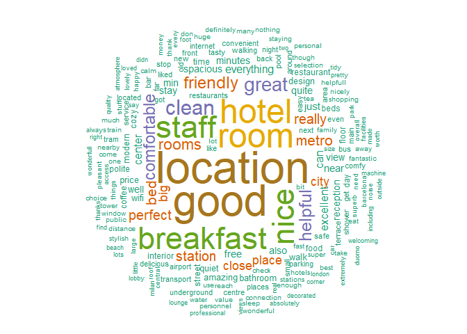
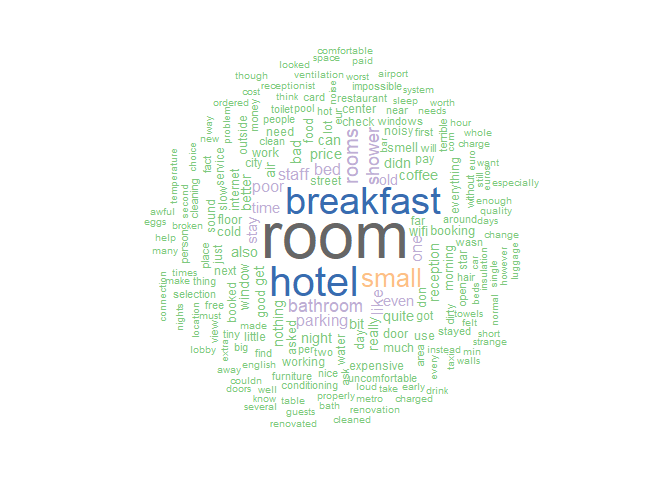

#Introduction
This projects includes data preprocessing and some vizualisations about hotels across Europe. Dataset contains 515,000 customer reviews of 1493 luxury hotels. 

#Preparations {.tabset .tabset-fade .tabset-pills}

##Loading libraries
Libraries that will be used for project:

```r
library(dplyr) 
library(ggplot2)
library(stringr)
library(tm) 
library(wordcloud) 
library(leaflet) 
library(mapview) 
library(data.table)
```

##Reading data

```r
path2 <- "C:/Users/Lukas/Desktop/R2/Hotel Reviews/Input/Hotel_Reviews.csv"
data <- fread(path2, header = TRUE, showProgress = FALSE)
```


#Exploring data{.tabset}

##Dimensions

```r
cat("Number of observations in dataset:", dim(data)[1],", number of features:", dim(data)[2])
```

Number of observations in dataset: 515738 , number of features: 17

##Structure

```r
str(data)
```

```
## Classes 'data.table' and 'data.frame':	515738 obs. of  17 variables:
##  $ Hotel_Address                             : chr  "s Gravesandestraat 55 Oost 1092 AA Amsterdam Netherlands" "s Gravesandestraat 55 Oost 1092 AA Amsterdam Netherlands" "s Gravesandestraat 55 Oost 1092 AA Amsterdam Netherlands" "s Gravesandestraat 55 Oost 1092 AA Amsterdam Netherlands" ...
##  $ Additional_Number_of_Scoring              : int  194 194 194 194 194 194 194 194 194 194 ...
##  $ Review_Date                               : chr  "8/3/2017" "8/3/2017" "7/31/2017" "7/31/2017" ...
##  $ Average_Score                             : num  7.7 7.7 7.7 7.7 7.7 7.7 7.7 7.7 7.7 7.7 ...
##  $ Hotel_Name                                : chr  "Hotel Arena" "Hotel Arena" "Hotel Arena" "Hotel Arena" ...
##  $ Reviewer_Nationality                      : chr  "Russia" "Ireland" "Australia" "United Kingdom" ...
##  $ Negative_Review                           : chr  "I am so angry that i made this post available via all possible sites i use when planing my trips so no one will"| __truncated__ "No Negative" "Rooms are nice but for elderly a bit difficult as most rooms are two story with narrow steps So ask for single "| __truncated__ "My room was dirty and I was afraid to walk barefoot on the floor which looked as if it was not cleaned in weeks"| __truncated__ ...
##  $ Review_Total_Negative_Word_Counts         : int  397 0 42 210 140 17 33 11 34 15 ...
##  $ Total_Number_of_Reviews                   : int  1403 1403 1403 1403 1403 1403 1403 1403 1403 1403 ...
##  $ Positive_Review                           : chr  "Only the park outside of the hotel was beautiful" "No real complaints the hotel was great great location surroundings rooms amenities and service Two recommendati"| __truncated__ "Location was good and staff were ok It is cute hotel the breakfast range is nice Will go back" "Great location in nice surroundings the bar and restaurant are nice and have a lovely outdoor area The building"| __truncated__ ...
##  $ Review_Total_Positive_Word_Counts         : int  11 105 21 26 8 20 18 19 0 50 ...
##  $ Total_Number_of_Reviews_Reviewer_Has_Given: int  7 7 9 1 3 1 6 1 3 1 ...
##  $ Reviewer_Score                            : num  2.9 7.5 7.1 3.8 6.7 6.7 4.6 10 6.5 7.9 ...
##  $ Tags                                      : chr  "[' Leisure trip ', ' Couple ', ' Duplex Double Room ', ' Stayed 6 nights ']" "[' Leisure trip ', ' Couple ', ' Duplex Double Room ', ' Stayed 4 nights ']" "[' Leisure trip ', ' Family with young children ', ' Duplex Double Room ', ' Stayed 3 nights ', ' Submitted fro"| __truncated__ "[' Leisure trip ', ' Solo traveler ', ' Duplex Double Room ', ' Stayed 3 nights ']" ...
##  $ days_since_review                         : chr  "0 days" "0 days" "3 days" "3 days" ...
##  $ lat                                       : num  52.4 52.4 52.4 52.4 52.4 ...
##  $ lng                                       : num  4.92 4.92 4.92 4.92 4.92 ...
##  - attr(*, ".internal.selfref")=<externalptr>
```

##Summary

```r
summary(data)
```

```
##  Hotel_Address      Additional_Number_of_Scoring Review_Date       
##  Length:515738      Min.   :   1.0               Length:515738     
##  Class :character   1st Qu.: 169.0               Class :character  
##  Mode  :character   Median : 341.0               Mode  :character  
##                     Mean   : 498.1                                 
##                     3rd Qu.: 660.0                                 
##                     Max.   :2682.0                                 
##                                                                    
##  Average_Score    Hotel_Name        Reviewer_Nationality
##  Min.   :5.200   Length:515738      Length:515738       
##  1st Qu.:8.100   Class :character   Class :character    
##  Median :8.400   Mode  :character   Mode  :character    
##  Mean   :8.397                                          
##  3rd Qu.:8.800                                          
##  Max.   :9.800                                          
##                                                         
##  Negative_Review    Review_Total_Negative_Word_Counts
##  Length:515738      Min.   :  0.00                   
##  Class :character   1st Qu.:  2.00                   
##  Mode  :character   Median :  9.00                   
##                     Mean   : 18.54                   
##                     3rd Qu.: 23.00                   
##                     Max.   :408.00                   
##                                                      
##  Total_Number_of_Reviews Positive_Review   
##  Min.   :   43           Length:515738     
##  1st Qu.: 1161           Class :character  
##  Median : 2134           Mode  :character  
##  Mean   : 2744                             
##  3rd Qu.: 3613                             
##  Max.   :16670                             
##                                            
##  Review_Total_Positive_Word_Counts
##  Min.   :  0.00                   
##  1st Qu.:  5.00                   
##  Median : 11.00                   
##  Mean   : 17.78                   
##  3rd Qu.: 22.00                   
##  Max.   :395.00                   
##                                   
##  Total_Number_of_Reviews_Reviewer_Has_Given Reviewer_Score  
##  Min.   :  1.000                            Min.   : 2.500  
##  1st Qu.:  1.000                            1st Qu.: 7.500  
##  Median :  3.000                            Median : 8.800  
##  Mean   :  7.166                            Mean   : 8.395  
##  3rd Qu.:  8.000                            3rd Qu.: 9.600  
##  Max.   :355.000                            Max.   :10.000  
##                                                             
##      Tags           days_since_review       lat             lng        
##  Length:515738      Length:515738      Min.   :41.33   Min.   :-0.370  
##  Class :character   Class :character   1st Qu.:48.22   1st Qu.:-0.143  
##  Mode  :character   Mode  :character   Median :51.50   Median : 0.011  
##                                        Mean   :49.44   Mean   : 2.824  
##                                        3rd Qu.:51.52   3rd Qu.: 4.834  
##                                        Max.   :52.40   Max.   :16.429  
##                                        NA's   :3268    NA's   :3268
```

##Missing values
Dataset contains 6536 missing values.

```r
cat("Number of missing values in dataset:",  sum(is.na(data)))
```

```
## Number of missing values in dataset: 6700
```
##

Extracting columns with missing values.

```r
missing_values <- lapply(data,function(x) sum(is.na(x)))
missing_values[missing_values>0]
```

```
## $Negative_Review
## [1] 153
## 
## $Positive_Review
## [1] 11
## 
## $lat
## [1] 3268
## 
## $lng
## [1] 3268
```

Number of hotels with missing values in latitude and longitude:

```r
table_with_missing_values <- data[which(is.na(data$lat == TRUE)), ] 
length(unique(table_with_missing_values$Hotel_Address))
```

```
## [1] 17
```

Hotel names with missing values:

```r
unique(table_with_missing_values$Hotel_Address)
```

```
##  [1] "20 Rue De La Ga t 14th arr 75014 Paris France"              
##  [2] "23 Rue Damr mont 18th arr 75018 Paris France"               
##  [3] "4 rue de la P pini re 8th arr 75008 Paris France"           
##  [4] "Bail n 4 6 Eixample 08010 Barcelona Spain"                  
##  [5] "Gr nentorgasse 30 09 Alsergrund 1090 Vienna Austria"        
##  [6] "Hasenauerstra e 12 19 D bling 1190 Vienna Austria"          
##  [7] "Josefst dter Stra e 10 12 08 Josefstadt 1080 Vienna Austria"
##  [8] "Josefst dter Stra e 22 08 Josefstadt 1080 Vienna Austria"   
##  [9] "Landstra er G rtel 5 03 Landstra e 1030 Vienna Austria"     
## [10] "Paragonstra e 1 11 Simmering 1110 Vienna Austria"           
## [11] "Pau Clar s 122 Eixample 08009 Barcelona Spain"              
## [12] "Savoyenstra e 2 16 Ottakring 1160 Vienna Austria"           
## [13] "Sep lveda 180 Eixample 08011 Barcelona Spain"               
## [14] "Sieveringer Stra e 4 19 D bling 1190 Vienna Austria"        
## [15] "Taborstra e 8 A 02 Leopoldstadt 1020 Vienna Austria"        
## [16] "W hringer Stra e 12 09 Alsergrund 1090 Vienna Austria"      
## [17] "W hringer Stra e 33 35 09 Alsergrund 1090 Vienna Austria"
```

Removing duplicates from data

```r
data <- distinct(data)
```

Filling missing values manually with cordinates from the internet

```r
data[data$Hotel_Address == "20 Rue De La Ga t 14th arr 75014 Paris France", ncol(data)] <- 2.323509
data[data$Hotel_Address == "20 Rue De La Ga t 14th arr 75014 Paris France", ncol(data)-1] <- 48.840747
data[data$Hotel_Address == "4 rue de la P pini re 8th arr 75008 Paris France", ncol(data)] <- 2.322156
data[data$Hotel_Address == "4 rue de la P pini re 8th arr 75008 Paris France", ncol(data)-1] <- 48.875382
data[data$Hotel_Address == "Gr nentorgasse 30 09 Alsergrund 1090 Vienna Austria", ncol(data)] <- 16.356793
data[data$Hotel_Address == "Gr nentorgasse 30 09 Alsergrund 1090 Vienna Austria", ncol(data)-1] <- 48.224874
data[data$Hotel_Address == "Josefst dter Stra e 10 12 08 Josefstadt 1080 Vienna Austria", ncol(data)] <- 16.353097
data[data$Hotel_Address == "Josefst dter Stra e 10 12 08 Josefstadt 1080 Vienna Austria", ncol(data)-1] <- 48.209445
data[data$Hotel_Address == "Landstra er G rtel 5 03 Landstra e 1030 Vienna Austria", ncol(data)] <- 16.393673
data[data$Hotel_Address == "Landstra er G rtel 5 03 Landstra e 1030 Vienna Austria", ncol(data)-1] <- 48.211162
data[data$Hotel_Address == "Pau Clar s 122 Eixample 08009 Barcelona Spain", ncol(data)] <- 2.170299
data[data$Hotel_Address == "Pau Clar s 122 Eixample 08009 Barcelona Spain", ncol(data)-1] <- 41.394611
data[data$Hotel_Address == "Sep lveda 180 Eixample 08011 Barcelona Spain", ncol(data)] <- 2.160687
data[data$Hotel_Address == "Sep lveda 180 Eixample 08011 Barcelona Spain", ncol(data)-1] <- 41.384845
data[data$Hotel_Address == "Taborstra e 8 A 02 Leopoldstadt 1020 Vienna Austria", ncol(data)] <- 16.414759
data[data$Hotel_Address == "Taborstra e 8 A 02 Leopoldstadt 1020 Vienna Austria", ncol(data)-1] <- 48.209254
data[data$Hotel_Address == "W hringer Stra e 33 35 09 Alsergrund 1090 Vienna Austria", ncol(data)] <- 16.356514
data[data$Hotel_Address == "W hringer Stra e 33 35 09 Alsergrund 1090 Vienna Austria", ncol(data)-1] <- 48.224946
data[data$Hotel_Address == "23 Rue Damr mont 18th arr 75018 Paris France", ncol(data)] <- 2.342705
data[data$Hotel_Address == "23 Rue Damr mont 18th arr 75018 Paris France", ncol(data)-1] <- 48.888148
data[data$Hotel_Address == "Bail n 4 6 Eixample 08010 Barcelona Spain", ncol(data)] <- 2.177693
data[data$Hotel_Address == "Bail n 4 6 Eixample 08010 Barcelona Spain", ncol(data)-1] <- 41.391972
data[data$Hotel_Address == "Hasenauerstra e 12 19 D bling 1190 Vienna Austria", ncol(data)] <- 16.345239
data[data$Hotel_Address == "Hasenauerstra e 12 19 D bling 1190 Vienna Austria", ncol(data)-1] <- 48.233705
data[data$Hotel_Address == "Josefst dter Stra e 22 08 Josefstadt 1080 Vienna Austria", ncol(data)] <- 16.351014
data[data$Hotel_Address == "Josefst dter Stra e 22 08 Josefstadt 1080 Vienna Austria", ncol(data)-1] <- 48.209659
data[data$Hotel_Address == "Paragonstra e 1 11 Simmering 1110 Vienna Austria", ncol(data)] <- 16.418367
data[data$Hotel_Address == "Paragonstra e 1 11 Simmering 1110 Vienna Austria", ncol(data)-1] <- 48.171124
data[data$Hotel_Address == "Savoyenstra e 2 16 Ottakring 1160 Vienna Austria", ncol(data)] <- 16.302941
data[data$Hotel_Address == "Savoyenstra e 2 16 Ottakring 1160 Vienna Austria", ncol(data)-1] <- 48.215164
data[data$Hotel_Address == "Sieveringer Stra e 4 19 D bling 1190 Vienna Austria", ncol(data)] <- 16.341607
data[data$Hotel_Address == "Sieveringer Stra e 4 19 D bling 1190 Vienna Austria", ncol(data)-1] <- 48.245945
data[data$Hotel_Address == "W hringer Stra e 12 09 Alsergrund 1090 Vienna Austria", ncol(data)] <- 16.359787
data[data$Hotel_Address == "W hringer Stra e 12 09 Alsergrund 1090 Vienna Austria", ncol(data)-1] <- 48.216853
```

#Data analysis
##Descriptive statistics and visualizations
Average Review Scores:

```r
data%>%select(Average_Score,Hotel_Address)%>%distinct(Average_Score,Hotel_Address)%>%
  ggplot(aes(x=Average_Score))+
  geom_histogram(color='black',fill='brown', bins=30)+xlab("Average Review Score") + ylab("Frequency") +
  scale_x_continuous(breaks = seq(5,10,0.5))
```

<!-- -->

The most frequent scores:

```r
ggplot(data = data, aes(x = data$Reviewer_Score)) +
  geom_histogram(bins = 40, fill = "palegreen4", color='black') +
  scale_x_continuous(breaks = seq(min(data$Reviewer_Score), max(data$Reviewer_Score), 0.5)) + 
  scale_y_continuous(breaks = seq(0,120000,20000)) +
  xlab("Reviewer Score") + ylab("Frequency") +
  ggtitle("Reviewer Score Frequency") +  
  theme(plot.title = element_text(hjust = 0.5))
```

<!-- -->

Nationalities of the people that wrote a review about hotel

```r
data %>% select(Reviewer_Nationality) %>% group_by(Reviewer_Nationality) %>% 
  count() %>% arrange(desc(n)) %>% head(10)
```

```
## # A tibble: 10 x 2
## # Groups:   Reviewer_Nationality [10]
##    Reviewer_Nationality          n
##    <chr>                     <int>
##  1 United Kingdom           245110
##  2 United States of America  35349
##  3 Australia                 21648
##  4 Ireland                   14814
##  5 United Arab Emirates      10229
##  6 Saudi Arabia               8940
##  7 Netherlands                8757
##  8 Switzerland                8669
##  9 Germany                    7929
## 10 Canada                     7883
```

The most reviewed hotels:

```r
data %>% select(Hotel_Name, Total_Number_of_Reviews) %>% 
  arrange(desc(Total_Number_of_Reviews)) %>% distinct() %>%
  head(10) %>% select(Hotel_Name)
```

```
##                                           Hotel_Name
## 1                                     Hotel Da Vinci
## 2               Park Plaza Westminster Bridge London
## 3                             Hotel degli Arcimboldi
## 4                                Strand Palace Hotel
## 5         Britannia International Hotel Canary Wharf
## 6                 Best Western Premier Hotel Couture
## 7                   The Student Hotel Amsterdam City
## 8                        Golden Tulip Amsterdam West
## 9  DoubleTree by Hilton Hotel London Tower of London
## 10                                       Glam Milano
```

Number of total reviews reviewer has given:

```r
data %>% select(Total_Number_of_Reviews_Reviewer_Has_Given, Reviewer_Nationality) %>%
  group_by(Total_Number_of_Reviews_Reviewer_Has_Given) %>%
  count() %>% head(10) %>%
  ggplot(., aes(Total_Number_of_Reviews_Reviewer_Has_Given, n)) +
  geom_bar(stat = "identity", fill = "blue", color='black') + ylab("Frequency") + xlab("Total number of reviews reviewer has given") +
  ggtitle("Total number of reviews") +
  scale_x_continuous(breaks = seq_len(10))
```

<!-- -->

Correlation coeficient between reviewer score and number of negative words in review:

```r
cor(data$Reviewer_Score, data$Review_Total_Negative_Word_Counts)
```

```
## [1] -0.3825523
```

Best rated hotels: (hotels that have more than 10 reviews)

```r
data %>% select(Hotel_Name, Reviewer_Score) %>% group_by(Hotel_Name) %>% 
  mutate(Daznis = n()) %>% filter(Daznis > 10) %>%
  summarize(Vertinimas = mean(Reviewer_Score)) %>%
  arrange(desc(Vertinimas)) %>% head(10)
```

```
## # A tibble: 10 x 2
##    Hotel_Name                          Vertinimas
##    <chr>                                    <dbl>
##  1 Ritz Paris                                9.72
##  2 Hotel Casa Camper                         9.72
##  3 41                                        9.71
##  4 H tel de La Tamise Esprit de France       9.69
##  5 Le Narcisse Blanc Spa                     9.67
##  6 H10 Casa Mimosa 4 Sup                     9.66
##  7 Hotel Eiffel Blomet                       9.65
##  8 Hotel The Serras                          9.62
##  9 45 Park Lane Dorchester Collection        9.60
## 10 The Soho Hotel                            9.60
```

Worst rated hotels: (hotels that have more than 10 reviews)

```r
data %>% select(Hotel_Name, Reviewer_Score) %>% group_by(Hotel_Name) %>% 
  mutate(Daznis = n()) %>% filter(Daznis > 10) %>%
  summarize(Vertinimas = mean(Reviewer_Score)) %>%
  arrange((Vertinimas)) %>% head(10)
```

```
## # A tibble: 10 x 2
##    Hotel_Name                               Vertinimas
##    <chr>                                         <dbl>
##  1 Hotel Liberty                                  5.12
##  2 Kube Hotel Ice Bar                             5.85
##  3 Villa Eugenie                                  5.86
##  4 Savoy Hotel Amsterdam                          6.01
##  5 Holiday Inn Paris Montparnasse Pasteur         6.33
##  6 Best Western Maitrise Hotel Edgware Road       6.38
##  7 Ibis Styles Milano Palmanova                   6.38
##  8 Villa Lut ce Port Royal                        6.39
##  9 Hotel Cavendish                                6.44
## 10 The Tophams Hotel                              6.48
```

Dates with the biggest number of reviews written:

```r
data %>% select(Review_Date) %>% group_by(Review_Date) %>%
  count() %>% arrange(desc(n)) %>% head(10) %>% 
  ggplot(., aes(x = Review_Date, y = n)) +
  geom_bar(stat="identity", fill = "palegreen4", color='black') + ylab("Frequency") + 
  ggtitle("Dates with the biggest review frequences") + 
  theme(axis.text.x = element_text(angle = 60, hjust = 1))
```

<!-- -->

Months with a biggest number of reviews written:

```r
month <- sapply(data$Review_Date, function(x) as.numeric(str_split(as.character(x), "/")[[1]][1]))
month %>% as.data.frame %>% 
  ggplot(., aes(.)) +
  geom_bar(fill = "lightsalmon1") + 
  scale_x_continuous(breaks = seq_len(12)) + 
  xlab("Month") + ylab("Frequency") +
  ggtitle("Review date frequency in months") + 
  theme(plot.title = element_text(hjust = 0.5))
```

<!-- -->

Most popular hotels for lithuanians and mean of of the score that was given:

```r
data %>% select(Reviewer_Nationality, Hotel_Name, Reviewer_Score) %>% 
  filter(trimws(Reviewer_Nationality) == "Lithuania") %>% 
  group_by(Hotel_Name) %>% 
  summarise(Frequency = n(), Mean = mean(Reviewer_Score)) %>%
  arrange(desc(Frequency)) %>%
  head(10)
```

```
## # A tibble: 10 x 3
##    Hotel_Name                                 Frequency  Mean
##    <chr>                                          <int> <dbl>
##  1 Hotel Da Vinci                                    19  8.26
##  2 Hotel degli Arcimboldi                            11  8.03
##  3 Idea Hotel Milano San Siro                         8  7.4 
##  4 Arion Cityhotel Vienna und Appartements            7  8.23
##  5 Starhotels Business Palace                         7  8.7 
##  6 Sunotel Central                                    7  7.21
##  7 Hotel Best Western PLUS Alfa Aeropuerto            6  7.15
##  8 Best Western Hotel St George                       5  8.42
##  9 Britannia International Hotel Canary Wharf         5  7.5 
## 10 Hotel Kavalier                                     5  8.66
```

Number of total reviews reviewer from Lithuania has given:

```r
data %>% filter(trimws(Reviewer_Nationality) == "Lithuania") %>%
  select(Total_Number_of_Reviews_Reviewer_Has_Given) %>%
  group_by(Total_Number_of_Reviews_Reviewer_Has_Given) %>% 
  count() %>% head(10) %>%
  ggplot(., aes(Total_Number_of_Reviews_Reviewer_Has_Given, n)) + 
  geom_bar(stat = "identity", fill = "palegreen4", color='green') + ylab("Frequency") + xlab("Total number of reviews reviewer from LT has given")+
  scale_x_continuous(breaks = seq_len(10))
```

<!-- -->
 
##Wordcloud 

Preparing data for wordcloud:

```r
liet <- data %>% 
  select(Reviewer_Nationality, Positive_Review, Negative_Review) %>%
  filter(trimws(Reviewer_Nationality) == "Lithuania")
liet2 <- liet[liet$Positive_Review != "No Positive" &
                liet$Negative_Review != "No Negative", ]
```

The most frequent postive words that people from LT have written in the review:

```r
pos2 <- Corpus(VectorSource(liet2$Positive_Review))
pos2 <- tm_map(pos2, content_transformer(tolower))
pos2 <- tm_map(pos2, removeNumbers)          
pos2 <- tm_map(pos2, removeWords, stopwords("en"))  
pos2 <- tm_map(pos2, stripWhitespace)
tdm <- TermDocumentMatrix(pos2)
m <- as.matrix(tdm)
v <- sort(rowSums(m), decreasing = TRUE)
d <- data.frame(word = names(v), freq = v)
wordcloud(d$word, d$freq, random.order = FALSE, rot.per = 0.3, max.words = 200, colors = brewer.pal(7, "Dark2"))
```

<!-- -->

The most frequent negative words that people from LT have written in the review:

```r
neg <- Corpus(VectorSource(liet2$Negative_Review))
neg <- tm_map(neg, content_transformer(tolower))
neg <- tm_map(neg, removeNumbers)          
neg <- tm_map(neg, removeWords, stopwords("en"))  
neg <- tm_map(neg, stripWhitespace)
tdm2 <- TermDocumentMatrix(neg)
m2 <- as.matrix(tdm2)
v2 <- sort(rowSums(m2), decreasing = TRUE)
d2 <- data.frame(word = names(v2), freq = v2)
wordcloud(d2$word, d2$freq, random.order = FALSE, rot.per = 0.3, max.words = 200, colors = brewer.pal(8, "Accent"))
```

<!-- -->

##Location of the hotels


```r
zem <- data %>% select(Hotel_Name, lat, lng, Average_Score) %>% distinct()
koor <- cbind(zem$lng, zem$lat)
c <- leaflet() %>% 
  addProviderTiles('OpenStreetMap.Mapnik') %>%
  addMarkers(data = koor,
             popup = paste0("Hotel: ", zem$Hotel_Name,
                          "<br>Average score: ", zem$Average_Score))
c
```

<!--html_preserve--><div id="htmlwidget-525d06b545e6cf16e613" style="width:672px;height:480px;" class="leaflet html-widget"></div>
<script type="application/json" data-for="htmlwidget-525d06b545e6cf16e613">{"x":{"options":{"crs":{"crsClass":"L.CRS.EPSG3857","code":null,"proj4def":null,"projectedBounds":null,"options":{}}},"calls":[{"method":"addProviderTiles","args":["OpenStreetMap.Mapnik",null,null,{"errorTileUrl":"","noWrap":false,"detectRetina":false}]},{"method":"addMarkers","args":[[52.3605759,51.4918878,51.5137335,51.5142184,48.8743481,48.88657,51.5226217,51.5014001,51.5117832,48.874707,48.8487675,51.5038632,48.9015941,51.5109945,51.5020425,51.5263854,48.8483053,48.8668564,48.8315204,48.8610265,48.8732543,48.8598229,48.8704175,51.4919588,51.5084595,51.5024348,48.8619373,48.8524215,48.8756435,48.8637135,48.8460269,51.4980052,51.5167472,51.4916378,48.8780363,51.5147387,51.5127625,51.4943077,51.5145986,51.4990259,51.5106538,48.8673199,48.8656973,48.8735418,48.8555319,48.88366,48.8789432,48.8491427,48.8734851,48.8376887,48.8699103,48.8766269,48.8661705,48.8729676,51.510843,51.4611219,51.5286766,51.495179,51.4925138,51.5254162,51.4891226,51.4956657,51.5014191,48.8848583,48.8688962,48.8494851,51.5108439,51.5209191,48.8756604,51.4925478,51.5426054,51.5426351,51.5054544,51.5188555,48.8468064,48.8427564,48.8708508,51.4936161,51.502485,48.8728324,48.871723,48.8732706,48.8761376,48.8581186,48.8725794,51.4959227,48.8405612,48.8550466,51.4945522,51.4990953,48.8687425,51.4948465,51.504716,51.4945144,51.5090985,48.8663359,48.870961,48.8865626,48.8724588,48.8715828,51.5208575,51.5119933,51.5166755,48.8489839,48.8684165,48.8685093,48.881407,48.8713699,48.8665788,48.8663444,48.8644627,51.5266618,48.8675886,48.8730823,51.5220869,48.8848292,51.5421476,51.51046,51.520378,48.8639318,48.8693409,48.8562272,48.8178079,48.8738557,48.8490691,48.8513515,51.5210085,51.5122457,51.5241386,48.8753446,51.5163841,51.517839,51.5132069,51.5109079,48.8751845,48.8493499,48.8668589,48.8686931,48.8560685,48.8438352,51.4938733,51.5131428,48.861711,51.5128032,51.4903724,48.875551,48.8531641,51.5161139,51.515632,51.4944849,51.5012329,51.5184158,51.4975621,48.8196885,51.4943935,51.520181,48.8679466,48.8532269,48.868414,48.8690596,48.8797331,48.8420669,48.8652582,48.8516619,48.8328764,48.8550236,51.5147071,51.5100362,51.5069446,51.5278465,48.8453774,51.5561548,48.853688,51.4934752,48.843707,51.5171671,48.8654874,48.8542681,48.8728351,51.5150534,48.8795369,48.8726335,48.8705741,51.4930905,51.4946905,48.8793427,51.5019097,48.8870573,48.8864673,48.8871283,51.5265189,51.4968406,51.4999683,48.8713239,48.8585193,48.8315962,51.5215257,48.871309,48.8720593,48.8644382,48.838484,48.8908018,48.8535089,51.5015721,51.4778583,51.5241452,48.8746128,48.8750848,51.520943,51.4954976,51.4913737,48.8555664,51.529257,48.8663208,48.8678432,48.8691686,48.8803752,48.8709627,51.4948059,51.5032524,48.8237487,51.5143624,51.4907493,51.5144381,48.8710605,48.8605125,51.583236,51.5122429,48.845743,48.8690198,48.8478399,48.8713421,48.8592264,48.8382943,48.8603483,48.8722588,48.8717649,51.5001979,51.5172398,51.4950098,51.5027022,51.5244224,48.8721062,51.5203469,51.5056956,51.511521,48.8448902,48.8475112,51.49398,51.498905,51.5191009,48.8637503,48.8442949,48.8349272,48.8722884,48.8690126,48.8814056,48.857898,48.8327729,48.8821595,48.8704371,48.8732231,48.8453785,48.8503901,48.8516148,48.8708391,51.507374,51.5059334,51.5458476,51.5141842,51.5150522,51.5243286,51.5054185,51.521759,48.8397623,51.4973203,51.5051507,51.5139275,51.4915712,51.5101401,48.8389823,48.8473459,48.840747,48.8503074,48.8548641,48.8735736,51.5084036,51.5116049,51.4948507,48.8642689,48.8412131,48.8393229,48.8747153,51.4944875,48.8823398,51.5205441,51.5094835,48.8794843,48.8493082,48.8737702,48.8655293,48.8363819,51.5079153,48.8756508,48.8452789,48.8886969,48.8757155,48.8649306,48.8519215,51.5218066,51.4993927,48.8823111,48.8554268,51.5072713,51.5055513,51.5161911,48.8692566,48.8681455,48.8538752,48.8518584,48.8721692,51.512257,48.8658792,51.519016,51.5195688,51.4992791,51.5199224,48.8653685,48.8606187,51.5124655,51.525535,48.888148,48.8731996,48.8717146,51.5215508,48.8396623,41.3882234,51.4942539,51.5203266,51.4960283,51.5139298,48.8689307,48.8754371,48.8768854,48.8730437,48.87096,48.8309896,48.8661932,48.830196,51.4931086,48.8565778,48.8827492,48.871859,48.8671889,51.5173303,48.8399018,51.4916677,51.5134603,51.5117907,51.4930097,51.5043483,51.4928147,48.8782679,51.5135555,41.3961448,51.514839,48.8969854,51.4998574,51.4957436,48.8562725,48.8775326,48.8661991,51.4988817,51.4917798,51.5207945,48.8615843,48.8485387,48.853865,48.8718321,48.8553486,48.880856,51.4801631,52.3743712,48.8654726,48.8753837,51.507746,48.8503493,48.8713619,48.8528364,51.5138357,51.519032,48.8802782,48.8430523,48.866435,48.8852794,48.8542454,48.878932,48.851589,48.8601927,48.8657394,48.8567042,48.8700325,48.8565421,48.884165,48.8756618,48.8661363,48.8869128,51.5189182,51.5142054,48.8715469,51.4922348,51.5404555,51.4932356,51.5129736,51.5156471,51.5186801,48.8691984,48.8752553,48.8715079,48.8703672,48.8335233,51.5289499,51.4981225,51.5189077,51.509963,48.8687512,51.5151247,48.8629329,48.8712877,51.5044972,48.849147,48.855263,48.8645647,51.4938468,51.5090558,48.8740463,48.8430891,48.869143,51.4978466,48.8450894,48.8710402,51.4892447,48.8682978,48.8547329,48.8694755,48.8354314,51.5373904,51.5273442,51.511879,51.5197933,51.4920287,48.8920485,51.4703604,51.5162883,48.8535639,48.8814425,48.8825781,48.8716831,48.8502052,51.521148,51.490724,48.8593152,51.5076899,51.4919083,48.8613055,48.872174,48.8737043,48.8651994,48.8794682,51.5055381,51.5146025,51.4815995,51.5126488,48.8268251,51.5149583,48.879314,48.8632723,48.8811741,48.8777895,48.8708863,51.5743549,48.8547161,48.8756359,51.4911924,51.522143,48.8684243,51.5110993,48.8719889,48.8691758,51.4967399,51.5196124,51.5139692,51.5226361,48.8683133,48.8772093,51.4981471,51.5101462,51.4935083,48.827388,48.8553117,51.5139315,51.514573,51.5210117,51.5139805,48.8759461,48.8742767,48.8648656,48.8694695,48.8723844,48.8528427,48.8749511,48.875382,48.8630829,48.8730552,48.8654532,48.8745879,48.8675674,48.8743885,51.5172825,51.5011704,48.8585626,48.8381079,48.8346811,48.8687804,51.510237,51.4937409,51.5125035,51.5126758,51.4986732,48.8686434,48.8683593,48.8491801,51.4981471,51.515755,51.4958184,48.8799239,48.8488044,48.8800565,51.531979,51.5206309,48.8644967,48.8740668,51.5553678,48.8471891,48.8732068,48.8496819,51.4202661,51.510574,48.8570275,48.8488608,51.5237209,51.5063709,51.5115509,48.8777621,51.5104696,48.8710709,51.5050165,48.8760884,51.5066991,51.5180207,48.8607764,51.5231564,51.5161286,48.8691399,51.5182768,48.8753359,48.8691325,51.5127453,48.8565629,48.8662695,48.8816306,48.8583127,51.5154006,51.5060237,51.5065578,51.504575,51.5611271,48.8497618,48.8801757,48.8722019,48.8688155,48.8636049,48.8729639,48.8701247,48.8589516,48.8684776,48.8758981,48.8547869,48.870808,48.8645309,51.5140208,51.5174853,51.5159214,51.5124496,48.866242,48.8481917,48.8769204,51.5131074,48.8659899,48.8699731,48.8966167,51.4572991,51.5123968,51.5208155,48.8691409,48.8364204,48.8303023,51.5366053,51.5054832,51.5074007,48.8571207,51.5360906,51.4963008,48.8689468,48.8520377,51.5152892,51.5045326,48.8673099,51.5153672,48.8819068,48.8447938,51.5140329,48.8648997,51.516843,51.5039399,51.5133832,48.8680055,48.8566336,48.865467,48.8729666,48.8370334,51.5143447,51.4982412,51.5241373,48.8732785,48.8457587,48.8750119,48.8714152,48.8854538,48.870994,48.8396395,48.8759855,48.8716017,48.8820046,48.883631,48.8797513,48.8382542,48.8498439,45.488764,51.5076044,51.5017224,51.5322508,48.8741002,51.4956883,51.5160988,48.8500283,48.8465653,48.8735135,48.8599998,51.4924184,51.527262,48.8672474,51.5634756,48.8706373,48.850448,48.849574,48.8612535,51.5121957,48.8820838,48.8534026,48.888539,51.5158643,51.5022081,48.8823141,51.4953691,48.8836255,51.5100916,48.8330649,51.4942654,51.4948416,48.8550298,51.5061587,51.5160484,51.5021027,48.8732788,48.8708419,48.8482842,51.5127964,51.5196913,51.5108412,48.8501522,48.8671391,48.8746066,48.8723438,48.8515198,48.8772493,48.863828,48.8503276,48.8701887,48.886687,48.8808779,51.5077198,48.8711365,51.5052587,48.8536854,51.4944319,48.8605219,51.5220522,51.5157316,51.5166887,48.8719212,48.8416787,48.8382916,48.8595985,51.4947754,48.8506499,51.5188,51.5151149,51.5052188,48.8605031,51.513055,48.8321231,48.8546989,51.506935,51.506935,51.5095259,48.8607299,48.8668228,48.8668048,48.8698184,48.8597024,48.8573706,48.8728492,48.8657687,48.866676,48.8785454,51.4901051,51.5265353,48.8794646,51.5255136,51.5077459,51.5460628,51.5195857,48.8647019,51.4926269,48.8636168,48.8384558,51.522672,51.509841,48.8427364,48.8622723,48.8663089,51.4992789,51.4933372,48.8776756,48.8738672,51.4910062,51.517608,48.8519208,51.4940285,48.8794223,48.8796596,48.8696173,48.8795947,48.8726814,48.8497553,48.8816073,48.8538608,48.853299,48.8454447,48.8438998,48.849758,51.5112451,48.846837,48.8474426,48.8724945,51.5201065,48.8603599,48.8710895,48.8803479,51.4942305,51.5179725,48.874853,48.8672694,48.8252307,48.8694768,48.8837472,51.5298597,52.3544507,51.5131979,52.3466449,48.2264063,45.4521067,48.1996129,48.2105243,48.2062268,41.378751,52.3663466,41.4031654,52.3607413,48.2040859,48.204183,52.3504558,52.350396,52.351381,52.3486098,41.3846637,52.3312406,41.3873478,41.3880549,52.3856494,48.2134246,48.2083518,41.3919114,41.393227,41.4109715,41.4038774,41.4036219,41.3899609,41.3944029,41.3941338,41.388682,41.3933943,41.3835246,41.3860183,41.3837583,41.4110056,41.3747031,41.39367,41.3725246,41.3795572,41.3810311,41.3815028,41.3844072,41.391058,41.4106944,41.3849613,41.3935591,41.375237,41.3807517,41.391972,41.408641,41.3917169,41.392095,41.3938632,51.4997486,48.191373,51.5294411,52.3677568,41.3893478,41.3865289,41.3858891,41.386136,41.4337561,51.5179659,48.2216779,51.5144418,41.3812223,41.3846844,48.2035677,51.4689559,51.5144004,51.498861,48.204576,41.3986093,41.3944574,51.4973568,41.3802469,41.37913,41.3283758,41.3948175,41.384829,41.3904305,51.5222472,41.3777977,51.5291423,51.5101556,41.3929366,41.4253332,41.3961021,51.474469,52.3696719,51.4756558,48.2058584,41.3859873,41.3895237,41.4006653,41.376801,51.5110114,51.5241248,41.3930406,45.4758842,45.4794406,45.4858877,45.4682358,45.473348,45.4580781,45.4572218,45.4529643,45.4642651,45.4769923,45.46676,45.4656023,45.4848809,45.4867005,41.4126508,41.3885274,52.3727067,52.377278,52.373704,52.3735266,48.2133296,52.3351951,52.314371,52.3511137,41.3827,48.2114567,41.4061636,52.3511447,41.3861153,41.3897945,41.3908486,41.3888014,52.3923684,41.4002812,41.3959587,48.231911,48.2078955,41.3781685,52.36513,52.364962,41.3832414,51.5590955,48.2273013,41.392018,41.391843,51.603207,41.4014399,52.333803,51.5267769,51.507377,48.2051299,48.1949694,48.1983543,52.3497431,52.3487635,48.1513676,52.3451511,48.2114087,48.1975497,48.2565936,51.481663,45.4644348,52.3357326,51.5179386,48.200561,41.3991773,48.224874,41.3732462,41.3841429,41.3927101,41.3915897,41.3831641,41.3842608,41.3891168,41.390913,41.391362,41.3901396,41.3916258,41.392344,41.3935967,51.514879,48.1825159,48.2196722,51.511579,48.1791893,41.4017465,48.1629737,48.2082256,48.2112491,51.5064607,51.5064534,51.4988977,51.504439,48.2140659,51.5213303,48.2199427,48.233705,52.357655,52.3718665,52.369391,52.3653868,52.364768,48.2195864,48.2238463,48.2097958,48.2101211,48.1667886,48.1866506,48.1877942,48.1585332,52.3560923,48.1640345,51.5051084,48.2152663,52.3101182,52.3096835,51.50303,52.3588806,52.3846059,51.475172,41.3835584,52.3595919,52.3599196,41.3830582,41.3862689,52.335182,48.1537005,48.2145071,48.2019865,52.3417894,48.2085627,48.209445,48.209659,41.4114188,48.2105156,48.2024907,48.2012505,48.2017091,48.2021105,48.2057193,48.2044655,48.2062103,48.1824271,52.3047669,52.377955,52.3763099,52.3758754,52.3654686,51.531427,51.480672,48.2031622,48.2047761,48.2185837,52.3542655,41.3827894,41.3834673,41.3843222,41.3780983,51.5576962,51.5119446,51.5120219,51.5119446,48.211162,48.1964001,48.1923791,48.2038688,48.2075294,45.4630685,45.4738012,41.3842838,52.3793659,52.363889,41.4101934,48.2064745,48.210285,52.3591467,48.1940487,41.3957584,41.4082054,51.5016102,41.406146,41.4006708,41.3897735,41.3900104,51.4993652,41.3861283,41.3792053,41.3890578,41.3894195,41.3910621,41.3931918,41.3945074,41.3962658,51.5165165,51.6068054,41.39038,48.1868107,48.1935593,48.1899743,48.1965878,48.2008957,48.2002872,48.1990335,48.1979979,41.3982129,41.3865424,48.1945297,48.1756283,52.385601,41.371308,48.19183,41.3936071,41.3985449,41.4034965,52.3872884,52.4001813,52.3711037,48.1995177,48.2006001,48.251195,41.383515,52.3678779,52.3681919,52.3741426,52.3754926,52.3760456,51.5104624,52.3611852,41.3780229,41.3825777,41.384591,51.5050355,51.5083719,51.511174,52.376752,48.2026449,48.2149414,52.3375677,52.3702613,52.370835,52.3840358,41.3727844,41.3971434,41.3969273,52.3714428,48.2000165,48.171124,41.3747873,51.5082019,48.2056333,48.2050967,41.3815625,41.3918805,41.3935497,41.3939082,41.4023621,41.4037972,41.4101306,41.3798658,41.3801815,41.3907208,41.391393,41.3980162,41.3930168,41.3935179,41.3946775,41.3866227,41.3775577,41.4084334,48.2217697,41.394611,41.3944848,41.3962106,41.3856387,41.3856173,48.1979514,51.520171,48.2097026,48.2038793,45.4793852,45.479888,45.4790357,45.4838504,45.4857027,45.4638223,45.4844028,45.4834133,45.4608547,45.4805847,45.4852549,45.4845143,45.4747809,45.4868745,45.453152,45.498503,51.5092876,52.3781016,41.3830117,41.3810421,41.4111652,41.3799929,41.368437,41.3892128,48.8639788,48.8719697,41.3703041,41.3861459,41.3750293,41.3798964,51.5357597,51.517876,51.5135929,48.212857,52.3744149,52.377743,52.3764175,52.3728353,52.364971,52.3678368,52.3648077,52.3419432,52.3600068,41.4052324,41.3919083,52.3154533,41.4072812,41.3941625,41.3894654,41.3875467,41.3922919,41.3790126,41.3837453,41.3989322,48.2133054,48.2508693,48.1776236,41.3896916,52.3664077,52.3657092,52.3657281,48.1955998,48.1954348,48.1950444,48.1854312,51.5013149,48.2071576,48.1978409,41.380939,48.2027296,52.3527675,52.3617577,41.3907821,41.393599,41.3905166,41.3909816,41.3910786,41.3759896,41.3895263,41.3885658,41.3869565,48.2163343,41.4226648,41.3949242,41.3962468,41.4047382,41.3920254,48.2176776,48.2178332,48.2102677,51.5083537,48.2138096,52.3702469,41.385817,41.3832498,41.3976233,41.3799209,41.3854716,41.3949199,52.3617751,48.215164,51.499046,48.184732,48.1925582,52.2924567,48.191339,48.2048494,48.2155236,48.2163149,48.2146623,48.2022415,48.2017277,48.2022742,48.2082215,48.2080479,48.2111522,41.384845,48.245945,45.4651371,48.1790835,52.3705447,48.2078727,51.4927325,52.3786823,48.1915401,48.1829645,48.1834787,51.5007324,51.519616,52.3924898,52.3727871,52.3697554,51.5059087,51.5064721,52.3681299,52.362514,52.3613814,52.3630682,48.2082385,48.2087646,51.5111922,51.5078943,48.2107358,48.2142766,48.209254,51.508236,48.2121772,51.5731061,51.4991134,48.2130607,41.3812574,48.1966396,48.2110845,41.3999934,41.388024,41.38793,52.358631,52.3266672,45.4828787,45.4608604,45.4694772,45.4501306,41.3961294,45.461177,45.466598,45.4693349,45.459485,45.4661781,45.4667717,45.4684251,45.4595203,45.4405621,45.4689376,45.49952,45.4708973,45.4836517,45.4845769,45.480515,45.4841371,45.4868744,45.4726942,45.4787357,45.4911829,45.4524879,45.4897688,45.4858877,45.4802503,45.4720654,45.4794587,45.4851889,45.469339,45.443791,45.484237,45.51152,45.4859983,45.5099969,45.465957,45.451873,45.4408963,41.3833541,41.3849695,41.3860521,41.3870479,41.3822909,45.4776167,45.4777623,45.4580137,45.443502,45.4436132,45.5161671,45.5005657,45.4862032,45.4684949,45.4909585,45.4739801,45.4699058,45.470532,45.4792738,45.4813423,45.4633289,45.4481878,45.4606597,45.4814923,45.4896727,45.482442,45.4559784,45.4788051,45.4622972,45.4984161,45.4826692,45.4830211,45.4802415,45.5045259,45.4782808,45.463135,45.43784,45.4565757,45.4837173,45.4701334,45.4881471,45.5138582,45.4589731,45.4829817,45.4670579,45.465237,45.4655368,45.467298,45.4672309,45.4630441,45.4657568,45.4574655,45.470238,45.4714062,45.4691663,45.5331372,45.4648822,45.4657842,45.463579,45.4779041,45.501946,45.4769167,45.4851799,45.4709657,45.4654912,45.4510425,45.488764,45.5000245,45.5147974,45.500667,45.4611287,45.4853717,45.4847398,45.4635445,45.4510397,45.4508673,45.4947129,45.494861,45.4921089,45.5266395,45.4471408,45.4472099,45.4872511,45.480968,45.502453,45.50054,45.4725167,45.4736557,45.5257221,45.506502,45.4770906,52.3663727,52.365823,41.3766732,41.4047934,41.3853781,48.2307014,52.3625662,48.216853,48.224946,48.2340799,48.2353789,48.2390022,48.231915,48.1919288,48.1941905,48.1945774,48.2072348,52.3583821,51.5403942,51.5084195,51.5009609,51.4242413,52.3594783,51.509133,51.5045583,52.3546649,48.1877258,48.1953229,48.1974036,48.1935235,48.2104468,51.5020912,51.499981,48.2037451],[4.9159683,-0.1949706,-0.1087512,-0.1809032,2.2897334,2.3588332,-0.1251602,-0.1160092,-0.1194172,2.2936761,2.3410376,-0.1504132,2.3597783,-0.1863417,-0.1866541,-0.1136042,2.3425596,2.3286339,2.3870797,2.3788974,2.343239,2.347111,2.3296832,-0.2200956,-0.1311382,-0.0002497,2.3040298,2.3743832,2.2938788,2.2934759,2.2788281,-0.1643238,-0.135965,-0.1832833,2.2864907,-0.1341108,-0.0997157,-0.1755579,-0.1270336,-0.1427453,-0.0773676,2.3656296,2.2829776,2.302442,2.3621212,2.3313845,2.3448623,2.3397118,2.3485111,2.3063102,2.2973386,2.3432886,2.331561,2.3081178,-0.1314287,-0.2756216,-0.1283489,-0.183827,-0.1787917,-0.0772849,-0.1205639,-0.1452793,-0.1625805,2.2997023,2.2827459,2.2955063,-0.1839074,-0.1566567,2.3252075,-0.1780611,-0.0072708,-0.0073272,-0.2262216,-0.1319172,2.3714789,2.3305636,2.3515882,-0.1592347,-0.1539265,2.3193886,2.3235377,2.3450746,2.3572681,2.3529369,2.3075779,-0.1702917,2.2991035,2.304583,-0.1861213,-0.1132136,2.3541761,-0.1187481,-0.1475618,-0.1866172,-0.0157302,2.2867935,2.3267678,2.3329648,2.3378004,2.3224853,-0.0779503,-0.1782794,-0.0697897,2.348383,2.336869,2.3067895,2.3274204,2.3181191,2.3084447,2.2881979,2.3318473,-0.1296571,2.3531018,2.309659,-0.1082443,2.3035189,-0.1703073,-0.1875844,-0.1303414,2.3658744,2.3310263,2.3351758,2.3293636,2.3444232,2.3697484,2.3375084,-0.1230966,-0.0757326,-0.1380807,2.3167161,-0.1635764,-0.1424476,-0.1807816,-0.1238221,2.3013214,2.3430569,2.3028215,2.325211,2.3236846,2.3280708,-0.1824963,-0.1576714,2.340674,-0.07586,-0.1459218,2.2835191,2.3344097,-0.1749521,-0.175737,-0.1884174,-0.1859937,-0.1348509,-0.145551,2.3263505,-0.1750169,-0.1256957,2.3289593,2.3457159,2.3213247,2.2971078,2.3206003,2.3304091,2.3329632,2.2979395,2.3572531,2.3350786,-0.1578291,-0.190657,-0.1415776,-0.0889473,2.3256427,-0.2141824,2.3322667,-0.2153256,2.3155631,-0.1290534,2.3348924,2.3078116,2.3362507,-0.1739974,2.3202966,2.3048084,2.3264194,-0.1755022,-0.1910197,2.3577745,-0.0232208,2.3143297,2.2948911,2.314205,-0.1303689,-0.1675498,-0.1599927,2.2937849,2.3077243,2.3399796,-0.1533039,2.3277079,2.3236802,2.3359148,2.3150904,2.3380204,2.3425787,-0.1628511,-0.0137463,-0.1609907,2.3056956,2.3048372,-0.1004581,-0.1893691,-0.1214194,2.2926243,-0.168358,2.3450399,2.3033075,2.3337818,2.319591,2.3154141,-0.1926525,-0.078179,2.324056,-0.1394483,-0.1934627,-0.1558337,2.2933537,2.3106533,-0.216868,-0.1045036,2.34493,2.2891278,2.342254,2.3280723,2.340996,2.3210421,2.3440535,2.3257608,2.2983855,-0.1795357,-0.1220324,-0.1906195,-0.1882164,-0.0764614,2.3451384,-0.1260893,-0.101525,-0.290706,2.252833,2.3022198,-0.143372,-0.1339093,-0.1592,2.3320406,2.3730938,2.3295913,2.3090359,2.3368708,2.3282568,2.3571978,2.2787597,2.3367444,2.329236,2.3436097,2.3753036,2.3422527,2.3381293,2.3303651,-0.129135,-0.1489418,-0.0554113,-0.3192925,-0.159239,-0.1846623,-0.1241499,-0.1425381,2.3235324,-0.1562558,-0.1004724,-0.1271506,-0.1963192,-0.1968951,2.3455528,2.2832408,2.323509,2.3450612,2.2923181,2.335965,-0.1067988,-0.1383145,-0.1945544,2.3308179,2.3302954,2.3892274,2.2906388,-0.2070605,2.3364764,-0.1308091,-0.1362538,2.3556545,2.2743626,2.3201063,2.3360102,2.2897793,-0.2730145,2.3041568,2.342295,2.3945403,2.3038781,2.3290844,2.3839993,-0.0856081,-0.1329128,2.3132374,2.4152555,-0.0211213,-0.1501698,-0.1579487,2.3339369,2.3313064,2.3366123,2.3447798,2.3262681,-0.2034244,2.3298903,-0.166267,-0.170521,-0.1973593,-0.2116636,2.328218,2.344401,-0.182274,-0.1180354,2.342705,2.3425446,2.3261812,-0.0469238,2.3300582,2.1644551,-0.1414756,-0.1245891,-0.1686355,-0.101126,2.2974503,2.3434586,2.3270623,2.3161144,2.3091617,2.3297301,2.3042141,2.3529539,-0.190208,2.3319767,2.2982782,2.2978177,2.326927,-0.1180966,2.3031011,-0.1947475,-0.1833081,-0.306071,-0.159715,-0.0334436,-0.1841753,2.294852,-0.180002,2.1631674,-0.1586656,2.3852745,-0.161717,-0.1477528,2.3660412,2.293458,2.3328826,-0.1062888,-0.1616049,-0.1310845,2.3620652,2.3479852,2.3072019,2.3278866,2.3340736,2.3375085,-0.0097201,4.8746196,2.3292934,2.2944651,-0.1422993,2.3344305,2.3426375,2.3440803,-0.1797976,-0.1825943,2.2843852,2.3422519,2.3251076,2.3301021,2.339956,2.3394182,2.2777274,2.318423,2.3274415,2.3277805,2.3112736,2.3303504,2.3328261,2.2863468,2.3260648,2.3004034,-0.0866009,-0.1766098,2.3439622,-0.1914229,-0.1460833,-0.1269082,-0.1837431,-0.1572443,-0.1354055,2.2979052,2.286653,2.3122259,2.2938868,2.3191194,-0.1232979,-0.1799693,-0.1421957,-0.129797,2.3001692,-0.1600656,2.3723823,2.3191903,-0.0855562,2.3471935,2.3305901,2.2821827,-0.1917582,-0.1421661,2.300196,2.4049867,2.3006526,-0.164156,2.3209503,2.3248014,-0.1803196,2.3268027,2.3395277,2.3046954,2.321142,-0.0023367,-0.0796152,-0.118552,-0.1241844,-0.1917801,2.3023791,-0.1779869,-0.1721078,2.3360169,2.3235592,2.3334805,2.3123759,2.289043,-0.171346,-0.143868,2.3104179,-0.1471358,-0.1684398,2.2862823,2.328075,2.3061477,2.3045076,2.3334957,-0.1396885,-0.1481978,-0.1481053,-0.1803795,2.2912033,-0.0823869,2.3560185,2.352691,2.2948337,2.2872498,2.3382128,-0.0977567,2.306642,2.3004967,-0.1449474,-0.153385,2.3036244,-0.1208673,2.3492913,2.3205807,-0.2064723,-0.1239628,-0.1828202,-0.1602871,2.3330851,2.2968266,-0.1436492,-0.1315061,-0.1834346,2.305478,2.3254628,-0.1219893,-0.15666,-0.2628618,-0.1337948,2.3270955,2.3426276,2.3295756,2.3208564,2.3088663,2.3422256,2.3259532,2.322156,2.3378592,2.3540112,2.3295231,2.3188143,2.3539896,2.2980915,-0.0812451,-0.0232607,2.3299138,2.318669,2.3255098,2.3610196,-0.0764428,-0.244896,-0.1477438,-0.1867828,-0.1376867,2.2984054,2.3002117,2.3423357,-0.1436492,-0.1603335,-0.1813958,2.3288332,2.3469889,2.3342353,-0.061598,-0.0915341,2.3405415,2.3502172,-0.2864945,2.3260138,2.3239015,2.3402806,-0.211268,-0.1509951,2.3170282,2.3315257,-0.0806178,-0.1515359,-0.0714919,2.293177,-0.1265824,2.3013119,-0.1049831,2.3456465,-0.0280208,-0.1500567,2.3427564,-0.1035134,-0.0624458,2.2981024,-0.1583511,2.3414617,2.3021659,-0.1926437,2.3273623,2.3668616,2.2992146,2.2795075,-0.0572364,-0.151078,-0.004514,-0.082675,-0.2787261,2.3392336,2.2859534,2.3030866,2.3305236,2.3688352,2.3444899,2.311141,2.3670407,2.3298238,2.3590504,2.3084819,2.3372737,2.3315532,-0.0854919,-0.1372109,-0.1598794,-0.1795215,2.3373169,2.3490316,2.3069132,-0.1778707,2.3674149,2.2909401,2.3434843,-0.2055425,-0.186124,-0.0915319,2.3031503,2.3603332,2.2842872,-0.1919832,-0.0951196,-0.1524593,2.3805581,-0.1048176,-0.1796853,2.3026559,2.3557092,-0.160898,-0.2191174,2.2856528,-0.1783271,2.3410005,2.3524462,-0.1320651,2.3469433,-0.1495574,-0.2244232,-0.1926617,2.3260075,2.2852607,2.3038811,2.2926226,2.372322,-0.1318157,-0.1134715,-0.0786983,2.3004174,2.3243071,2.3416769,2.3239679,2.3335809,2.3235329,2.2663056,2.293938,2.3349768,2.2818538,2.3257643,2.2919634,2.2903494,2.3244253,9.183057,-0.132266,-0.1846243,-0.1095714,2.3426357,-0.1827878,-0.1181749,2.2834126,2.4102405,2.3217457,2.3087425,-0.2784701,-0.282992,2.33738,-0.2042758,2.2982095,2.2928845,2.3798518,2.3426256,-0.1318384,2.3315849,2.3299043,2.3498459,-0.1200625,-0.1599428,2.3316688,-0.1818966,2.3340538,-0.1359431,2.2879617,-0.1366026,-0.1772056,2.3332104,-0.1402803,-0.0880181,-0.187901,2.3466576,2.3605864,2.3657251,-0.0847973,-0.1254243,-0.0780581,2.3392782,2.3038447,2.3167195,2.3033378,2.3486511,2.3543043,2.3519345,2.2982022,2.2997281,2.3449332,2.2989756,0.0229805,2.3050482,-0.099176,2.3805796,-0.1363756,2.3680239,-0.132414,-0.1802179,-0.1706147,2.2971404,2.3022862,2.3230188,2.3088076,-0.177789,2.2750873,-0.153839,-0.1743857,-0.088166,2.3006606,-0.152257,2.3536172,2.3691899,-0.126012,-0.126012,-0.1967234,2.3465326,2.3257729,2.3039465,2.3208729,2.3239701,2.3314669,2.3073663,2.3090386,2.3089908,2.3384866,-0.1381355,-0.1361682,2.2849548,-0.082927,-0.1378733,-0.0700817,-0.1584803,2.2886425,-0.2288598,2.3607998,2.3805885,-0.1036841,-0.1552193,2.3672171,2.3495707,2.289609,-0.2090733,-0.1788931,2.3493159,2.3005894,-0.1717691,-0.1276253,2.338878,-0.1910497,2.2957628,2.3209155,2.3346428,2.3280695,2.3020866,2.3467616,2.3371648,2.3429487,2.337993,2.3242814,2.3294858,2.3095213,-0.1808938,2.3258066,2.3223783,2.3091549,-0.1221393,2.3230778,2.3393461,2.2858242,-0.1851141,-0.1280495,2.3245798,2.2878666,2.3569005,2.3515065,2.3186342,-0.1444623,4.8875036,-0.1174504,4.8310984,16.3600628,9.1758135,16.3773546,16.3683592,16.3833767,2.17873,4.8985764,2.1231637,4.8695315,16.3725046,16.3726664,4.8770194,4.8756404,4.872723,4.8844292,2.1740902,4.8774466,2.1603987,2.1599602,4.834443,16.3831309,16.354532,2.1765438,2.1927427,2.2186535,2.1911894,2.1902808,2.135684,2.150194,2.1489569,2.1316368,2.1461315,2.1096141,2.19473,2.1846933,2.1866009,2.1707106,2.1115418,2.1540788,2.1425457,2.1455516,2.1449138,2.1514584,2.141706,2.136294,2.1756666,2.1993915,2.1684058,2.1772425,2.177693,2.1478143,2.1592614,2.158493,2.1568039,-0.1615242,16.4082294,-0.1233745,4.8682174,2.1209755,2.1682919,2.1681652,2.1682914,2.147327,-0.1234343,16.3567111,-0.146432,2.1739622,2.1791065,16.356445,-0.1787256,-0.1565506,-0.1374897,16.3563661,2.1625037,2.1564353,-0.1576728,2.1541149,2.1561186,2.1129638,2.1434702,2.1751277,2.1262314,-0.1426128,2.1135971,-0.1372782,-0.1496314,2.1653954,2.1211028,2.1794688,-0.019428,4.8614475,-0.1813888,16.3766545,2.1514021,2.1490307,2.1787089,2.1460443,-0.0771251,-0.1258066,2.1545393,9.205791,9.2096756,9.2042827,9.2073799,9.1910733,9.1924205,9.1937008,9.1962217,9.1960569,9.1844899,9.194293,9.1778675,9.1596461,9.1575137,2.2090895,2.1360471,4.8943658,4.897818,4.893591,4.8933041,16.3471399,4.8885354,4.9388064,4.8411629,2.1791999,16.3738677,2.2008956,4.8740764,2.1611899,2.1660575,2.1680745,2.1653738,4.9110442,2.1297427,2.2008981,16.4129493,16.3701084,2.1786627,4.8729422,4.873495,2.1685298,-0.284704,16.4001791,2.157066,2.156844,0.010607,2.2100745,4.8884708,-0.1324905,0.038657,16.369036,16.3692624,16.3375246,4.8911908,4.8938829,16.4064709,4.9252372,16.3746469,16.3686397,16.4031426,-0.1909565,9.1952727,4.8743947,-0.1529794,16.3647063,2.1656134,16.356793,2.1474351,2.1616896,2.1722139,2.1720108,2.1604736,2.1609471,2.1671986,2.1706981,2.1700953,2.1696699,2.1716378,2.1729157,2.1742718,-0.1606501,16.3322428,16.3863588,-0.1500193,16.3625367,2.1477365,16.3404024,16.3684123,16.3776519,-0.1454198,-0.1456146,-0.1562015,-0.149911,16.4217627,-0.2915052,16.3598984,16.345239,4.844576,4.8873794,4.8871721,4.8931979,4.896945,16.3255339,16.3138357,16.3658705,16.3655537,16.344908,16.3023375,16.2727214,16.3451115,4.8858229,16.3216061,-0.213266,16.376103,4.9472918,4.9422614,-0.15242,4.9886041,4.8941866,-0.1870629,2.178311,4.8801587,4.8810128,2.1778267,2.1291786,4.9138688,16.2825822,16.2845042,16.3789934,4.824952,16.3541687,16.353097,16.351014,2.211756,16.3760717,16.3702656,16.3731255,16.3710205,16.3720841,16.3710878,16.3702399,16.3710387,16.3808291,4.9476868,4.894641,4.8862701,4.8859642,4.8798713,-0.126133,-0.0071375,16.3561999,16.3512515,16.3881339,4.8664365,2.1715636,2.1712016,2.1712893,2.1762005,-0.2835263,-0.179939,-0.1762414,-0.179939,16.393673,16.3958668,16.3994512,16.3887039,16.3525967,9.1979367,9.2239702,2.1707092,4.8457179,4.881302,2.1695574,16.3546297,16.373579,4.9263601,16.2971831,2.1822402,2.2124626,-0.1191545,2.2008636,2.2087844,2.1419762,2.1422396,-0.1576613,2.1745291,2.1427989,2.1565948,2.1564886,2.1593373,2.16152,2.1632659,2.1662153,-0.1509735,0.0590416,2.121,16.3440157,16.3616098,16.3567007,16.3413729,16.3592496,16.3547746,16.3525051,16.3483314,2.1494179,2.1969665,16.340327,16.4200957,4.8470597,2.181698,16.3770876,2.1504611,2.1438237,2.1370426,4.8349748,4.8936653,4.8936787,16.3388225,16.3386333,16.2989165,2.1407396,4.8948936,4.8957609,4.8907741,4.8929878,4.8943917,-0.0795502,4.8936341,2.1730782,2.1400103,2.1378107,-0.1500864,0.0355768,-0.1349904,4.904618,16.3671054,16.3365285,4.8178172,4.9032489,4.895403,4.9028572,2.1721134,2.1921947,2.192267,4.9346331,16.3641802,16.418367,2.1611846,-0.1545589,16.3778615,16.3770928,2.1838458,2.1660363,2.1627098,2.1622556,2.2119049,2.213767,2.2188047,2.1805271,2.180688,2.1660732,2.1668467,2.1581229,2.1646148,2.1639813,2.162638,2.1840722,2.1384686,2.2178205,16.3578738,2.170299,2.1651078,2.1621171,2.1668274,2.1659487,16.336318,-0.102463,16.3703902,16.3698086,9.1961308,9.1962982,9.199028,9.2034067,9.2020127,9.1940273,9.1673528,9.1666361,9.1886179,9.2117326,9.2069501,9.2057532,9.2059385,9.2018406,9.179172,9.1664111,-0.1370062,4.9142508,2.1700699,2.1814294,2.2192012,2.1748256,2.1901534,2.1726015,2.3352615,2.3316014,2.17141,2.1711594,2.1491172,2.1412433,-0.1902591,-0.1440647,-0.0907833,16.37986,4.9041443,4.897057,4.9002201,4.883326,4.8839827,4.8830788,4.8853962,4.8759604,4.9051643,2.2117289,2.1573318,4.9962997,2.1443116,2.1597836,2.1662651,2.1673975,2.1622256,2.1696339,2.171014,2.2024183,16.3567884,16.304957,16.3243588,2.1798661,4.8969091,4.8966912,4.8972883,16.3826989,16.383429,16.3844751,16.404884,-0.2174459,16.3765913,16.367087,2.1796095,16.3661211,4.88373,4.8780052,2.1717426,2.1684151,2.1725643,2.1714938,2.1717285,2.167148,2.1747136,2.1712991,2.1665338,16.3595536,2.1464261,2.1593099,2.1609551,2.1727127,2.1554675,16.3821364,16.3821636,16.3741269,0.0198855,16.3714293,4.8966743,2.1256789,2.1753483,2.188975,2.1728181,2.1018835,2.1468594,4.9118187,16.302941,-0.1917073,16.3211959,16.3576071,4.9444338,16.3165873,16.343618,16.3646858,16.3685103,16.3627994,16.3749336,16.375463,16.3762615,16.3751842,16.375612,16.3788631,2.160687,16.341607,9.1895249,16.4116997,4.8886439,16.3724042,-0.1573708,4.8207833,16.3546263,16.3776709,16.3762765,-0.01655,-0.1218432,4.8683822,4.8900059,4.8887815,-0.1403795,-0.0716893,4.8440847,4.8800077,4.8832594,4.8794451,16.3715725,16.3721138,-0.1194006,-0.1436707,16.382147,16.3801779,16.414759,-0.1261963,16.3680771,-0.2233332,-0.0790969,16.4133973,2.1269078,16.3863822,16.3838405,2.1452467,2.1731556,2.1568061,4.8786236,4.8800884,9.186346,9.1890215,9.1909325,9.1696481,2.1551626,9.191047,9.183064,9.2142383,9.179511,9.1588367,9.1871001,9.1834161,9.1770004,9.1921165,9.1868891,9.206138,9.1840992,9.2078581,9.2065256,9.160063,9.2001623,9.2018407,9.1943911,9.2041131,9.2393614,9.1669784,9.1549451,9.2042827,9.1494925,9.0777871,9.1951427,9.198015,9.195108,9.152947,9.198858,9.1241306,9.1637603,9.1739942,9.192297,9.20548,9.1728003,2.1794038,2.1776631,2.176157,2.174336,2.1807447,9.2016244,9.203169,9.1913676,9.1377081,9.1161094,9.2272778,9.1383663,9.200322,9.1550355,9.1614268,9.1960671,9.1925024,9.19302,9.1459546,9.2039494,9.1884242,9.2570459,9.1810947,9.192023,9.2006406,9.1756982,9.1871812,9.1446276,9.1814695,9.1904375,9.2034371,9.2033246,9.2131919,9.246461,9.1997755,9.2102,9.230901,9.1684824,9.1649371,9.1897405,9.2016609,9.1194759,9.0687506,9.2041911,9.1427822,9.191247,9.1914986,9.1846982,9.184154,9.183607,9.1916674,9.1919138,9.195347,9.1965303,9.1984454,9.1711019,9.1893265,9.1895321,9.1869092,9.2094965,9.2277569,9.196665,9.1831189,9.1566242,9.1889612,9.1606536,9.183057,9.1428722,9.116606,9.1445874,9.1542675,9.2115837,9.2072916,9.2068649,9.1920911,9.1948659,9.1418864,9.141551,9.1476806,9.2131549,9.2070051,9.2090967,9.2237385,9.189977,9.2218364,9.2208089,9.1439198,9.2066824,9.2150033,9.1965192,9.2054208,4.8930505,4.893243,2.1524478,2.1288527,2.1567228,16.3552189,4.8779225,16.359787,16.356514,16.4210093,16.4219737,16.4292329,16.417026,16.3391395,16.3462578,16.346356,16.372238,4.8988777,-0.3697581,0.0253216,-0.1165913,-0.2293503,4.895853,-0.130189,-0.1262584,4.9131641,16.3781454,16.3672882,16.3673003,16.3669145,16.3715781,-0.1577795,-0.1928791,16.3356767],null,null,null,{"interactive":true,"draggable":false,"keyboard":true,"title":"","alt":"","zIndexOffset":0,"opacity":1,"riseOnHover":false,"riseOffset":250},["Hotel: Hotel Arena<br>Average score: 7.7","Hotel: K K Hotel George<br>Average score: 8.5","Hotel: Apex Temple Court Hotel<br>Average score: 9.2","Hotel: The Park Grand London Paddington<br>Average score: 7.7","Hotel: Monhotel Lounge SPA<br>Average score: 8.4","Hotel: Kube Hotel Ice Bar<br>Average score: 7.2","Hotel: The Principal London<br>Average score: 8","Hotel: Park Plaza County Hall London<br>Average score: 8.4","Hotel: One Aldwych<br>Average score: 9.2","Hotel: Splendid Etoile<br>Average score: 8.9","Hotel: Hotel Trianon Rive Gauche<br>Average score: 8.2","Hotel: InterContinental London Park Lane<br>Average score: 8.5","Hotel: Novotel Suites Paris Nord 18 me<br>Average score: 7.4","Hotel: Grand Royale London Hyde Park<br>Average score: 7.7","Hotel: Milestone Hotel Kensington<br>Average score: 9.5","Hotel: Crowne Plaza London Kings Cross<br>Average score: 8.1","Hotel: Select Hotel<br>Average score: 8.9","Hotel: H tel De Vend me<br>Average score: 8.7","Hotel: Pullman Paris Centre Bercy<br>Average score: 8.7","Hotel: Gardette Park Hotel<br>Average score: 8.2","Hotel: Hotel Panache<br>Average score: 8.6","Hotel: H tel des Ducs D Anjou<br>Average score: 7.7","Hotel: Hotel Scribe Paris Opera by Sofitel<br>Average score: 8.6","Hotel: Novotel London West<br>Average score: 8.3","Hotel: Haymarket Hotel<br>Average score: 9.6","Hotel: Intercontinental London The O2<br>Average score: 9.4","Hotel: H tel Juliana Paris<br>Average score: 8.6","Hotel: Hotel L Antoine<br>Average score: 8.9","Hotel: Belfast<br>Average score: 7.7","Hotel: Shangri La Hotel Paris<br>Average score: 9.3","Hotel: Mercure Paris Tour Eiffel Pont Mirabeau<br>Average score: 8","Hotel: Knightsbridge Hotel<br>Average score: 9.1","Hotel: The London EDITION<br>Average score: 9.1","Hotel: The Cranley Hotel<br>Average score: 7.8","Hotel: Hotel Le 10 BIS<br>Average score: 9.2","Hotel: The Nadler Soho<br>Average score: 9","Hotel: Grange St Paul s Hotel<br>Average score: 8.5","Hotel: The Ampersand Hotel<br>Average score: 9.1","Hotel: Covent Garden Hotel<br>Average score: 9.4","Hotel: The Nadler Victoria<br>Average score: 9.3","Hotel: Novotel London Tower Bridge<br>Average score: 8.6","Hotel: Crowne Plaza Paris R publique<br>Average score: 8","Hotel: Le Metropolitan a Tribute Portfolio Hotel<br>Average score: 8.3","Hotel: Atala Champs Elys es<br>Average score: 8.2","Hotel: H tel de Jos phine BONAPARTE<br>Average score: 9","Hotel: Maison Souquet<br>Average score: 9.3","Hotel: Hotel Tour d Auvergne Opera<br>Average score: 8.3","Hotel: Le Senat<br>Average score: 8.3","Hotel: Windsor Opera<br>Average score: 8.3","Hotel: Holiday Inn Paris Montparnasse Pasteur<br>Average score: 7.1","Hotel: H tel Keppler<br>Average score: 9.1","Hotel: Les Plumes Hotel<br>Average score: 8.8","Hotel: Hotel des Tuileries Relais du Silence<br>Average score: 8.1","Hotel: Bradford Elys es Astotel<br>Average score: 9.1","Hotel: W London Leicester Square<br>Average score: 8.4","Hotel: The Victoria<br>Average score: 8.3","Hotel: Pullman London St Pancras<br>Average score: 8.9","Hotel: Crowne Plaza London Kensington<br>Average score: 8.7","Hotel: Doubletree by Hilton London Kensington<br>Average score: 8","Hotel: Ace Hotel London Shoreditch<br>Average score: 8.6","Hotel: Staybridge Suites London Vauxhall<br>Average score: 9.2","Hotel: The Grosvenor<br>Average score: 8.4","Hotel: The Park Tower Knightsbridge a Luxury Collection Hotel<br>Average score: 8.2","Hotel: Amp re<br>Average score: 8.8","Hotel: Melia Paris Champs Elys es<br>Average score: 8.3","Hotel: Le Parisis Paris Tour Eiffel<br>Average score: 8.6","Hotel: Thistle Kensington Gardens<br>Average score: 8.2","Hotel: Park Plaza Sherlock Holmes London<br>Average score: 8.2","Hotel: Hilton Paris Opera<br>Average score: 8.4","Hotel: The Kensington Hotel<br>Average score: 8.7","Hotel: Holiday Inn London Stratford City<br>Average score: 8.7","Hotel: Staybridge Suites London Stratford<br>Average score: 9.2","Hotel: Shepherd s Bush Boutique Hotel<br>Average score: 8","Hotel: My Bloomsbury<br>Average score: 8.1","Hotel: Holiday Inn Paris Gare de Lyon Bastille<br>Average score: 8.3","Hotel: H tel Chaplain Paris Rive Gauche<br>Average score: 8.7","Hotel: H tel Regina Op ra Grands Boulevards<br>Average score: 7.9","Hotel: 11 Cadogan Gardens<br>Average score: 8.7","Hotel: The Wellesley Knightsbridge a Luxury Collection Hotel London<br>Average score: 9","Hotel: Hotel Astor Saint Honor<br>Average score: 7.5","Hotel: Op ra Marigny<br>Average score: 8.1","Hotel: H tel Diva Opera<br>Average score: 8.3","Hotel: Le Marcel<br>Average score: 8.5","Hotel: H tel Duo<br>Average score: 8.6","Hotel: H tel Le Marianne<br>Average score: 8.7","Hotel: The Rembrandt<br>Average score: 8.5","Hotel: Hotel Eden<br>Average score: 8.5","Hotel: H tel de la Bourdonnais<br>Average score: 8.8","Hotel: Ashburn Hotel<br>Average score: 8.6","Hotel: Marlin Waterloo<br>Average score: 8.6","Hotel: Best Western Premier Marais Grands Boulevards<br>Average score: 8.3","Hotel: Novotel London Waterloo<br>Average score: 8.2","Hotel: The Athenaeum<br>Average score: 8.1","Hotel: Park International Hotel<br>Average score: 7.8","Hotel: Lansbury Heritage Hotel<br>Average score: 9.4","Hotel: Le Dokhan s a Tribute Portfolio Hotel<br>Average score: 7.9","Hotel: Le Relais Madeleine<br>Average score: 8.7","Hotel: Terrass H tel Montmartre by MH<br>Average score: 9","Hotel: Millennium Hotel Paris Opera<br>Average score: 7.8","Hotel: Waldorf Madeleine<br>Average score: 8.4","Hotel: Batty Langley s<br>Average score: 9.4","Hotel: Best Western Mornington Hotel Hyde Park<br>Average score: 8","Hotel: Arbor City<br>Average score: 8.9","Hotel: Hotel La Lanterne<br>Average score: 9","Hotel: H tel Square Louvois<br>Average score: 9.3","Hotel: Hotel Marignan Champs Elys es<br>Average score: 8.7","Hotel: Le Grey Hotel<br>Average score: 9","Hotel: Le Pavillon des Lettres<br>Average score: 9","Hotel: H tel San R gis<br>Average score: 8.7","Hotel: Garden Elys e<br>Average score: 8.5","Hotel: Hotel Louvre Montana<br>Average score: 8.4","Hotel: Ambassadors Bloomsbury<br>Average score: 7.9","Hotel: Le 123 S bastopol Astotel<br>Average score: 9.3","Hotel: Le 123 Elysees Astotel<br>Average score: 9.2","Hotel: The Bryson Hotel<br>Average score: 7.8","Hotel: Best Western Mercedes Arc de Triomphe<br>Average score: 7.8","Hotel: London Marriott Hotel Regents Park<br>Average score: 8.3","Hotel: Hilton London Hyde Park<br>Average score: 7.8","Hotel: Staunton Hotel B B<br>Average score: 8.3","Hotel: 1K Hotel<br>Average score: 7.7","Hotel: H tel Westminster<br>Average score: 8.4","Hotel: L H tel<br>Average score: 8.8","Hotel: Mercure Paris Porte d Orleans<br>Average score: 7.5","Hotel: Maxim Op ra<br>Average score: 8.4","Hotel: Le Marceau Bastille<br>Average score: 8.6","Hotel: Hotel Odeon Saint Germain<br>Average score: 8.6","Hotel: Mercure London Bloomsbury Hotel<br>Average score: 8.3","Hotel: The Chamberlain<br>Average score: 8.9","Hotel: Radisson Blu Edwardian Grafton<br>Average score: 8.3","Hotel: La Villa Haussmann<br>Average score: 9.2","Hotel: London Marriott Hotel Marble Arch<br>Average score: 8.2","Hotel: Saint Georges Hotel<br>Average score: 7.5","Hotel: Park Grand London Lancaster Gate<br>Average score: 8.8","Hotel: The Henrietta Hotel<br>Average score: 9.2","Hotel: Sofitel Paris Arc De Triomphe<br>Average score: 8.8","Hotel: Hotel Mercure La Sorbonne Saint Germain des Pr s<br>Average score: 8.3","Hotel: La Tremoille Paris<br>Average score: 8.5","Hotel: Hotel Op ra Richepanse<br>Average score: 9.2","Hotel: H tel Duc De St Simon<br>Average score: 9","Hotel: Hotel Le Six<br>Average score: 9.1","Hotel: The Bailey s Hotel London<br>Average score: 8.7","Hotel: London Marriott Hotel Park Lane<br>Average score: 8.8","Hotel: Best Western Premier Louvre Saint Honor<br>Average score: 8.1","Hotel: Hotel Indigo London Tower Hill<br>Average score: 9.2","Hotel: Windermere Hotel<br>Average score: 8.7","Hotel: La Villa Maillot<br>Average score: 8.9","Hotel: H tel Madison by MH<br>Average score: 8.8","Hotel: Mercure London Paddington Hotel<br>Average score: 7.6","Hotel: Hilton London Paddington<br>Average score: 8.2","Hotel: London Marriott Hotel Kensington<br>Average score: 8","Hotel: Kensington House Hotel<br>Average score: 8.2","Hotel: Charlotte Street Hotel<br>Average score: 9.5","Hotel: The Goring<br>Average score: 9.4","Hotel: Novotel Paris 14 Porte d Orl ans<br>Average score: 8.3","Hotel: The Pelham Starhotels Collezione<br>Average score: 8.6","Hotel: The Montague On The Gardens<br>Average score: 9.3","Hotel: Ritz Paris<br>Average score: 9.8","Hotel: Hotel Les Rives de Notre Dame<br>Average score: 8.6","Hotel: Sofitel Paris Le Faubourg<br>Average score: 8.5","Hotel: Bassano<br>Average score: 8.3","Hotel: Best Western Premier Le Swann<br>Average score: 8.3","Hotel: H tel des Academies et des Arts<br>Average score: 8.8","Hotel: Hotel Lumen Paris Louvre<br>Average score: 8.7","Hotel: Le Marquis Eiffel<br>Average score: 8.8","Hotel: COQ Hotel Paris<br>Average score: 9","Hotel: Mill sime H tel<br>Average score: 9.3","Hotel: The Leonard Hotel<br>Average score: 8.2","Hotel: DoubleTree by Hilton London Hyde Park<br>Average score: 8.4","Hotel: The Ritz London<br>Average score: 9.3","Hotel: M by Montcalm Shoreditch London Tech City<br>Average score: 9.1","Hotel: Legend Saint Germain by Elegancia<br>Average score: 8.9","Hotel: Clayton Crown Hotel London<br>Average score: 8","Hotel: Au Manoir Saint Germain<br>Average score: 8.6","Hotel: St Paul s Hotel<br>Average score: 9","Hotel: Best Western S vres Montparnasse<br>Average score: 7.8","Hotel: The Bloomsbury Hotel<br>Average score: 9","Hotel: Nolinski Paris<br>Average score: 9.4","Hotel: Le Tourville Eiffel<br>Average score: 8.8","Hotel: Paris Marriott Opera Ambassador Hotel<br>Average score: 7.9","Hotel: Hotel Indigo London Paddington<br>Average score: 8.7","Hotel: Idol Hotel<br>Average score: 9.1","Hotel: H tel California Champs Elys es<br>Average score: 8.2","Hotel: Hotel de Seze<br>Average score: 9.2","Hotel: Number Sixteen<br>Average score: 9.1","Hotel: Hotel Xenia Autograph Collection<br>Average score: 9","Hotel: H tel Hor<br>Average score: 8.6","Hotel: Britannia International Hotel Canary Wharf<br>Average score: 7.1","Hotel: Best Western Op ra Batignolles<br>Average score: 7.6","Hotel: H tel de Banville<br>Average score: 8.7","Hotel: Villa Eugenie<br>Average score: 6.8","Hotel: Hilton London Euston<br>Average score: 7.4","Hotel: Egerton House<br>Average score: 9.3","Hotel: Millennium Hotel London Knightsbridge<br>Average score: 7.5","Hotel: H tel Raphael<br>Average score: 8.7","Hotel: Le 7 Eiffel Hotel<br>Average score: 8.5","Hotel: Paris Marriott Rive Gauche Hotel<br>Average score: 7.5","Hotel: Hotel La Place<br>Average score: 7.6","Hotel: Hotel Le Pera<br>Average score: 7.8","Hotel: H tel Bedford<br>Average score: 8.6","Hotel: Drawing Hotel<br>Average score: 8.9","Hotel: Novotel Paris Centre Gare Montparnasse<br>Average score: 8.1","Hotel: D clic Hotel<br>Average score: 8.8","Hotel: Villa d Estr es<br>Average score: 8.7","Hotel: Bulgari Hotel London<br>Average score: 9.3","Hotel: Novotel London Greenwich<br>Average score: 8.6","Hotel: Park Avenue Baker Street<br>Average score: 7.7","Hotel: Hotel Plaza Elys es<br>Average score: 8.5","Hotel: Hotel Champs Elys es Friedland by Happyculture<br>Average score: 8.7","Hotel: Malmaison London<br>Average score: 8.7","Hotel: The Park City Grand Plaza Kensington Hotel<br>Average score: 8.3","Hotel: Park Plaza London Riverbank<br>Average score: 8.3","Hotel: Pullman Paris Tour Eiffel<br>Average score: 8.6","Hotel: Danubius Hotel Regents Park<br>Average score: 8.1","Hotel: Hotel Bachaumont<br>Average score: 8.8","Hotel: Franklin Roosevelt<br>Average score: 8.6","Hotel: H tel Horset Op ra Best Western Premier Collection<br>Average score: 8.5","Hotel: Best Western Paris Gare Saint Lazare<br>Average score: 7.6","Hotel: Splendide Royal Paris<br>Average score: 9.4","Hotel: The Rockwell<br>Average score: 8.6","Hotel: The LaLit London<br>Average score: 9.3","Hotel: Mercure Paris Alesia<br>Average score: 8.4","Hotel: Courthouse Hotel London<br>Average score: 8","Hotel: Best Western The Boltons Hotel London Kensington<br>Average score: 7.7","Hotel: Radisson Blu Edwardian Sussex<br>Average score: 8","Hotel: Hotel The Peninsula Paris<br>Average score: 9.5","Hotel: Le Narcisse Blanc Spa<br>Average score: 9.5","Hotel: The Pillar Hotel<br>Average score: 8.6","Hotel: Crowne Plaza London The City<br>Average score: 8.6","Hotel: H tel Les Dames du Panth on<br>Average score: 8.8","Hotel: H tel Victor Hugo Paris Kl ber<br>Average score: 7.9","Hotel: Grand Hotel Saint Michel<br>Average score: 8.8","Hotel: Hotel Maison Ath n e<br>Average score: 8.8","Hotel: Relais Du Louvre<br>Average score: 8.9","Hotel: Pullman Paris Montparnasse<br>Average score: 8.1","Hotel: Best Western Ducs de Bourgogne<br>Average score: 7.7","Hotel: Best Western Premier Op ra Opal<br>Average score: 8.6","Hotel: Amarante Champs Elys es<br>Average score: 7.7","Hotel: The Gore Hotel Starhotels Collezione<br>Average score: 8.6","Hotel: The Hoxton Holborn<br>Average score: 9.2","Hotel: Mercure London Kensington Hotel<br>Average score: 7.5","Hotel: Royal Garden Hotel<br>Average score: 8.8","Hotel: Boundary Rooms Suites<br>Average score: 8.4","Hotel: H tel Ad le Jules<br>Average score: 9.1","Hotel: Grange White Hall Hotel<br>Average score: 7.9","Hotel: Hilton London Bankside<br>Average score: 9.3","Hotel: DoubleTree by Hilton London Ealing<br>Average score: 8.4","Hotel: Molitor Paris MGallery by Sofitel<br>Average score: 8.8","Hotel: First Hotel Paris Tour Eiffel<br>Average score: 8.3","Hotel: DoubleTree by Hilton London Victoria<br>Average score: 8.4","Hotel: St Ermin s Hotel Autograph Collection<br>Average score: 8.9","Hotel: Montagu Place Hotel<br>Average score: 9.1","Hotel: H tel Regina<br>Average score: 9","Hotel: Mercure Paris Gare De Lyon TGV<br>Average score: 7.9","Hotel: Villa Montparnasse<br>Average score: 7.6","Hotel: H tel des Champs Elys es<br>Average score: 8.4","Hotel: Lyric H tel Paris<br>Average score: 8.9","Hotel: Hotel Design Secret de Paris<br>Average score: 9.2","Hotel: Hotel Dupond Smith<br>Average score: 9.3","Hotel: Okko Hotels Paris Porte De Versailles<br>Average score: 9.2","Hotel: La Villa Royale<br>Average score: 8.1","Hotel: Hotel Indigo Paris Opera<br>Average score: 9.1","Hotel: Villa Opera Drouot<br>Average score: 8.4","Hotel: Novotel Paris Gare De Lyon<br>Average score: 8.5","Hotel: H tel Belloy Saint Germain By Happyculture<br>Average score: 8.3","Hotel: Hotel Louis 2<br>Average score: 8.4","Hotel: InterContinental Paris Le Grand<br>Average score: 8.8","Hotel: The Trafalgar Hilton<br>Average score: 8.1","Hotel: Park Lane Mews Hotel<br>Average score: 7","Hotel: Old Ship Inn Hackney<br>Average score: 7.9","Hotel: The Drayton Court Hotel<br>Average score: 8.8","Hotel: The Montcalm Marble Arch<br>Average score: 8.9","Hotel: The Colonnade<br>Average score: 7.8","Hotel: The Royal Horseguards<br>Average score: 8.9","Hotel: Grange Fitzrovia Hotel<br>Average score: 8.1","Hotel: H tel Le M<br>Average score: 8.2","Hotel: The Hari London<br>Average score: 9.2","Hotel: citizenM London Bankside<br>Average score: 9.1","Hotel: Radisson Blu Edwardian Mercer Street<br>Average score: 8.7","Hotel: Twenty Nevern Square Hotel<br>Average score: 8.3","Hotel: The Abbey Court Notting Hill<br>Average score: 7.8","Hotel: Seven Hotel<br>Average score: 8.5","Hotel: Platine Hotel Spa<br>Average score: 8.6","Hotel: Mercure Paris Gare Montparnasse<br>Average score: 7.8","Hotel: Mercure Paris Notre Dame Saint Germain des Pr s<br>Average score: 8","Hotel: Mercure Paris Centre Tour Eiffel<br>Average score: 8","Hotel: Banke H tel<br>Average score: 8.4","Hotel: Mondrian London<br>Average score: 9.1","Hotel: Karma Sanctum Soho Hotel<br>Average score: 8.1","Hotel: NH London Kensington<br>Average score: 8.2","Hotel: Saint James Albany Paris Hotel Spa<br>Average score: 8","Hotel: Mercure Paris Montparnasse Raspail<br>Average score: 8.2","Hotel: Golden Tulip Bercy Gare de Lyon 209<br>Average score: 8.7","Hotel: Montfleuri<br>Average score: 8.2","Hotel: Simply Rooms Suites<br>Average score: 7.7","Hotel: Mercure Paris Pigalle Sacre Coeur<br>Average score: 8.3","Hotel: The Academy<br>Average score: 7.8","Hotel: Le Meridien Piccadilly<br>Average score: 7.6","Hotel: Mercure Paris Terminus Nord<br>Average score: 7.4","Hotel: H tel F licien by Elegancia<br>Average score: 8.4","Hotel: Le Lavoisier<br>Average score: 8","Hotel: H tel Moli re<br>Average score: 9.2","Hotel: Vice Versa<br>Average score: 8.3","Hotel: The Kings Head Hotel<br>Average score: 8.9","Hotel: H tel Etoile Saint Honor by Happyculture<br>Average score: 8.2","Hotel: Hotel Le petit Paris<br>Average score: 8.8","Hotel: Mercure Paris 19 Philharmonie La Villette<br>Average score: 7.5","Hotel: Royal Garden Champs Elysees<br>Average score: 7.3","Hotel: H tel Brighton Esprit de France<br>Average score: 8.7","Hotel: H tel Paris Bastille Boutet MGallery by Sofitel<br>Average score: 8.8","Hotel: Montcalm Royal London House City of London<br>Average score: 9.2","Hotel: Conrad London St James<br>Average score: 9.1","Hotel: L Edmond H tel<br>Average score: 8.2","Hotel: Novotel Suites Paris Montreuil Vincennes<br>Average score: 7.6","Hotel: London Marriott Hotel West India Quay<br>Average score: 8.9","Hotel: London Hilton on Park Lane<br>Average score: 7.8","Hotel: Radisson Blu Portman Hotel London<br>Average score: 7.9","Hotel: H tel France d Antin Op ra<br>Average score: 8.5","Hotel: Hotel Stendhal Place Vend me Paris MGallery by Sofitel<br>Average score: 8.8","Hotel: H tel De Buci by MH<br>Average score: 8.9","Hotel: Hotel Parc Saint Severin Esprit de France<br>Average score: 9.1","Hotel: Hotel Chavanel<br>Average score: 8.7","Hotel: The Portobello Hotel<br>Average score: 8.9","Hotel: Royal Saint Honore<br>Average score: 8.6","Hotel: Landmark London<br>Average score: 9","Hotel: Hilton London Metropole<br>Average score: 7.5","Hotel: Best Western Seraphine Kensington Olympia<br>Average score: 7.4","Hotel: Portobello House<br>Average score: 8.4","Hotel: Le Meurice<br>Average score: 9.3","Hotel: Maison Albar Hotel Paris C line<br>Average score: 8.9","Hotel: Henry VIII<br>Average score: 7","Hotel: Goodenough Club<br>Average score: 8.5","Hotel: Holiday Inn Paris Montmartre<br>Average score: 8.3","Hotel: Hotel Pulitzer Paris<br>Average score: 8.4","Hotel: Hotel Vignon<br>Average score: 8.8","Hotel: London Suites<br>Average score: 7.4","Hotel: H tel Aiglon Esprit de France<br>Average score: 8.9","Hotel: Sansi Diputacio<br>Average score: 7.8","Hotel: Park Plaza Victoria London<br>Average score: 8.6","Hotel: Grange Beauchamp Hotel<br>Average score: 8.6","Hotel: The Franklin Hotel Starhotels Collezione<br>Average score: 8.8","Hotel: Club Quarters Hotel St Paul s<br>Average score: 8.4","Hotel: Hotel Elys es Bassano<br>Average score: 7.9","Hotel: Hotel Opera Cadet<br>Average score: 8.5","Hotel: Phileas Hotel<br>Average score: 8.7","Hotel: Holiday Inn Paris Elys es<br>Average score: 8","Hotel: H tel Beauchamps<br>Average score: 8.1","Hotel: Best Western Nouvel Orl ans Montparnasse<br>Average score: 8.1","Hotel: Hotel Plaza Athenee Paris<br>Average score: 9.3","Hotel: Mercure Paris Place d Italie<br>Average score: 7.9","Hotel: The Nadler Kensington<br>Average score: 9","Hotel: H tel Da Vinci Spa<br>Average score: 9.1","Hotel: XO Hotel<br>Average score: 8.9","Hotel: H tel Vernet<br>Average score: 8.6","Hotel: Mandarin Oriental Paris<br>Average score: 9.1","Hotel: Rosewood London<br>Average score: 9.4","Hotel: Novotel Paris Vaugirard Montparnasse<br>Average score: 7.6","Hotel: Mayflower Hotel Apartments<br>Average score: 7.5","Hotel: Caesar Hotel<br>Average score: 8.2","Hotel: Hotel Xanadu<br>Average score: 8.6","Hotel: Draycott Hotel<br>Average score: 9.2","Hotel: DoubleTree by Hilton London Docklands Riverside<br>Average score: 8.1","Hotel: Bentley London<br>Average score: 8.4","Hotel: Mercure Paris Arc de Triomphe Etoile<br>Average score: 7.9","Hotel: Park Grand Paddington Court<br>Average score: 8.1","Hotel: The One Barcelona GL<br>Average score: 9.4","Hotel: The Zetter Townhouse Marylebone<br>Average score: 9.3","Hotel: Forest Hill Paris la Villette<br>Average score: 7.6","Hotel: The Levin Hotel<br>Average score: 9.1","Hotel: The Tophams Hotel<br>Average score: 6.6","Hotel: Le Pavillon de la Reine Spa<br>Average score: 9.2","Hotel: Hidden Hotel by Elegancia<br>Average score: 9.1","Hotel: Le Roch Hotel Spa<br>Average score: 9","Hotel: H10 London Waterloo<br>Average score: 8.5","Hotel: San Domenico House<br>Average score: 9","Hotel: Bloomsbury Palace Hotel<br>Average score: 6.8","Hotel: Hotel du Petit Moulin<br>Average score: 9.1","Hotel: Hotel Atmospheres<br>Average score: 8.7","Hotel: H tel La Comtesse by Elegancia<br>Average score: 9","Hotel: Hotel Astra Opera Astotel<br>Average score: 8.4","Hotel: Hotel La Villa Saint Germain Des Pr s<br>Average score: 9.1","Hotel: Grand Pigalle Hotel<br>Average score: 9.1","Hotel: Innkeeper s Lodge London Greenwich<br>Average score: 8.2","Hotel: Morgan Mees<br>Average score: 8.8","Hotel: Hotel Duminy Vendome<br>Average score: 8.2","Hotel: Maison Albar H tel Paris Champs Elys es ex Mac Mahon<br>Average score: 8.4","Hotel: Holiday Inn London Mayfair<br>Average score: 8","Hotel: H tel Recamier<br>Average score: 9","Hotel: TRYP Paris Op ra<br>Average score: 7.8","Hotel: Royal Saint Michel<br>Average score: 8","Hotel: Paddington Court Executive Rooms<br>Average score: 7.9","Hotel: Novotel London Paddington<br>Average score: 8.5","Hotel: Hyatt Regency Paris Etoile<br>Average score: 7.1","Hotel: Relais Saint Jacques<br>Average score: 8.7","Hotel: Hotel Cambon<br>Average score: 8.3","Hotel: Mercure Paris Montmartre Sacr Coeur<br>Average score: 8.4","Hotel: Relais Christine<br>Average score: 9.1","Hotel: Les Matins de Paris Spa<br>Average score: 8.6","Hotel: Hotel Square<br>Average score: 8.5","Hotel: H tel Bourgogne Montana by MH<br>Average score: 8.9","Hotel: The Westin Paris Vend me<br>Average score: 8.1","Hotel: Hotel Montalembert<br>Average score: 8.5","Hotel: H tel Mathis Elys es<br>Average score: 8.7","Hotel: Le Saint Hotel Paris<br>Average score: 8.8","Hotel: Hotel Le Squara<br>Average score: 8.3","Hotel: L Hotel Pergol se Paris<br>Average score: 8.2","Hotel: H tel Mayfair Paris<br>Average score: 8.5","Hotel: Best Western Plus de Neuville Arc de Triomphe<br>Average score: 8","Hotel: South Place Hotel<br>Average score: 9.3","Hotel: The Royal Park Hotel<br>Average score: 8.7","Hotel: Holiday Inn Paris Op ra Grands Boulevards<br>Average score: 8.2","Hotel: Henley House Hotel<br>Average score: 8.6","Hotel: Holiday Inn London Camden Lock<br>Average score: 8.6","Hotel: DoubleTree by Hilton London Westminster<br>Average score: 8.5","Hotel: Blakemore Hyde Park<br>Average score: 8.5","Hotel: Hyatt Regency London The Churchill<br>Average score: 8.7","Hotel: Rathbone<br>Average score: 8.3","Hotel: Le Belmont Champs Elys es<br>Average score: 8.3","Hotel: Duret<br>Average score: 8.4","Hotel: H tel Elysees Mermoz<br>Average score: 8.7","Hotel: Majestic Hotel Spa<br>Average score: 8.7","Hotel: BoB Hotel by Elegancia<br>Average score: 9","Hotel: Comfort Inn Suites Kings Cross St Pancras<br>Average score: 8.1","Hotel: The Queens Gate Hotel<br>Average score: 8.2","Hotel: Grange Langham Court Hotel<br>Average score: 7.9","Hotel: Radisson Blu Edwardian Hampshire<br>Average score: 8.7","Hotel: Four Seasons Hotel George V Paris<br>Average score: 9.3","Hotel: The Marble Arch London<br>Average score: 8.1","Hotel: H tel Fabric<br>Average score: 9.3","Hotel: H tel du Minist re<br>Average score: 8.8","Hotel: Shangri La Hotel at The Shard London<br>Average score: 9.4","Hotel: Hotel Les Bulles De Paris<br>Average score: 8.2","Hotel: Acad mie H tel Saint Germain<br>Average score: 9","Hotel: Plaza Tour Eiffel<br>Average score: 8.5","Hotel: Park Grand London Kensington<br>Average score: 8.4","Hotel: Rocco Forte Brown s Hotel<br>Average score: 9.1","Hotel: Royal Hotel Champs Elys es<br>Average score: 7.9","Hotel: Best Western Allegro Nation<br>Average score: 7.8","Hotel: Prince de Galles a Luxury Collection hotel Paris<br>Average score: 9","Hotel: The Beaufort<br>Average score: 8.8","Hotel: H tel La Parizienne by Elegancia<br>Average score: 8.5","Hotel: Madeleine Plaza<br>Average score: 8.4","Hotel: Blakes Hotel<br>Average score: 8","Hotel: Castille Paris Starhotels Collezione<br>Average score: 8.7","Hotel: H tel D Aubusson<br>Average score: 9.4","Hotel: Hotel Oscar<br>Average score: 8.5","Hotel: Best Western Bretagne Montparnasse<br>Average score: 7.7","Hotel: The Westbridge Hotel<br>Average score: 9","Hotel: Courthouse Hotel Shoreditch<br>Average score: 8.9","Hotel: ME London by Melia<br>Average score: 9.2","Hotel: Grange Clarendon Hotel<br>Average score: 8.1","Hotel: Hotel Indigo London Kensington<br>Average score: 9.1","Hotel: Novotel Paris 17<br>Average score: 7.9","Hotel: Rafayel Hotel Spa<br>Average score: 8","Hotel: Norfolk Towers Paddington<br>Average score: 7.9","Hotel: Artus Hotel by MH<br>Average score: 9","Hotel: Best Western Premier Kapital Op ra<br>Average score: 8.9","Hotel: Timhotel Op ra Blanche Fontaine<br>Average score: 8.4","Hotel: H tel Amastan Paris<br>Average score: 9.1","Hotel: H tel Gustave<br>Average score: 8.8","Hotel: Best Western Maitrise Hotel Edgware Road<br>Average score: 6.6","Hotel: Georgian House Hotel<br>Average score: 8.4","Hotel: Best Western Tour Eiffel Invalides<br>Average score: 7.9","Hotel: The Chesterfield Mayfair<br>Average score: 9.1","Hotel: My Chelsea<br>Average score: 8.2","Hotel: Eiffel Trocad ro<br>Average score: 8","Hotel: Hotel Saint Petersbourg Opera<br>Average score: 8.9","Hotel: H tel Champs lys es Plaza<br>Average score: 8.7","Hotel: Melia Paris Tour Eiffel<br>Average score: 8.1","Hotel: Timhotel Op ra Grands Magasins<br>Average score: 8.3","Hotel: Dukes Hotel<br>Average score: 8.6","Hotel: Radisson Blu Edwardian Berkshire<br>Average score: 8.1","Hotel: Pestana Chelsea Bridge Hotel Spa<br>Average score: 8.6","Hotel: Arbor Hyde Park<br>Average score: 8.4","Hotel: Mercure Paris Porte De Versailles Expo<br>Average score: 7.7","Hotel: Great St Helen Hotel<br>Average score: 7.4","Hotel: Hotel Whistler<br>Average score: 9.2","Hotel: Hotel Georgette<br>Average score: 8.8","Hotel: Westside Arc de Triomphe Hotel<br>Average score: 8.1","Hotel: Etoile Saint Ferdinand<br>Average score: 8.3","Hotel: H tel Saint Marc<br>Average score: 9.3","Hotel: United Lodge Hotel and Apartments<br>Average score: 7.5","Hotel: H tel Le Walt<br>Average score: 8.8","Hotel: H tel Le Royal Monceau Raffles Paris<br>Average score: 9.3","Hotel: Eccleston Square Hotel<br>Average score: 8.5","Hotel: Nottingham Place Hotel<br>Average score: 8.2","Hotel: Hotel Claridge Paris<br>Average score: 8.1","Hotel: Strand Palace Hotel<br>Average score: 8.1","Hotel: H tel L Echiquier Op ra Paris MGallery by Sofitel<br>Average score: 9.1","Hotel: H tel De Castiglione<br>Average score: 7.2","Hotel: Hilton London Olympia<br>Average score: 7.4","Hotel: Grange Buckingham Hotel<br>Average score: 8.5","Hotel: The Cleveland<br>Average score: 8.2","Hotel: Dorset Square Hotel<br>Average score: 9","Hotel: Edouard 7 Paris Op ra<br>Average score: 9.1","Hotel: Renaissance Paris Arc de Triomphe Hotel<br>Average score: 8.4","Hotel: Rubens At The Palace<br>Average score: 8.7","Hotel: every hotel Piccadilly<br>Average score: 8.8","Hotel: Millennium Gloucester Hotel London<br>Average score: 7.8","Hotel: Novotel Suites Paris Expo Porte de Versailles<br>Average score: 8.8","Hotel: K K H tel Cayr Saint Germain des Pr s<br>Average score: 8.4","Hotel: Fielding Hotel<br>Average score: 8.7","Hotel: DoubleTree by Hilton Hotel London Marble Arch<br>Average score: 8.1","Hotel: Holiday Inn London West<br>Average score: 8.1","Hotel: The Soho Hotel<br>Average score: 9.5","Hotel: Le Grand H tel de Normandie<br>Average score: 7.5","Hotel: Monsieur Cadet Hotel Spa Ex Meyerhold Spa<br>Average score: 8.7","Hotel: H tel de La Tamise Esprit de France<br>Average score: 9.6","Hotel: Buddha Bar Hotel Paris<br>Average score: 8.8","Hotel: Le A<br>Average score: 8.9","Hotel: Holiday Inn Paris Notre Dame<br>Average score: 8.3","Hotel: Mercure Paris Opera Garnier<br>Average score: 8.1","Hotel: Maison Albar Hotel Paris Op ra Diamond<br>Average score: 8.8","Hotel: Grand H tel Du Palais Royal<br>Average score: 9.2","Hotel: Best Western Aulivia Op ra<br>Average score: 7.8","Hotel: Renaissance Paris Vendome Hotel<br>Average score: 7.9","Hotel: Hotel Park Lane Paris<br>Average score: 8.7","Hotel: Little Palace Hotel<br>Average score: 8.2","Hotel: Napoleon Paris<br>Average score: 8.5","Hotel: Andaz London Liverpool Street<br>Average score: 9","Hotel: Novotel London Canary Wharf<br>Average score: 9","Hotel: H tel de Lille<br>Average score: 8.9","Hotel: H tel Concorde Montparnasse<br>Average score: 7.9","Hotel: Suites H tel Helzear Montparnasse<br>Average score: 8.1","Hotel: Renaissance Paris Republique Hotel Spa<br>Average score: 8.5","Hotel: citizenM Tower of London<br>Average score: 9.1","Hotel: Chiswick Rooms<br>Average score: 7.8","Hotel: Claridge s<br>Average score: 9.3","Hotel: La Suite West Hyde Park<br>Average score: 8","Hotel: St James Court A Taj Hotel London<br>Average score: 8.7","Hotel: Elys es R gencia<br>Average score: 8.2","Hotel: H tel De Sers Champs Elys es Paris<br>Average score: 8.5","Hotel: Hotel le Lapin Blanc<br>Average score: 9.1","Hotel: 41<br>Average score: 9.6","Hotel: Shaftesbury Suites London Marble Arch<br>Average score: 8.1","Hotel: Grange Strathmore Hotel<br>Average score: 8","Hotel: H tel R de Paris Boutique Hotel<br>Average score: 9.1","Hotel: Villa Panth on<br>Average score: 8.1","Hotel: Trinit Haussmann<br>Average score: 8.4","Hotel: The RE London Shoreditch<br>Average score: 7.8","Hotel: London City Suites<br>Average score: 8.9","Hotel: H tel Crayon Rouge by Elegancia<br>Average score: 9","Hotel: Mercure Paris Opera Grands Boulevards<br>Average score: 8","Hotel: St George s Hotel Wembley<br>Average score: 8.9","Hotel: Hotel Le Saint Gregoire<br>Average score: 8.5","Hotel: Le Mathurin Hotel Spa<br>Average score: 8.6","Hotel: H tel Saint Paul Rive Gauche<br>Average score: 8.9","Hotel: The Justin James Hotel<br>Average score: 8.3","Hotel: Millennium Hotel London Mayfair<br>Average score: 7.8","Hotel: H tel de Varenne<br>Average score: 8.7","Hotel: A La Villa Madame<br>Average score: 8.8","Hotel: The Curtain<br>Average score: 9.1","Hotel: 45 Park Lane Dorchester Collection<br>Average score: 9.4","Hotel: Grange Tower Bridge Hotel<br>Average score: 8.7","Hotel: Le Tsuba Hotel<br>Average score: 9.3","Hotel: St Martins Lane A Morgans Original<br>Average score: 9","Hotel: H tel Barri re Le Fouquet s<br>Average score: 9","Hotel: Novotel London Blackfriars<br>Average score: 8.7","Hotel: Hotel Villa Lafayette Paris IX<br>Average score: 8.8","Hotel: Canary Riverside Plaza Hotel<br>Average score: 8.9","Hotel: The Marylebone Hotel<br>Average score: 8.9","Hotel: L Empire Paris<br>Average score: 8.6","Hotel: The Zetter Townhouse Clerkenwell<br>Average score: 9.1","Hotel: The Whitechapel<br>Average score: 7.6","Hotel: Suites H tel Helzear Champs Elys es<br>Average score: 8.2","Hotel: St George Hotel<br>Average score: 7.4","Hotel: Best Western Premier Op ra Faubourg Ex Hotel Jules<br>Average score: 8.1","Hotel: Pershing Hall<br>Average score: 8.2","Hotel: The Premier Notting Hill<br>Average score: 7.3","Hotel: H tel Pont Royal<br>Average score: 8.6","Hotel: Le G n ral H tel<br>Average score: 9.1","Hotel: H tel Th r se<br>Average score: 9","Hotel: Best Western Premier Trocadero La Tour<br>Average score: 8","Hotel: Holiday Inn London Whitechapel<br>Average score: 8.5","Hotel: Washington Mayfair Hotel<br>Average score: 7.9","Hotel: Radisson Blu Edwardian New Providence Wharf<br>Average score: 9","Hotel: Hilton London Tower Bridge<br>Average score: 8.7","Hotel: Novotel London Wembley<br>Average score: 8.9","Hotel: Le Relais M dicis<br>Average score: 8.3","Hotel: Les Jardins De La Villa Spa<br>Average score: 8.8","Hotel: Warwick Paris Former Warwick Champs Elysees<br>Average score: 8.1","Hotel: Park Hyatt Paris Vendome<br>Average score: 8.9","Hotel: My Home In Paris<br>Average score: 9.1","Hotel: Mercure Paris Op ra Faubourg Montmartre<br>Average score: 7.5","Hotel: Best Western Plus Elys e Secret<br>Average score: 7.7","Hotel: Villa Beaumarchais<br>Average score: 8.1","Hotel: H tel Mansart Esprit de France<br>Average score: 8.6","Hotel: Holiday Inn Paris Gare de l Est<br>Average score: 7.9","Hotel: Le Cinq Codet<br>Average score: 9","Hotel: La Maison Favart<br>Average score: 9.2","Hotel: Le Pradey<br>Average score: 8.8","Hotel: Threadneedles Autograph Collection<br>Average score: 8.8","Hotel: Sanderson A Morgans Hotel<br>Average score: 9","Hotel: The Arch London<br>Average score: 9.1","Hotel: Commodore Hotel<br>Average score: 6.7","Hotel: Golden Tulip Washington Opera<br>Average score: 8.3","Hotel: Residence Henri IV<br>Average score: 9.1","Hotel: Hotel du Collectionneur Arc de Triomphe<br>Average score: 8.1","Hotel: The Westbourne Hyde Park<br>Average score: 8.9","Hotel: Hotel Le Mareuil<br>Average score: 8.9","Hotel: Mercure Paris Champs Elys es<br>Average score: 7.2","Hotel: Best Western Le 18 Paris<br>Average score: 7.6","Hotel: The Lodge Hotel Putney<br>Average score: 8.2","Hotel: Shaftesbury Hyde Park International<br>Average score: 8","Hotel: The Montcalm At Brewery London City<br>Average score: 8.8","Hotel: H tel Powers<br>Average score: 8.5","Hotel: Villa Lut ce Port Royal<br>Average score: 7","Hotel: Oceania Paris Porte De Versailles<br>Average score: 8.2","Hotel: BEST WESTERN Maitrise Hotel Maida Vale<br>Average score: 7.1","Hotel: Novotel London City South<br>Average score: 8.7","Hotel: The Dorchester Dorchester Collection<br>Average score: 9.1","Hotel: Mercure Paris Bastille Marais<br>Average score: 8.1","Hotel: Hilton London Angel Islington<br>Average score: 8.6","Hotel: Fifty Four Boutique Hotel<br>Average score: 8.2","Hotel: Chateau Frontenac<br>Average score: 8.5","Hotel: H tel Du Jeu De Paume<br>Average score: 8.7","Hotel: The Sumner Hotel<br>Average score: 8.5","Hotel: W12 Rooms<br>Average score: 8.7","Hotel: Renaissance Paris Le Parc Trocadero Hotel<br>Average score: 8.1","Hotel: Shaftesbury Premier London Paddington<br>Average score: 7.3","Hotel: Hotel Carlton s Montmartre<br>Average score: 7.8","Hotel: Hotel Monge<br>Average score: 9.4","Hotel: Mimi s Hotel Soho<br>Average score: 8.3","Hotel: Victoires Opera<br>Average score: 7.5","Hotel: Holiday Inn London Oxford Circus<br>Average score: 7.5","Hotel: Dorsett Shepherds Bush<br>Average score: 8.6","Hotel: New Linden Hotel<br>Average score: 7.6","Hotel: Le Burgundy Paris<br>Average score: 9.1","Hotel: Hotel Sezz Paris<br>Average score: 8.4","Hotel: Hotel Montaigne<br>Average score: 8.1","Hotel: Hotel Royal Elys es<br>Average score: 7","Hotel: Mercure Paris Bercy Biblioth que<br>Average score: 8.4","Hotel: Hazlitt s<br>Average score: 9","Hotel: Park Plaza London Waterloo<br>Average score: 8.8","Hotel: citizenM London Shoreditch<br>Average score: 9.1","Hotel: H tel Balzac<br>Average score: 8.3","Hotel: Victoria Palace Hotel<br>Average score: 8.3","Hotel: Hotel Eug ne en Ville<br>Average score: 8.3","Hotel: Newhotel Roblin<br>Average score: 8.8","Hotel: Le Relais Montmartre<br>Average score: 9.3","Hotel: Amarante Beau Manoir<br>Average score: 7.2","Hotel: Hotel Maison FL<br>Average score: 8.7","Hotel: Balmoral Champs Elys es<br>Average score: 8.7","Hotel: The Chess Hotel<br>Average score: 8.7","Hotel: AC Hotel Paris Porte Maillot by Marriott<br>Average score: 8.5","Hotel: B Montmartre<br>Average score: 9.2","Hotel: H tel Regent s Garden<br>Average score: 9.1","Hotel: Mercure Paris 15 Porte de Versailles<br>Average score: 8","Hotel: Hotel Le Placide Saint Germain Des Pr s<br>Average score: 8.4","Hotel: Hotel VIU Milan<br>Average score: 8.9","Hotel: Sofitel London St James<br>Average score: 9.2","Hotel: Baglioni Hotel London The Leading Hotels of the World<br>Average score: 9","Hotel: DoubleTree by Hilton London Islington<br>Average score: 8.6","Hotel: Nell Hotel Suites<br>Average score: 8.8","Hotel: Rydges Kensington Hotel<br>Average score: 8.1","Hotel: Club Quarters Hotel Lincoln s Inn Fields<br>Average score: 8.9","Hotel: Novotel Paris Centre Tour Eiffel<br>Average score: 7.6","Hotel: Best Western Plus 61 Paris Nation Hotel<br>Average score: 7.7","Hotel: Hotel Monsieur<br>Average score: 9","Hotel: Hotel Saint Dominique<br>Average score: 8.7","Hotel: Clayton Hotel Chiswick<br>Average score: 8.5","Hotel: Park Plaza London Park Royal<br>Average score: 8.9","Hotel: Hotel Malte Astotel<br>Average score: 8.9","Hotel: Best Western Palm Hotel<br>Average score: 7.9","Hotel: InterContinental Paris Avenue Marceau<br>Average score: 7.9","Hotel: Mercure Tour Eiffel Grenelle<br>Average score: 8.3","Hotel: Mercure Paris Bastille Saint Antoine<br>Average score: 7.9","Hotel: Boutique H tel Konfidentiel<br>Average score: 8.9","Hotel: The Piccadilly London West End<br>Average score: 9","Hotel: R Kipling by Happyculture<br>Average score: 8.3","Hotel: Hotel Des Saints Peres Esprit de France<br>Average score: 8.8","Hotel: Best Western Hotel Montmartre Sacr Coeur<br>Average score: 7.2","Hotel: Kingsway Hall Hotel<br>Average score: 8.5","Hotel: Mandarin Oriental Hyde Park London<br>Average score: 8.5","Hotel: H tel Jos phine by Happyculture<br>Average score: 8.1","Hotel: Radisson Blu Edwardian Vanderbilt<br>Average score: 8.2","Hotel: Hotel Le Chat Noir<br>Average score: 8.2","Hotel: Hotel Cafe Royal<br>Average score: 9.3","Hotel: Mercure Vaugirard Paris Porte De Versailles<br>Average score: 8.5","Hotel: Grange Rochester Hotel<br>Average score: 8.2","Hotel: Gainsborough Hotel<br>Average score: 6.9","Hotel: H tel Bel Ami<br>Average score: 8.6","Hotel: St James Hotel Club Mayfair<br>Average score: 8.7","Hotel: Apex London Wall Hotel<br>Average score: 9.1","Hotel: Seraphine Kensington Gardens Hotel<br>Average score: 7.4","Hotel: Hotel de Nell<br>Average score: 9","Hotel: 9Hotel Republique<br>Average score: 8.8","Hotel: Goralska R sidences H tel Paris Bastille<br>Average score: 9.4","Hotel: Club Quarters Hotel Gracechurch<br>Average score: 8.2","Hotel: Grange Blooms Hotel<br>Average score: 8.3","Hotel: DoubleTree by Hilton Hotel London Tower of London<br>Average score: 8.7","Hotel: H tel Baume<br>Average score: 9","Hotel: Hotel West End<br>Average score: 8.8","Hotel: Arioso<br>Average score: 8.4","Hotel: H tel Lancaster Paris Champs Elys es<br>Average score: 8.8","Hotel: Melia Paris Notre Dame<br>Average score: 8.7","Hotel: Hotel Mademoiselle<br>Average score: 8.6","Hotel: Hotel Les Bains Paris<br>Average score: 8.9","Hotel: Hotel Ares Eiffel<br>Average score: 8.8","Hotel: Francois 1er<br>Average score: 8.7","Hotel: H tel Montmartre Mon Amour<br>Average score: 8.1","Hotel: Hotel Monceau Wagram<br>Average score: 7.9","Hotel: Novotel London Excel<br>Average score: 8.5","Hotel: Paris Marriott Champs Elysees Hotel<br>Average score: 7.9","Hotel: Mercure London Bridge<br>Average score: 8.5","Hotel: H tel Exquis by Elegancia<br>Average score: 8.9","Hotel: Grange Wellington Hotel<br>Average score: 8.8","Hotel: Les Jardins Du Marais<br>Average score: 8.1","Hotel: Hotel Cavendish<br>Average score: 6.4","Hotel: Park Grand London Hyde Park<br>Average score: 7.5","Hotel: Shaftesbury Metropolis London Hyde Park<br>Average score: 7.7","Hotel: Radisson Blu Champs Elys es Paris<br>Average score: 7.4","Hotel: Hotel Eiffel Blomet<br>Average score: 9.4","Hotel: Holiday Inn Paris Gare Montparnasse<br>Average score: 7.5","Hotel: H tel Thoumieux<br>Average score: 8.9","Hotel: The Exhibitionist Hotel<br>Average score: 8.4","Hotel: Auteuil Tour Eiffel<br>Average score: 7.5","Hotel: Ten Manchester Street Hotel<br>Average score: 8.8","Hotel: Mercure London Hyde Park<br>Average score: 8.6","Hotel: London Bridge Hotel<br>Average score: 8.7","Hotel: Derby Alma<br>Average score: 8.9","Hotel: The Beaumont Hotel<br>Average score: 9.4","Hotel: Mercure Paris Gobelins Place d Italie<br>Average score: 7.6","Hotel: H tel Original Paris<br>Average score: 8.9","Hotel: The Grand at Trafalgar Square<br>Average score: 8.3","Hotel: Club Quarters Hotel Trafalgar Square<br>Average score: 8.5","Hotel: The Laslett<br>Average score: 8.9","Hotel: Novotel Paris Les Halles<br>Average score: 8.4","Hotel: Melia Paris Vendome<br>Average score: 8.4","Hotel: Chambiges Elys es<br>Average score: 8.9","Hotel: MARQUIS Faubourg St Honor Relais Ch teaux<br>Average score: 8.6","Hotel: H tel Le Bellechasse Saint Germain<br>Average score: 8.7","Hotel: Hotel Verneuil Saint Germain<br>Average score: 8.7","Hotel: Hotel Daniel Paris<br>Average score: 8.8","Hotel: Residence Du Roy<br>Average score: 8.4","Hotel: La Maison Champs Elys es<br>Average score: 8.8","Hotel: H tel Arvor Saint Georges<br>Average score: 8.7","Hotel: The Belgrave Hotel<br>Average score: 8.6","Hotel: TheWesley<br>Average score: 8","Hotel: Le M ridien Etoile<br>Average score: 8","Hotel: The Hoxton Shoreditch<br>Average score: 9","Hotel: The Cavendish London<br>Average score: 8.8","Hotel: Avo Hotel<br>Average score: 8.1","Hotel: Hotel 82 London<br>Average score: 7.5","Hotel: La Clef Tour Eiffel<br>Average score: 9","Hotel: Best Western Plus Seraphine Hammersmith Hotel<br>Average score: 7.8","Hotel: La Chambre du Marais<br>Average score: 9.4","Hotel: Novotel Paris Centre Bercy<br>Average score: 8.3","Hotel: The Zetter Hotel<br>Average score: 8.9","Hotel: Grosvenor House Suites by Jumeirah Living<br>Average score: 8.7","Hotel: Hotel OFF Paris Seine<br>Average score: 8.4","Hotel: Snob Hotel by Elegancia<br>Average score: 9","Hotel: Sofitel Paris Baltimore Tour Eiffel<br>Average score: 8.3","Hotel: 88 Studios<br>Average score: 8.4","Hotel: Adria Boutique Hotel<br>Average score: 8.8","Hotel: Best Western Premier Faubourg 88<br>Average score: 8.4","Hotel: Hotel De Vigny<br>Average score: 7.5","Hotel: Sydney House Chelsea<br>Average score: 8.7","Hotel: Radisson Blu Edwardian Bloomsbury Street<br>Average score: 8.6","Hotel: H tel Le Relais Saint Germain<br>Average score: 9.3","Hotel: Hotel Moonlight<br>Average score: 9","Hotel: Villa Alessandra<br>Average score: 7.3","Hotel: Ibis Styles Paris Gare Saint Lazare<br>Average score: 7.7","Hotel: Golden Tulip Opera de Noailles<br>Average score: 8.6","Hotel: Best Western Premier Op ra Li ge<br>Average score: 8.7","Hotel: H tel Cristal Champs Elys es<br>Average score: 8.3","Hotel: Best Western Le Jardin de Cluny<br>Average score: 8.5","Hotel: Le Pigalle Hotel<br>Average score: 9","Hotel: Relais H tel du Vieux Paris<br>Average score: 8.9","Hotel: Victoire Germain<br>Average score: 9.3","Hotel: Le Littr<br>Average score: 8.6","Hotel: Hotel Le Sainte Beuve<br>Average score: 8.9","Hotel: Hotel Villa Saxe Eiffel<br>Average score: 8.9","Hotel: Thistle Hyde Park<br>Average score: 7.8","Hotel: Holiday Inn Paris Saint Germain des Pr s<br>Average score: 8.1","Hotel: Hotel Spa La Belle Juliette<br>Average score: 8.9","Hotel: Rochester Champs Elysees<br>Average score: 8.5","Hotel: DoubleTree by Hilton London West End<br>Average score: 8.3","Hotel: Hotel d Orsay Esprit de France<br>Average score: 9.1","Hotel: Mercure Paris Opera Louvre<br>Average score: 8.1","Hotel: La Villa des Ternes<br>Average score: 8.6","Hotel: Holiday Inn London Kensington Forum<br>Average score: 7.8","Hotel: Radisson Blu Edwardian Kenilworth<br>Average score: 8.2","Hotel: H tel Monna Lisa Champs Elys es<br>Average score: 8.7","Hotel: H tel Waldorf Trocad ro<br>Average score: 8.5","Hotel: Best Western Amiral Hotel<br>Average score: 7.5","Hotel: Hotel Les Th tres<br>Average score: 8.2","Hotel: Mercure Paris 17 me Saint Lazare Monceau<br>Average score: 7.9","Hotel: Melia White House Hotel<br>Average score: 8.3","Hotel: Sir Albert Hotel<br>Average score: 8.8","Hotel: The Waldorf Hilton<br>Average score: 8.4","Hotel: Corendon Vitality Hotel Amsterdam<br>Average score: 8.4","Hotel: Hotel Bellevue Wien<br>Average score: 8.1","Hotel: Maison Borella<br>Average score: 9.1","Hotel: Hotel Am Konzerthaus Vienna MGallery by Sofitel<br>Average score: 8.6","Hotel: Park Hyatt Vienna<br>Average score: 9.3","Hotel: Hilton Vienna<br>Average score: 8","Hotel: Catalonia Port<br>Average score: 8.8","Hotel: Hampshire Hotel Rembrandt Square Amsterdam<br>Average score: 7.8","Hotel: Eurostars Angli<br>Average score: 8.3","Hotel: Pillows Anna van den Vondel Amsterdam<br>Average score: 9.4","Hotel: Schlosshotel R mischer Kaiser<br>Average score: 8.9","Hotel: Hotel Mailberger Hof<br>Average score: 8.4","Hotel: Best Western Delphi Hotel<br>Average score: 7.5","Hotel: Apollofirst Boutique Hotel<br>Average score: 8.5","Hotel: Hilton Amsterdam<br>Average score: 8.3","Hotel: Apollo Hotel Amsterdam<br>Average score: 8.2","Hotel: Catalonia Catedral<br>Average score: 9.2","Hotel: Element Amsterdam<br>Average score: 8.9","Hotel: Axel Hotel Barcelona Urban Spa Adults Only<br>Average score: 8","Hotel: Cram<br>Average score: 8.5","Hotel: Urban Lodge Hotel<br>Average score: 8.6","Hotel: Novotel Wien City<br>Average score: 8.1","Hotel: The Levante Parliament A Design Hotel<br>Average score: 8.4","Hotel: Room Mate Gerard<br>Average score: 9","Hotel: H10 Marina Barcelona<br>Average score: 8.2","Hotel: Barcelona Princess<br>Average score: 8.3","Hotel: Novotel Barcelona City<br>Average score: 8.4","Hotel: The Gates Diagonal Barcelona<br>Average score: 8","Hotel: AC Hotel Diagonal L Illa a Marriott Lifestyle Hotel<br>Average score: 8.6","Hotel: Wilson Boutique Hotel<br>Average score: 8.7","Hotel: NH Hesperia Barcelona Presidente<br>Average score: 8.6","Hotel: Hilton Barcelona<br>Average score: 8.1","Hotel: Vincci Mae<br>Average score: 8.9","Hotel: Fairmont Rey Juan Carlos I<br>Average score: 8.3","Hotel: Pullman Barcelona Skipper<br>Average score: 8.6","Hotel: Hotel Ciutadella Barcelona<br>Average score: 8.1","Hotel: Catalonia Atenas<br>Average score: 7.9","Hotel: Tryp Barcelona Apolo Hotel<br>Average score: 7.8","Hotel: Sansi Pedralbes<br>Average score: 8.4","Hotel: Crowne Plaza Barcelona Fira Center<br>Average score: 8.8","Hotel: Gran Hotel Torre Catalunya<br>Average score: 8.5","Hotel: H10 Itaca<br>Average score: 8.2","Hotel: Hotel Abbot<br>Average score: 7.4","Hotel: Sercotel Amister Art Hotel Barcelona<br>Average score: 8.5","Hotel: Melia Barcelona Sarri<br>Average score: 8.1","Hotel: ABaC Restaurant Hotel Barcelona GL Monumento<br>Average score: 8.8","Hotel: Col n Hotel Barcelona<br>Average score: 8.9","Hotel: Hotel SB Icaria Barcelona<br>Average score: 8","Hotel: Hotel Barcelona Universal<br>Average score: 8.8","Hotel: Aparthotel Arai 4 Superior<br>Average score: 9.3","Hotel: NH Collection Barcelona Podium<br>Average score: 8.9","Hotel: Hotel Ronda Lesseps<br>Average score: 7.4","Hotel: Hotel Barcelona Center<br>Average score: 8.4","Hotel: Olivia Balmes Hotel<br>Average score: 9.3","Hotel: Catalonia Diagonal Centro<br>Average score: 8.1","Hotel: The Capital<br>Average score: 9","Hotel: Vienna Sporthotel<br>Average score: 8.4","Hotel: Megaro Hotel<br>Average score: 8.8","Hotel: Hotel De Hallen<br>Average score: 8.8","Hotel: AC Hotel Victoria Suites a Marriott Lifestyle Hotel<br>Average score: 8.6","Hotel: Catalonia Plaza Catalunya<br>Average score: 8.6","Hotel: Hotel Regina<br>Average score: 8.5","Hotel: Hotel Pulitzer<br>Average score: 8.8","Hotel: Hotel Alimara<br>Average score: 8.1","Hotel: Thistle Holborn The Kingsley<br>Average score: 8.5","Hotel: Hotel Boltzmann<br>Average score: 8.1","Hotel: The Westbury A Luxury Collection Hotel Mayfair London<br>Average score: 8.2","Hotel: Petit Palace Boqueria Garden<br>Average score: 8.5","Hotel: Mercer House B ria BCN<br>Average score: 8.6","Hotel: Hotel ViennArt am Museumsquartier<br>Average score: 8.4","Hotel: Crowne Plaza London Battersea<br>Average score: 8.8","Hotel: Amba Hotel Marble Arch<br>Average score: 8.5","Hotel: Taj 51 Buckingham Gate Suites and Residences<br>Average score: 9.5","Hotel: Hotel Sans Souci Wien<br>Average score: 9.4","Hotel: Catalonia La Pedrera<br>Average score: 8.4","Hotel: Ohla Eixample<br>Average score: 9.1","Hotel: Jumeirah Carlton Tower<br>Average score: 8.6","Hotel: Hotel Villa Emilia<br>Average score: 9.1","Hotel: TWO Hotel Barcelona by Axel 4 Sup Adults Only<br>Average score: 8.8","Hotel: Hotel Best Western PLUS Alfa Aeropuerto<br>Average score: 7.8","Hotel: AC Hotel Irla a Marriott Lifestyle Hotel<br>Average score: 7.9","Hotel: Hotel Barcelona Catedral<br>Average score: 8.9","Hotel: Arenas Atiram Hotels<br>Average score: 7.5","Hotel: Holiday Inn London Regent s Park<br>Average score: 8.2","Hotel: Senator Barcelona Spa Hotel<br>Average score: 7.7","Hotel: Thistle Euston<br>Average score: 8.3","Hotel: The Connaught<br>Average score: 9.3","Hotel: Room Mate Anna<br>Average score: 9.1","Hotel: Gran Hotel La Florida<br>Average score: 8.7","Hotel: Ayre Hotel Caspe<br>Average score: 8.5","Hotel: Doubletree By Hilton London Greenwich<br>Average score: 8.8","Hotel: Chasse Hotel<br>Average score: 8.9","Hotel: The Chelsea Harbour Hotel<br>Average score: 8.6","Hotel: Palais Coburg Residenz<br>Average score: 9.5","Hotel: Zenit Borrell<br>Average score: 8","Hotel: U232 Hotel<br>Average score: 8.7","Hotel: Eurostars Monumental<br>Average score: 8.3","Hotel: Pestana Arena Barcelona<br>Average score: 8.5","Hotel: Grange City Hotel<br>Average score: 8.7","Hotel: Holiday Inn London Bloomsbury<br>Average score: 8.2","Hotel: The Mirror Barcelona<br>Average score: 8.6","Hotel: Worldhotel Cristoforo Colombo<br>Average score: 8.6","Hotel: IH Hotels Milano Puccini<br>Average score: 7.6","Hotel: Best Western Hotel City<br>Average score: 8.4","Hotel: Ch teau Monfort Relais Ch teaux<br>Average score: 9","Hotel: Palazzo Parigi Hotel Grand Spa Milano<br>Average score: 9.3","Hotel: Hotel Lloyd<br>Average score: 7.5","Hotel: Hotel Romana Residence<br>Average score: 7.8","Hotel: Hotel Crivi s<br>Average score: 8","Hotel: Hotel Galileo<br>Average score: 7.9","Hotel: Carlyle Brera Hotel<br>Average score: 8.2","Hotel: Boscolo Milano Autograph Collection<br>Average score: 7.9","Hotel: Mokinba Hotels King<br>Average score: 7.3","Hotel: Qualys Hotel Nasco<br>Average score: 8.2","Hotel: Enterprise Hotel Design Boutique<br>Average score: 8.5","Hotel: Tryp Barcelona Condal Mar Hotel<br>Average score: 8.1","Hotel: NH Collection Barcelona Constanza<br>Average score: 8.7","Hotel: NH Collection Amsterdam Grand Hotel Krasnapolsky<br>Average score: 8.4","Hotel: Park Plaza Victoria Amsterdam<br>Average score: 8","Hotel: Hotel Amsterdam De Roode Leeuw<br>Average score: 7.9","Hotel: Swiss tel Amsterdam<br>Average score: 8.5","Hotel: City Rooms<br>Average score: 7.9","Hotel: Holiday Inn Amsterdam<br>Average score: 7.7","Hotel: Jaz Amsterdam<br>Average score: 8.9","Hotel: Best Western Premier Hotel Couture<br>Average score: 8.7","Hotel: Mercer Hotel Barcelona<br>Average score: 9.5","Hotel: Mercure Vienna First<br>Average score: 8.8","Hotel: Melia Barcelona Sky 4 Sup<br>Average score: 8.4","Hotel: Bilderberg Garden Hotel<br>Average score: 8.1","Hotel: Ako Suites Hotel<br>Average score: 8.7","Hotel: Eurostars Cristal Palace<br>Average score: 8.2","Hotel: HCC St Moritz<br>Average score: 8.3","Hotel: Petit Palace Museum<br>Average score: 8.6","Hotel: NH Amsterdam Noord<br>Average score: 8.2","Hotel: Primero Primera<br>Average score: 9.2","Hotel: Hotel 4 Barcelona<br>Average score: 7.7","Hotel: Melia Vienna<br>Average score: 8.6","Hotel: Graben Hotel<br>Average score: 8.6","Hotel: Medinaceli<br>Average score: 7.8","Hotel: Grand Hotel Downtown<br>Average score: 7.5","Hotel: Amadi Park Hotel<br>Average score: 8.1","Hotel: Hotel Casa Camper<br>Average score: 9.6","Hotel: Holiday Inn London Wembley<br>Average score: 8.3","Hotel: Austria Trend Hotel Lassalle Wien<br>Average score: 8.1","Hotel: H10 Art Gallery 4 Sup<br>Average score: 8.8","Hotel: Hotel Granados 83<br>Average score: 8.8","Hotel: Best Western PLUS Epping Forest<br>Average score: 7.5","Hotel: NH Hesperia Barcelona del Mar<br>Average score: 8.2","Hotel: Novotel Amsterdam City<br>Average score: 7.8","Hotel: St Pancras Renaissance Hotel London<br>Average score: 8.8","Hotel: DoubleTree By Hilton London Excel<br>Average score: 8.4","Hotel: The Guesthouse Vienna<br>Average score: 9.4","Hotel: Hotel Johann Strauss<br>Average score: 8.5","Hotel: Hotel Mercure Wien Westbahnhof<br>Average score: 7.9","Hotel: Savoy Hotel Amsterdam<br>Average score: 6.4","Hotel: Hotel Okura Amsterdam<br>Average score: 8.9","Hotel: Hotel Eitlj rg<br>Average score: 8.2","Hotel: Hotel V Fizeaustraat<br>Average score: 9.1","Hotel: Mercure Wien Zentrum<br>Average score: 8.3","Hotel: Best Western Premier Kaiserhof Wien<br>Average score: 9.4","Hotel: FourSide Hotel Suites Vienna<br>Average score: 8.6","Hotel: Millennium Copthorne Hotels at Chelsea Football Club<br>Average score: 8.2","Hotel: IH Hotels Milano Ambasciatori<br>Average score: 7.8","Hotel: Crowne Plaza Amsterdam South<br>Average score: 9","Hotel: Durrants Hotel<br>Average score: 8.1","Hotel: Mercure Secession Wien<br>Average score: 8.5","Hotel: Hotel Well and Come<br>Average score: 9","Hotel: City Hotel Deutschmeister<br>Average score: 8","Hotel: Ayre Hotel Gran V a<br>Average score: 8.8","Hotel: Sunotel Central<br>Average score: 8.2","Hotel: Silken Gran Hotel Havana<br>Average score: 8.5","Hotel: Cotton House Hotel Autograph Collection<br>Average score: 8.8","Hotel: Hotel Vueling Bcn by HC<br>Average score: 8.8","Hotel: H10 Casanova<br>Average score: 8.6","Hotel: Avenida Palace<br>Average score: 8.4","Hotel: Acta Atrium Palace<br>Average score: 8.5","Hotel: Hotel Indigo Barcelona Plaza Catalunya<br>Average score: 8.6","Hotel: Catalonia Passeig de Gr cia 4 Sup<br>Average score: 9.2","Hotel: Hotel Palace GL<br>Average score: 9.4","Hotel: Grupotel Gran Via 678<br>Average score: 8.4","Hotel: Hotel Casa Bonay<br>Average score: 8.7","Hotel: The Cumberland A Guoman Hotel<br>Average score: 7.5","Hotel: FourSide Hotel Vienna City Center<br>Average score: 8.1","Hotel: Hotel Vienna<br>Average score: 8.1","Hotel: London Marriott Hotel Grosvenor Square<br>Average score: 7.9","Hotel: Rainers Hotel Vienna<br>Average score: 8.2","Hotel: Pol Grace Hotel<br>Average score: 8.8","Hotel: Austria Trend Hotel Bosei Wien<br>Average score: 8.3","Hotel: Pertschy Palais Hotel<br>Average score: 8.1","Hotel: Alma Boutique Hotel<br>Average score: 8.7","Hotel: Flemings Mayfair<br>Average score: 8.7","Hotel: Hilton London Green Park<br>Average score: 7.3","Hotel: COMO The Halkin<br>Average score: 9.3","Hotel: Four Seasons Hotel London at Park Lane<br>Average score: 9.3","Hotel: Hilton Vienna Danube Waterfront<br>Average score: 8.4","Hotel: Hotel 55<br>Average score: 8.5","Hotel: The Harmonie Vienna<br>Average score: 9.2","Hotel: Hotel Park Villa<br>Average score: 8.6","Hotel: WestCord Fashion Hotel Amsterdam<br>Average score: 8.7","Hotel: The Hoxton Amsterdam<br>Average score: 9.3","Hotel: Ambassade Hotel<br>Average score: 9.3","Hotel: Banks Mansion All Inclusive Hotel<br>Average score: 9.2","Hotel: Waldorf Astoria Amsterdam<br>Average score: 9.5","Hotel: Senator Hotel Vienna<br>Average score: 8.1","Hotel: Hotel J ger<br>Average score: 9","Hotel: Steigenberger Hotel Herrenhof<br>Average score: 9","Hotel: Radisson Blu Style Hotel Vienna<br>Average score: 8.4","Hotel: Hilton Garden Inn Vienna South<br>Average score: 8.1","Hotel: Austria Trend Parkhotel Sch nbrunn Wien<br>Average score: 8.6","Hotel: Club Hotel Cortina<br>Average score: 8.2","Hotel: Arion Cityhotel Vienna und Appartements<br>Average score: 8.1","Hotel: NH Amsterdam Museum Quarter<br>Average score: 8","Hotel: Gartenhotel Altmannsdorf Hotel 1<br>Average score: 8","Hotel: Hilton London Kensington Hotel<br>Average score: 7.8","Hotel: Hotel Mercure Wien City<br>Average score: 8.2","Hotel: Courtyard by Marriott Amsterdam Arena Atlas<br>Average score: 8.4","Hotel: Holiday Inn Amsterdam Arena Towers<br>Average score: 8.4","Hotel: The Lanesborough<br>Average score: 9.4","Hotel: Amadi Panorama Hotel<br>Average score: 8.4","Hotel: Room Mate Aitana<br>Average score: 8.8","Hotel: DoubleTree by Hilton London Chelsea<br>Average score: 8.3","Hotel: Hotel G tico<br>Average score: 8.2","Hotel: Hotel JL No76<br>Average score: 8.8","Hotel: Bilderberg Hotel Jan Luyken<br>Average score: 8.3","Hotel: Gran Hotel Barcino<br>Average score: 7","Hotel: Aparthotel Atenea Barcelona<br>Average score: 8","Hotel: Mercure Hotel Amsterdam City South<br>Average score: 8.2","Hotel: Am Spiegeln<br>Average score: 8.3","Hotel: Hotel Gallitzinberg<br>Average score: 8.6","Hotel: InterContinental Wien<br>Average score: 8.1","Hotel: Dutch Design Hotel Artemis<br>Average score: 7.9","Hotel: Mercure Josefshof Wien<br>Average score: 8.3","Hotel: Fleming s Selection Hotel Wien City<br>Average score: 8.3","Hotel: Cordial Theaterhotel Wien<br>Average score: 8.4","Hotel: Vincci Bit<br>Average score: 8.5","Hotel: Hollmann Beletage Design Boutique<br>Average score: 9.3","Hotel: Hotel Bristol A Luxury Collection Hotel<br>Average score: 9.1","Hotel: Hotel Imperial A Luxury Collection Hotel<br>Average score: 9.2","Hotel: The Ring Vienna s Casual Luxury Hotel<br>Average score: 9","Hotel: Grand Hotel Wien<br>Average score: 9","Hotel: Hotel Ambassador<br>Average score: 8.3","Hotel: Austria Trend Hotel Astoria Wien<br>Average score: 8.5","Hotel: Austria Trend Hotel Europa Wien<br>Average score: 8.6","Hotel: Hotel Schani Wien<br>Average score: 8.8","Hotel: Ozo Hotel<br>Average score: 7.6","Hotel: Renaissance Amsterdam Hotel<br>Average score: 8","Hotel: Canal House<br>Average score: 9.3","Hotel: The Toren<br>Average score: 9.4","Hotel: The Dylan Amsterdam<br>Average score: 9.1","Hotel: Great Northern Hotel A Tribute Portfolio Hotel London<br>Average score: 8.9","Hotel: De Vere Devonport House<br>Average score: 8.2","Hotel: K K Hotel Maria Theresia<br>Average score: 8.7","Hotel: Small Luxury Hotel Altstadt Vienna<br>Average score: 9.3","Hotel: Der Wilhelmshof<br>Average score: 8.8","Hotel: Park Plaza Vondelpark Amsterdam<br>Average score: 7.5","Hotel: Hotel Bagu s<br>Average score: 8.9","Hotel: Hotel 1898<br>Average score: 9.2","Hotel: Hotel Serhs Rivoli Rambla<br>Average score: 8.1","Hotel: Eurostars Ramblas<br>Average score: 8.2","Hotel: Hilton London Wembley<br>Average score: 8.8","Hotel: Corus Hotel Hyde Park<br>Average score: 7.6","Hotel: London Elizabeth Hotel<br>Average score: 7","Hotel: Lancaster London<br>Average score: 8.3","Hotel: Hotel Daniel Vienna<br>Average score: 8.5","Hotel: Eurostars Embassy<br>Average score: 8.4","Hotel: BEST WESTERN PLUS Amedia Wien<br>Average score: 8.4","Hotel: Mercure Grand Hotel Biedermeier Wien<br>Average score: 8.4","Hotel: Hotel Rathaus Wein Design<br>Average score: 9.3","Hotel: NH Collection Milano President<br>Average score: 8.7","Hotel: Hotel Dieci<br>Average score: 8.1","Hotel: Royal Ramblas<br>Average score: 8.4","Hotel: Best Western Blue Tower Hotel<br>Average score: 7.4","Hotel: Hampshire Hotel Amsterdam American<br>Average score: 8.5","Hotel: Ilunion Bel Art<br>Average score: 7.9","Hotel: 25hours Hotel beim MuseumsQuartier<br>Average score: 8.8","Hotel: Hotel Topazz<br>Average score: 8.7","Hotel: Hampshire Hotel The Manor Amsterdam<br>Average score: 8.3","Hotel: Hotel Kavalier<br>Average score: 8","Hotel: Ofelias Hotel 4 Sup<br>Average score: 8.6","Hotel: Vincci Maritimo<br>Average score: 8.3","Hotel: London Marriott Hotel County Hall<br>Average score: 8.5","Hotel: The Level at Melia Barcelona Sky<br>Average score: 8.6","Hotel: Eurohotel Diagonal Port<br>Average score: 7","Hotel: Hotel Derby<br>Average score: 8","Hotel: Hotel Gran Derby Suites<br>Average score: 8.5","Hotel: Jumeirah Lowndes Hotel<br>Average score: 8.6","Hotel: Catalonia Magdalenes<br>Average score: 9.4","Hotel: Expo Hotel Barcelona<br>Average score: 7.6","Hotel: The Corner Hotel<br>Average score: 9.3","Hotel: Best Western Premier Hotel Dante<br>Average score: 8.4","Hotel: Hotel Balmes<br>Average score: 8.5","Hotel: Alexandra Barcelona A DoubleTree by Hilton<br>Average score: 8.3","Hotel: Alma Barcelona GL<br>Average score: 9.2","Hotel: Room Mate Carla<br>Average score: 8.9","Hotel: The Mandeville Hotel<br>Average score: 8.5","Hotel: Hallmark Hotel London Chigwell Prince Regent<br>Average score: 6.9","Hotel: Upper Diagonal<br>Average score: 8.8","Hotel: Falkensteiner Hotel Wien Margareten<br>Average score: 8.9","Hotel: Holiday Inn Vienna City<br>Average score: 8.7","Hotel: pentahotel Vienna<br>Average score: 8.5","Hotel: IntercityHotel Wien<br>Average score: 8.5","Hotel: Boutiquehotel Das Tyrol<br>Average score: 9.4","Hotel: NH Wien City<br>Average score: 8.4","Hotel: Hotel Corvinus<br>Average score: 8.5","Hotel: NH Collection Wien Zentrum<br>Average score: 8.9","Hotel: Aparthotel Mariano Cubi Barcelona<br>Average score: 8.3","Hotel: Hotel Arts Barcelona<br>Average score: 8.8","Hotel: Leonardo Hotel Vienna<br>Average score: 8.1","Hotel: JUFA Hotel Wien<br>Average score: 8.5","Hotel: Golden Tulip Amsterdam West<br>Average score: 8.5","Hotel: Eurostars Grand Marina Hotel GL<br>Average score: 8.5","Hotel: Pakat Suites Hotel<br>Average score: 8.6","Hotel: Guitart Grand Passage<br>Average score: 8.1","Hotel: Hotel Rekord<br>Average score: 8.1","Hotel: Catalonia Barcelona 505<br>Average score: 8.2","Hotel: Mercure Amsterdam Sloterdijk Station<br>Average score: 8.6","Hotel: DoubleTree by Hilton Hotel Amsterdam NDSM Wharf<br>Average score: 8.2","Hotel: Hotel V Nesplein<br>Average score: 9.1","Hotel: Fleming s Conference Hotel Wien<br>Average score: 8.5","Hotel: ARCOTEL Wimberger<br>Average score: 8.2","Hotel: Hotel Schild<br>Average score: 7.9","Hotel: Acta CITY47<br>Average score: 8.1","Hotel: De L Europe Amsterdam<br>Average score: 9.1","Hotel: NH Collection Amsterdam Doelen<br>Average score: 8.8","Hotel: Hotel Die Port van Cleve<br>Average score: 8","Hotel: INK Hotel Amsterdam MGallery by Sofitel<br>Average score: 8.9","Hotel: Inntel Hotels Amsterdam Centre<br>Average score: 8.2","Hotel: Apex City Of London Hotel<br>Average score: 9","Hotel: Mercure Hotel Amsterdam Centre Canal District<br>Average score: 8.2","Hotel: Onix Liceo<br>Average score: 8.1","Hotel: Abba Sants<br>Average score: 8.2","Hotel: NH Sants Barcelona<br>Average score: 8.2","Hotel: COMO Metropolitan London<br>Average score: 9","Hotel: Aloft London Excel<br>Average score: 8.7","Hotel: Ham Yard Hotel<br>Average score: 9.5","Hotel: DoubleTree by Hilton Amsterdam Centraal Station<br>Average score: 8.4","Hotel: Das Opernring Hotel<br>Average score: 8.9","Hotel: Exe Vienna<br>Average score: 7.7","Hotel: Mercure Hotel Amsterdam West<br>Average score: 7.8","Hotel: Luxury Suites Amsterdam<br>Average score: 9.3","Hotel: Sofitel Legend The Grand Amsterdam<br>Average score: 9.2","Hotel: Sir Adam Hotel<br>Average score: 9","Hotel: Hotel Grums Barcelona<br>Average score: 8.3","Hotel: Hotel Spa Villa Olimpica Suites<br>Average score: 8","Hotel: Sall s Hotel Pere IV<br>Average score: 7.9","Hotel: Hampton by Hilton Amsterdam Centre East<br>Average score: 8.4","Hotel: Hotel Beethoven Wien<br>Average score: 8.9","Hotel: Roomz Vienna<br>Average score: 8.1","Hotel: Silken Concordia<br>Average score: 8.2","Hotel: Grosvenor House A JW Marriott Hotel<br>Average score: 7.9","Hotel: Hotel Am Parkring<br>Average score: 9","Hotel: Vienna Marriott Hotel<br>Average score: 8.2","Hotel: H10 Port Vell 4 Sup<br>Average score: 9.2","Hotel: Hotel Margot House<br>Average score: 9.4","Hotel: Condes de Barcelona<br>Average score: 8.7","Hotel: Monument Hotel<br>Average score: 9.3","Hotel: Occidental Atenea Mar Adults Only<br>Average score: 8.2","Hotel: Hotel Front Maritim<br>Average score: 7.5","Hotel: AC Hotel Barcelona Forum a Marriott Lifestyle Hotel<br>Average score: 8.1","Hotel: Duquesa de Cardona<br>Average score: 8.9","Hotel: Hotel The Serras<br>Average score: 9.6","Hotel: Eurostars Bcn Design<br>Average score: 8.3","Hotel: Mandarin Oriental Barcelona<br>Average score: 9","Hotel: Hotel Casa Fuster G L Monumento<br>Average score: 9","Hotel: Sixtytwo Hotel<br>Average score: 9.2","Hotel: Majestic Hotel Spa Barcelona GL<br>Average score: 8.9","Hotel: Royal Passeig de Gracia<br>Average score: 8.6","Hotel: K K Hotel Picasso<br>Average score: 8.9","Hotel: AC Hotel Sants a Marriott Lifestyle Hotel<br>Average score: 8","Hotel: Hilton Diagonal Mar Barcelona<br>Average score: 7.9","Hotel: Hotel Palais Strudlhof<br>Average score: 8.7","Hotel: Renaissance Barcelona Hotel<br>Average score: 7.6","Hotel: Claris Hotel Spa GL<br>Average score: 8.6","Hotel: H10 Casa Mimosa 4 Sup<br>Average score: 9.6","Hotel: Catalonia Ramblas 4 Sup<br>Average score: 8.6","Hotel: Hotel Midmost<br>Average score: 9.2","Hotel: Arthotel ANA Westbahn<br>Average score: 8.3","Hotel: The Rookery<br>Average score: 9.1","Hotel: Hotel Wandl<br>Average score: 8.5","Hotel: Hotel Sacher Wien<br>Average score: 9.5","Hotel: ME Milan Il Duca<br>Average score: 9.2","Hotel: Hotel Principe Di Savoia<br>Average score: 9.1","Hotel: The Westin Palace<br>Average score: 8.5","Hotel: Glam Milano<br>Average score: 8.8","Hotel: Excelsior Hotel Gallia Luxury Collection Hotel<br>Average score: 9.4","Hotel: Rosa Grand Milano Starhotels Collezione<br>Average score: 8.6","Hotel: TownHouse 12<br>Average score: 8.1","Hotel: Hotel Mozart<br>Average score: 8","Hotel: Hotel Dei Cavalieri<br>Average score: 8.4","Hotel: Best Western Plus Hotel Galles<br>Average score: 8.5","Hotel: Starhotels Anderson<br>Average score: 8.7","Hotel: Hotel Michelangelo<br>Average score: 8.4","Hotel: Hotel Mercure Milano Centro<br>Average score: 8.4","Hotel: NYX Milan<br>Average score: 8.8","Hotel: The Yard Milano<br>Average score: 9.2","Hotel: Hotel Sunflower<br>Average score: 7.6","Hotel: Sheraton Grand London Park Lane<br>Average score: 8.1","Hotel: M venpick Hotel Amsterdam City Centre<br>Average score: 8.4","Hotel: Silken Ramblas<br>Average score: 7.9","Hotel: Duquesa Suites Barcelona<br>Average score: 9.1","Hotel: Hotel SB Diagonal Zero Barcelona 4 Sup<br>Average score: 8.2","Hotel: Hotel DO Pla a Reial G L<br>Average score: 9.3","Hotel: W Barcelona<br>Average score: 8.5","Hotel: H10 Urquinaona Plaza<br>Average score: 9.1","Hotel: Hotel du Louvre in the Unbound Collection by Hyatt<br>Average score: 8.3","Hotel: W Paris Op ra<br>Average score: 8.2","Hotel: Hotel Miramar Barcelona GL<br>Average score: 8.7","Hotel: Olivia Plaza Hotel<br>Average score: 9.3","Hotel: Catalonia Barcelona Plaza<br>Average score: 8.4","Hotel: Barcel Sants<br>Average score: 8.6","Hotel: London Marriott Maida Vale<br>Average score: 8.1","Hotel: The Langham London<br>Average score: 9.3","Hotel: The Ned<br>Average score: 9.3","Hotel: Sofitel Vienna Stephansdom<br>Average score: 9","Hotel: Grand Hotel Amr th Amsterdam<br>Average score: 8.3","Hotel: art otel Amsterdam<br>Average score: 9","Hotel: NH Collection Amsterdam Barbizon Palace<br>Average score: 8.6","Hotel: Pulitzer Amsterdam<br>Average score: 9.1","Hotel: Dikker en Thijs Fenice Hotel<br>Average score: 8.4","Hotel: Andaz Amsterdam Prinsengracht A Hyatt Hotel<br>Average score: 9.3","Hotel: Hotel Seven One Seven<br>Average score: 8.8","Hotel: citizenM Amsterdam<br>Average score: 8.6","Hotel: InterContinental Amstel Amsterdam<br>Average score: 9","Hotel: Attica 21 Barcelona Mar<br>Average score: 8.1","Hotel: Hotel America Barcelona<br>Average score: 8.7","Hotel: Golden Tulip Amsterdam Riverside<br>Average score: 7.5","Hotel: Catalonia Park Putxet<br>Average score: 7.4","Hotel: Hotel Murmuri Barcelona<br>Average score: 8.8","Hotel: NH Collection Barcelona Gran Hotel Calder n<br>Average score: 8.8","Hotel: H10 Metropolitan 4 Sup<br>Average score: 9.2","Hotel: HCC Regente<br>Average score: 8.1","Hotel: Barcel Raval<br>Average score: 8.4","Hotel: Le M ridien Barcelona<br>Average score: 8.2","Hotel: Ilunion Barcelona<br>Average score: 7.9","Hotel: Austria Trend Hotel Rathauspark Wien<br>Average score: 8.5","Hotel: Hotel Landhaus Fuhrgassl Huber<br>Average score: 9","Hotel: Hotel Parco di Sch nbrunn Vienna<br>Average score: 7.9","Hotel: Catalonia Born<br>Average score: 8.8","Hotel: NH Amsterdam Caransa<br>Average score: 7.9","Hotel: NH Amsterdam Schiller<br>Average score: 7.7","Hotel: Royal Amsterdam Hotel<br>Average score: 7.4","Hotel: Lindner Hotel Am Belvedere<br>Average score: 8.4","Hotel: NH Wien Belvedere<br>Average score: 8.4","Hotel: Austria Trend Hotel Savoyen Vienna<br>Average score: 8.9","Hotel: Austria Trend Hotel Doppio Wien<br>Average score: 8.7","Hotel: K West Hotel Spa<br>Average score: 8.4","Hotel: Appartement Hotel an der Riemergasse<br>Average score: 9.2","Hotel: Saint SHERMIN bed breakfast champagne<br>Average score: 9","Hotel: The Wittmore Adults Only<br>Average score: 9.4","Hotel: Le Meridien Vienna<br>Average score: 8.3","Hotel: The College Hotel<br>Average score: 8.3","Hotel: Hotel Roemer Amsterdam<br>Average score: 8.3","Hotel: Hotel mbit Barcelona<br>Average score: 8.9","Hotel: Catalonia Eixample 1864<br>Average score: 8.3","Hotel: Negresco Princess 4 Sup<br>Average score: 8.9","Hotel: Petit Palace Barcelona<br>Average score: 7.9","Hotel: Roger de Ll ria<br>Average score: 8.5","Hotel: Hotel Garbi Millenni<br>Average score: 7.6","Hotel: Vincci Gala<br>Average score: 8.9","Hotel: Catalonia Square 4 Sup<br>Average score: 9.4","Hotel: H10 Universitat<br>Average score: 8.5","Hotel: Hotel Regina<br>Average score: 8.4","Hotel: Bcn Urban Hotels Gran Rosellon<br>Average score: 8.5","Hotel: Gallery Hotel<br>Average score: 9.1","Hotel: Hotel Omm<br>Average score: 8.9","Hotel: Ayre Hotel Rosell n<br>Average score: 8.7","Hotel: Evenia Rossello<br>Average score: 8.2","Hotel: Hotel Imlauer Wien<br>Average score: 8.5","Hotel: Hotel Nestroy Wien<br>Average score: 8.1","Hotel: Hotel Lam e<br>Average score: 8.7","Hotel: Crowne Plaza London Docklands<br>Average score: 8.8","Hotel: K K Palais Hotel<br>Average score: 8.6","Hotel: Radisson Blu Hotel Amsterdam<br>Average score: 8.6","Hotel: Catalonia Rigoletto<br>Average score: 8.6","Hotel: Hotel Neri<br>Average score: 9.2","Hotel: Capri by Fraser Barcelona<br>Average score: 8.8","Hotel: Hotel Espa a Ramblas<br>Average score: 8.7","Hotel: Abba Garden<br>Average score: 7.9","Hotel: Zenit Barcelona<br>Average score: 8.1","Hotel: Hyatt Regency Amsterdam<br>Average score: 8.8","Hotel: Austria Trend Hotel Schloss Wilhelminenberg Wien<br>Average score: 8.3","Hotel: Copthorne Tara Hotel London Kensington<br>Average score: 8.1","Hotel: Courtyard by Marriott Vienna Schoenbrunn<br>Average score: 8.3","Hotel: Arthotel ANA Prime<br>Average score: 8.4","Hotel: Fletcher Hotel Amsterdam<br>Average score: 7.8","Hotel: Austria Trend Hotel Park Royal Palace Vienna<br>Average score: 8.8","Hotel: Falkensteiner Hotel Wien Zentrum Schottenfeld<br>Average score: 8.3","Hotel: Hilton Vienna Plaza<br>Average score: 8.6","Hotel: Palais Hansen Kempinski Vienna<br>Average score: 9.2","Hotel: Hotel de France Wien<br>Average score: 8.5","Hotel: Grand Ferdinand Vienna Your Hotel In The City Center<br>Average score: 8.6","Hotel: Hotel Am Schubertring<br>Average score: 8.2","Hotel: The Ritz Carlton Vienna<br>Average score: 8.9","Hotel: Hotel K nig von Ungarn<br>Average score: 9.3","Hotel: Hotel Domizil<br>Average score: 8.9","Hotel: Hotel Capricorno<br>Average score: 9.1","Hotel: Hotel Advance<br>Average score: 8.3","Hotel: Derag Livinghotel Kaiser Franz Joseph Vienna<br>Average score: 8","Hotel: Room Mate Giulia<br>Average score: 9.3","Hotel: Simm s Hotel<br>Average score: 8.5","Hotel: Hotel Esther a<br>Average score: 9.1","Hotel: Hotel Royal<br>Average score: 8.6","Hotel: Sloane Square Hotel<br>Average score: 8.2","Hotel: Best Western Plus Hotel Blue Square<br>Average score: 7.3","Hotel: Austria Trend Hotel Ananas Wien<br>Average score: 8.2","Hotel: Hotel Zeitgeist Vienna Hauptbahnhof<br>Average score: 8.7","Hotel: AZIMUT Hotel Vienna<br>Average score: 8.2","Hotel: Hilton London Canary Wharf<br>Average score: 9","Hotel: Grange Holborn Hotel<br>Average score: 8.4","Hotel: WestCord Art Hotel Amsterdam 4 stars<br>Average score: 8.5","Hotel: W Amsterdam<br>Average score: 8.4","Hotel: NH City Centre Amsterdam<br>Average score: 8.2","Hotel: The Stafford London<br>Average score: 9.1","Hotel: The Tower A Guoman Hotel<br>Average score: 8.6","Hotel: Ramada Apollo Amsterdam Centre<br>Average score: 8.2","Hotel: Amsterdam Marriott Hotel<br>Average score: 8.1","Hotel: Park Hotel<br>Average score: 8.3","Hotel: NH Amsterdam Centre<br>Average score: 7.7","Hotel: DO CO Hotel Vienna<br>Average score: 9","Hotel: Hotel Am Stephansplatz<br>Average score: 9.3","Hotel: The Savoy<br>Average score: 9.4","Hotel: The May Fair Hotel<br>Average score: 8.4","Hotel: Best Western Hotel Pension Arenberg Wien Zentrum<br>Average score: 7.7","Hotel: Hotel Stefanie<br>Average score: 9.1","Hotel: Hotel City Central<br>Average score: 8.6","Hotel: Amba Hotel Charing Cross<br>Average score: 9.3","Hotel: Hotel Das Tigra<br>Average score: 8.9","Hotel: Holiday Inn London Brent Cross<br>Average score: 7.9","Hotel: Bermondsey Square Hotel A Bespoke Hotel<br>Average score: 8.3","Hotel: Courtyard by Marriott Vienna Prater Messe<br>Average score: 8.7","Hotel: NH Barcelona Stadium<br>Average score: 8.1","Hotel: Imperial Riding School Renaissance Vienna Hotel<br>Average score: 8.1","Hotel: Aparthotel Adagio Vienna City<br>Average score: 8.1","Hotel: Mercure Barcelona Condor<br>Average score: 8","Hotel: H10 Cubik 4 Sup<br>Average score: 9.3","Hotel: Sunotel Club Central<br>Average score: 8.2","Hotel: Conservatorium Hotel<br>Average score: 9.2","Hotel: NH Amsterdam Zuid<br>Average score: 7.8","Hotel: Hotel Tocq<br>Average score: 8.6","Hotel: The Square Milano Duomo<br>Average score: 9","Hotel: Mandarin Oriental Milan<br>Average score: 9.2","Hotel: Art Hotel Navigli<br>Average score: 8.6","Hotel: Hotel Balmoral<br>Average score: 8.3","Hotel: Brunelleschi Hotel<br>Average score: 8.3","Hotel: Camperio House Suites Apartments<br>Average score: 8.9","Hotel: TownHouse 33<br>Average score: 8.2","Hotel: Hotel Regina<br>Average score: 8.4","Hotel: Hotel Capitol Milano<br>Average score: 8.3","Hotel: Hotel Clerici<br>Average score: 9","Hotel: UNA Hotel Cusani<br>Average score: 8.8","Hotel: Hotel Pierre Milano<br>Average score: 7.5","Hotel: MiHotel<br>Average score: 7.8","Hotel: Hotel Milano Scala<br>Average score: 8.8","Hotel: IH Hotels Milano Gioia<br>Average score: 7.5","Hotel: Style Hotel<br>Average score: 7.7","Hotel: Andreola Central Hotel<br>Average score: 8.3","Hotel: Hotel Bristol<br>Average score: 8","Hotel: Admiral Hotel<br>Average score: 7.3","Hotel: UNA Hotel Century<br>Average score: 8.6","Hotel: Hotel Marconi<br>Average score: 8.3","Hotel: Hotel Cavour<br>Average score: 8.5","Hotel: Best Western Plus Hotel Felice Casati<br>Average score: 8.4","Hotel: Nu Hotel<br>Average score: 8.9","Hotel: Hotel Magna Pars Small Luxury Hotels of the World<br>Average score: 9","Hotel: Mercure Milano Regency<br>Average score: 7.7","Hotel: Hotel Auriga<br>Average score: 8.2","Hotel: Hotel Portello Gruppo Minihotel<br>Average score: 7.8","Hotel: Idea Hotel Milano San Siro<br>Average score: 6.9","Hotel: Windsor Hotel Milano<br>Average score: 8.5","Hotel: Four Points Sheraton Milan Center<br>Average score: 8.2","Hotel: Four Seasons Hotel Milano<br>Average score: 9.1","Hotel: IH Hotels Milano Watt 13<br>Average score: 7.6","Hotel: LaGare Hotel Milano Centrale MGallery by Sofitel<br>Average score: 8.7","Hotel: Barcel Milan<br>Average score: 8.1","Hotel: UNA Hotel Scandinavia<br>Average score: 8.5","Hotel: Acca Palace<br>Average score: 8.5","Hotel: Sina De La Ville<br>Average score: 8.2","Hotel: UNA Hotel Mediterraneo<br>Average score: 8.2","Hotel: Hotel La Spezia Gruppo MiniHotel<br>Average score: 8.4","Hotel: Exe Laietana Palace<br>Average score: 7.9","Hotel: Grand Hotel Central<br>Average score: 8.9","Hotel: Ilunion Almirante<br>Average score: 7.1","Hotel: Ohla Barcelona<br>Average score: 9","Hotel: Barcelona Hotel Colonial<br>Average score: 7.8","Hotel: NH Milano Machiavelli<br>Average score: 8.4","Hotel: Hotel Sanpi Milano<br>Average score: 8.5","Hotel: Best Western Hotel Ascot<br>Average score: 7.7","Hotel: Ca Bianca Hotel Corte Del Naviglio<br>Average score: 7.7","Hotel: IH Hotels Milano Lorenteggio<br>Average score: 7","Hotel: Hilton Garden Inn Milan North<br>Average score: 8.3","Hotel: DoubleTree By Hilton Milan<br>Average score: 8.1","Hotel: Hilton Milan<br>Average score: 8.2","Hotel: Hotel Wagner<br>Average score: 8","Hotel: Hotel Boutique Duomo<br>Average score: 7.5","Hotel: Hotel Manin<br>Average score: 8.4","Hotel: Grand Hotel et de Milan<br>Average score: 9.1","Hotel: Armani Hotel Milano<br>Average score: 9.2","Hotel: Meli Milano<br>Average score: 8.3","Hotel: Hotel Mediolanum<br>Average score: 8.4","Hotel: UNA Maison Milano<br>Average score: 9.3","Hotel: Novotel Milano Linate Aeroporto<br>Average score: 8","Hotel: Hotel Carrobbio<br>Average score: 8","Hotel: NH Milano Grand Hotel Verdi<br>Average score: 8.2","Hotel: Crowne Plaza Milan City<br>Average score: 8.5","Hotel: Leonardo Hotel Milan City Center<br>Average score: 8.2","Hotel: Petit Palais Hotel De Charme<br>Average score: 8.5","Hotel: Mokinba Hotels Montebianco<br>Average score: 7.5","Hotel: Hotel Mentana<br>Average score: 7.4","Hotel: Atahotel Contessa Jolanda<br>Average score: 7.5","Hotel: Hotel Berna<br>Average score: 9.2","Hotel: Best Western Atlantic Hotel<br>Average score: 8.5","Hotel: LHP Hotel Napoleon<br>Average score: 8.3","Hotel: Ibis Styles Milano Palmanova<br>Average score: 6.7","Hotel: Mokinba Hotels Baviera<br>Average score: 7.7","Hotel: Hotel Vittoria<br>Average score: 8.1","Hotel: Starhotels Business Palace<br>Average score: 8.1","Hotel: Hotel Mercure Milano Solari<br>Average score: 8.3","Hotel: ADI Hotel Poliziano Fiera<br>Average score: 8.2","Hotel: Bulgari Hotel Milano<br>Average score: 9.2","Hotel: Best Western Madison Hotel<br>Average score: 8.4","Hotel: The Hub Hotel<br>Average score: 7.7","Hotel: Hotel Silver<br>Average score: 8.4","Hotel: Colombia<br>Average score: 8.3","Hotel: Antares Hotel Rubens<br>Average score: 8.5","Hotel: STRAF a Member of Design Hotels<br>Average score: 8.3","Hotel: Sina The Gray<br>Average score: 8.3","Hotel: Antica Locanda Dei Mercanti<br>Average score: 9","Hotel: Palazzo Segreti<br>Average score: 8.9","Hotel: Hotel Santa Marta Suites<br>Average score: 9.2","Hotel: TH Street Duomo<br>Average score: 8.2","Hotel: Uptown Palace<br>Average score: 8.5","Hotel: Hotel Manzoni<br>Average score: 9.2","Hotel: Senato Hotel Milano<br>Average score: 9","Hotel: Baglioni Hotel Carlton The Leading Hotels of the World<br>Average score: 8.8","Hotel: Hotel Da Vinci<br>Average score: 8.1","Hotel: TownHouse Duomo<br>Average score: 8.4","Hotel: TownHouse Galleria<br>Average score: 8.3","Hotel: Hotel Spadari Al Duomo<br>Average score: 9.3","Hotel: Starhotels Ritz<br>Average score: 8.1","Hotel: Ramada Plaza Milano<br>Average score: 8.4","Hotel: NH Milano Touring<br>Average score: 8.4","Hotel: AC Hotel Milano a Marriott Lifestyle Hotel<br>Average score: 8.3","Hotel: Hotel Tiziano Park Vita Parcour Gruppo MiniHotels<br>Average score: 8.6","Hotel: Park Hyatt Milano<br>Average score: 9.1","Hotel: Nhow Milan<br>Average score: 8.6","Hotel: Holiday Inn Milan Garibaldi Station<br>Average score: 8.3","Hotel: Milan Suite Hotel<br>Average score: 8.7","Hotel: Klima Hotel Milano Fiere<br>Average score: 8.3","Hotel: Radisson Blu Hotel Milan<br>Average score: 8.2","Hotel: Milan Marriott Hotel<br>Average score: 7.6","Hotel: ADI Doria Grand Hotel<br>Average score: 8.3","Hotel: Starhotels Echo<br>Average score: 8.9","Hotel: Bianca Maria Palace Hotel<br>Average score: 9","Hotel: Hotel D Este<br>Average score: 8.1","Hotel: Hotel Liberty<br>Average score: 5.2","Hotel: Best Western Hotel Mirage<br>Average score: 8.5","Hotel: Hotel Raffaello<br>Average score: 8.1","Hotel: Antares Hotel Accademia<br>Average score: 8.4","Hotel: Starhotels Tourist<br>Average score: 8.5","Hotel: Grand Visconti Palace<br>Average score: 8.6","Hotel: Best Western Hotel Major<br>Average score: 8.1","Hotel: Hotel Lombardia<br>Average score: 7.9","Hotel: NH Milano Palazzo Moscova<br>Average score: 8.2","Hotel: Best Western Antares Hotel Concorde<br>Average score: 8.1","Hotel: Atahotel Linea Uno<br>Average score: 8","Hotel: Best Western Hotel Astoria<br>Average score: 7.7","Hotel: Sheraton Diana Majestic<br>Average score: 7.9","Hotel: Hotel degli Arcimboldi<br>Average score: 8.3","Hotel: Novotel Milano Nord Ca Granda<br>Average score: 7.8","Hotel: Best Western Hotel St George<br>Average score: 8.1","Hotel: NH Carlton Amsterdam<br>Average score: 7","Hotel: Albus Hotel Amsterdam City Centre<br>Average score: 8.2","Hotel: Hotel Vilamar<br>Average score: 8.3","Hotel: Vilana Hotel<br>Average score: 8.2","Hotel: Acevi Villarroel<br>Average score: 7.8","Hotel: Hotel Arkadenhof<br>Average score: 8.5","Hotel: Hotel Vondel Amsterdam<br>Average score: 8","Hotel: Hotel Pension Baron am Schottentor<br>Average score: 8","Hotel: Hotel Atlanta<br>Average score: 7.8","Hotel: Park Inn by Radisson Uno City Vienna<br>Average score: 8.6","Hotel: NH Danube City<br>Average score: 8.4","Hotel: Strandhotel Alte Donau<br>Average score: 9.1","Hotel: ARCOTEL Kaiserwasser Superior<br>Average score: 8.6","Hotel: Mercure Hotel Raphael Wien<br>Average score: 8.5","Hotel: Arthotel ANA Boutique Six<br>Average score: 8.2","Hotel: Austria Trend Hotel Anatol Wien<br>Average score: 8.8","Hotel: Hotel Kaiserin Elisabeth<br>Average score: 9.2","Hotel: Boutique Hotel Notting Hill<br>Average score: 8.4","Hotel: Crowne Plaza London Ealing<br>Average score: 8.5","Hotel: Good Hotel London<br>Average score: 8.1","Hotel: Park Plaza Westminster Bridge London<br>Average score: 8.7","Hotel: Hotel du Vin Cannizaro House Wimbledon<br>Average score: 8.4","Hotel: Amsterdam Canal Residence<br>Average score: 8.3","Hotel: Thistle Trafalgar Square The Royal Trafalgar<br>Average score: 8.4","Hotel: Corinthia Hotel London<br>Average score: 9.4","Hotel: The Student Hotel Amsterdam City<br>Average score: 8.7","Hotel: Hotel Prinz Eugen<br>Average score: 8.3","Hotel: Hotel Erzherzog Rainer<br>Average score: 8.8","Hotel: Das Triest Hotel<br>Average score: 8.1","Hotel: Suite Hotel 900 m zur Oper<br>Average score: 8","Hotel: Hotel Amadeus<br>Average score: 8.9","Hotel: The Berkeley<br>Average score: 9.1","Hotel: Holiday Inn London Kensington<br>Average score: 7.8","Hotel: Atlantis Hotel Vienna<br>Average score: 8.1"],null,null,null,null,{"interactive":false,"permanent":false,"direction":"auto","opacity":1,"offset":[0,0],"textsize":"10px","textOnly":false,"className":"","sticky":true},null]}],"limits":{"lat":[41.3283758,52.4001813],"lng":[-0.3697581,16.4292329]}},"evals":[],"jsHooks":[]}</script><!--/html_preserve-->

